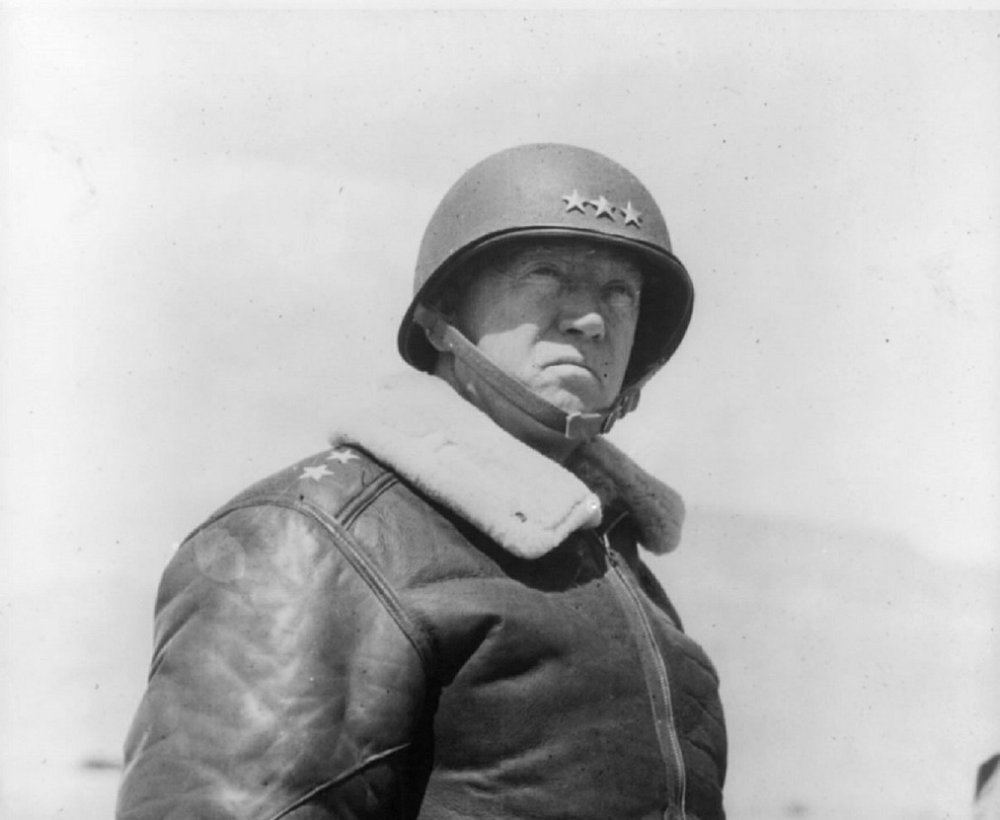
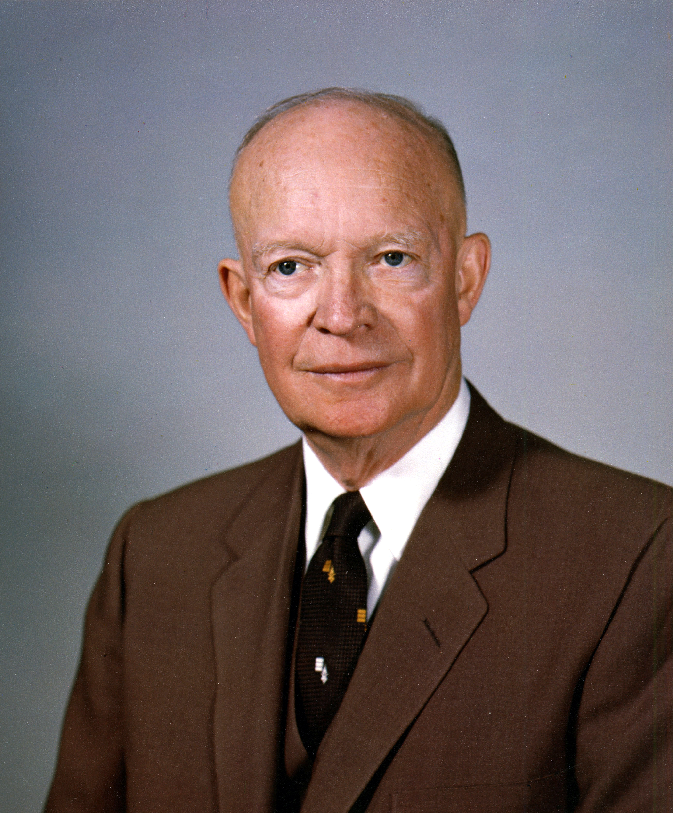
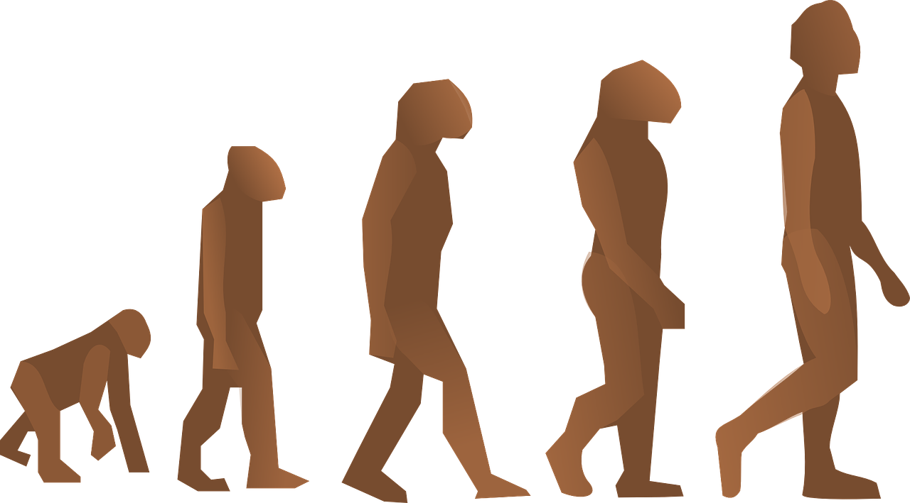
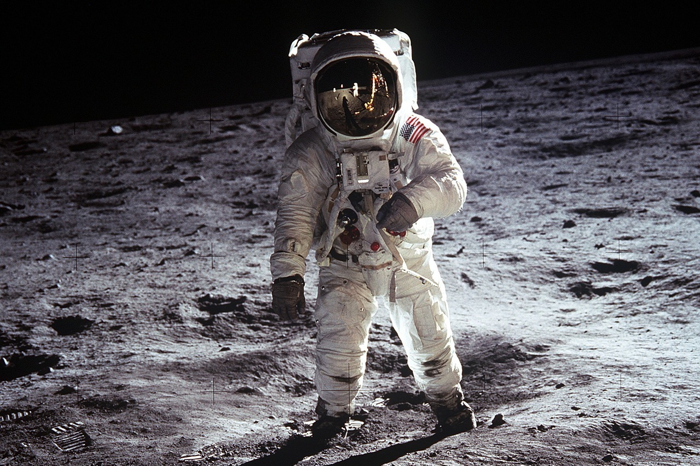
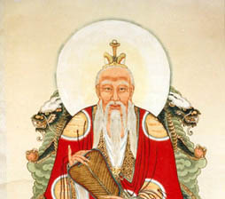

# Agile is for Everyone

---

# [fit]60

# [fit]Steps

---

>  **Don't tell people how to do things, tell them what to do and let them surprise you with their results.**
>
> — George S. Patton Jr.

---

# [fit] Continuous

# Improvement.

---

> **4 Values**

---

> **Individuals and interactions** 
>
> over processes and tools. 

[.footer: *Manifesto for Agile Software Development*. (2001). Agilemanifesto.org. Retrieved 29 April 2017, from http://agilemanifesto.org/]

---

> **You manage things; you lead people.**
>
> — Rear Admiral Grace M. Hopper

---

> **Working software** 
>
> over comprehensive documentation. 

[.footer: *Manifesto for Agile Software Development*. (2001). Agilemanifesto.org. Retrieved 29 April 2017, from http://agilemanifesto.org/]

---

> **Customer collaboration** 
>
> over contract negotiation. 

[.footer: *Manifesto for Agile Software Development*. (2001). Agilemanifesto.org. Retrieved 29 April 2017, from http://agilemanifesto.org/]

---

> **Responding to change** 
>
> over following a plan. 

[.footer: *Manifesto for Agile Software Development*. (2001). Agilemanifesto.org. Retrieved 29 April 2017, from http://agilemanifesto.org/]

---

> **12 Principles**

---

> **Our highest priority is to satisfy the customer through early and continuous delivery of valuable software.**

[.footer: *Manifesto for Agile Software Development*. (2001). Agilemanifesto.org. Retrieved 29 April 2017, from http://agilemanifesto.org/principles.html]

---

> **Welcome changing requirements, even late in development. Agile processes harness change for the customer's competitive advantage.**

[.footer: *Manifesto for Agile Software Development*. (2001). Agilemanifesto.org. Retrieved 29 April 2017, from http://agilemanifesto.org/principles.html]

---

> **Deliver working software frequently, from a couple of weeks to a couple of months, with a preference to the shorter timescale.**

[.footer: *Manifesto for Agile Software Development*. (2001). Agilemanifesto.org. Retrieved 29 April 2017, from http://agilemanifesto.org/principles.html]

---

> **Business people and developers must work together daily throughout the project.**

[.footer: *Manifesto for Agile Software Development*. (2001). Agilemanifesto.org. Retrieved 29 April 2017, from http://agilemanifesto.org/principles.html]

---

> **Build projects around motivated individuals. Give them the environment and support they need, and trust them to get the job done.**

[.footer: *Manifesto for Agile Software Development*. (2001). Agilemanifesto.org. Retrieved 29 April 2017, from http://agilemanifesto.org/principles.html]

---

> **Leadership is the art of getting someone else to do something you want done because he wants to do it.**
>
> — Dwight D. Eisenhower

---

> **The most efficient and effective method of conveying information to and within a development team is face-to-face conversation.**

[.footer: *Manifesto for Agile Software Development*. (2001). Agilemanifesto.org. Retrieved 29 April 2017, from http://agilemanifesto.org/principles.html]

---

> **Working software is the primary measure of progress.**

---

> **Agile processes promote sustainable development.  The sponsors, developers, and users should be able  to maintain a constant pace indefinitely.**

[.footer: *Manifesto for Agile Software Development*. (2001). Agilemanifesto.org. Retrieved 29 April 2017, from http://agilemanifesto.org/principles.html]

---

> **Continuous attention to technical excellence and good design enhances agility.**

[.footer: *Manifesto for Agile Software Development*. (2001). Agilemanifesto.org. Retrieved 29 April 2017, from http://agilemanifesto.org/principles.html]

---

> **Simplicity--the art of maximizing the amount of work not done--is essential.**

[.footer: *Manifesto for Agile Software Development*. (2001). Agilemanifesto.org. Retrieved 29 April 2017, from http://agilemanifesto.org/principles.html]

---

> **The best architectures, requirements, and designs emerge from self-organizing teams.**

[.footer: *Manifesto for Agile Software Development*. (2001). Agilemanifesto.org. Retrieved 29 April 2017, from http://agilemanifesto.org/principles.html]

---

> **An agile or Scrum team’s job is to self-organize around the challenges, and within the boundaries and constraints, put in place by management.**

[.footer: Cohn, M. (2010). The Role of Leaders on a Self-Organizing Team. Mountain Goat Software. Retrieved 3 May 2017, from https://www.mountaingoatsoftware.com/blog/the-role-of-leaders-on-a-self-organizing-team]

---

> **Management’s job is to come up with appropriate challenges and remove impediments to self-organization.** 
>
> — Mike Cohn

[.footer: Cohn, M. (2010). The Role of Leaders on a Self-Organizing Team. Mountain Goat Software. Retrieved 3 May 2017, from https://www.mountaingoatsoftware.com/blog/the-role-of-leaders-on-a-self-organizing-team]

---

> **At regular intervals, the team reflects on how to become more effective, then tunes and adjusts its behavior accordingly.**

[.footer: *Manifesto for Agile Software Development*. (2001). Agilemanifesto.org. Retrieved 29 April 2017, from http://agilemanifesto.org/principles.html]

---

>  **How is this *different*?**

---

> **In writing, you *must* kill all your darlings.**
>
> —William Faulkner

^ We are writing a story, the story of Galvanize.

---

> **12 Experiments**

---

> Agile is a **mindset**.

---

---

---

---

---

---

> "Whatever you are, **be a good one**." 
>
> — Abraham Lincoln

---

> **Questions?**

---

> **A leader is best when people barely know he exists, when his work is done, his aim fulfilled, they will say: we did it ourselves.**
>
> — Lao Tzu

---

> **I was never the smartest guy in the room. From the first person I hired, I was never the smartest guy in the room. And that's a big deal.** 

---

> **And if you're going to be a leader - if you're a leader and you're the smartest guy in the world - in the room, you've got real problems.**
>
> — Jack Welch

---

> **As we look ahead into the next century, leaders will be those who empower others.**
>
> — Bill Gates

---

All photos in this presentation were downloaded from [Pixabay](http://pixabay.com) and released under a [Creative Commons CCO](https://creativecommons.org/publicdomain/zero/1.0/deed.en) License.