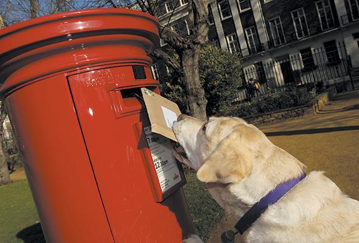
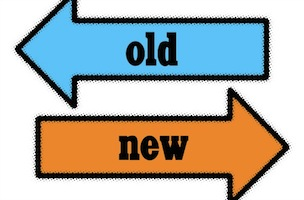

# RESTful Design


---

# Objectives

- Explain the concept of REST
- Explain which HTTP verbs (methods) match up to CRUD


---

# What is REST?
#<br>
##[fit]RE**presentational** S**tate** T**ransfer**
#<br>

###REST is an architectural style for designing distributed systems.

---

#REST Principles


---

#Resources
>Resources expose easily understood routes.

#Representations
> Transfer JSON or XML to represent resources.

---

#Messages
> Use HTTP methods and status codes explicitly.

#Stateless
> Iteractions store no client context on the sever between requests.
> <br>
> The client holds session state.

---

#HTTP methods / verbs
#<br>
##HTTP methods map CRUD operations to HTTP Requests.


---

# CRUD
| HTTP | CRUD | SQL  |
| ------------- |:-------------:| -----:|
| POST|  |  |
| GET |  |  |
| PUT / PATCH |  |  |
| DELETE |  |  |

---

# CRUD
| HTTP | CRUD | SQL  |
| ------------- |:-------------:| -----:|
| POST| Create |  |
| GET | Read (Retrieve) |	 |
| PUT / PATCH | Update (Modify) |	 |
| DELETE | Delete (Destroy) |  |

---

# CRUD
| HTTP | CRUD | SQL  |
| ------------- |:-------------:| -----:|
| POST| Create | INSERT |
| GET | Read (Retrieve) |	SELECT |
| PUT / PATCH | Update (Modify) |	UPDATE |
| DELETE | Delete (Destroy) | DELETE |

---

#GET

>Used to retrieve infomration.  
><br>
>Must be safe.  Should not have side-effects that affect the data.
><br>
>Must be *idempotent* - meaning it will produce the same results if executed one or multiple times.


---

#POST

>Used to create a new entity. Usually provided some "body data", maybe from an HTML form for creating said entity.



---

#PUT

>Used to update an entity.  
><br>
>Creation of new entity often allowed.
><br>
>Idempotent.
><br>
>PUT replaces an existing entity.  Missing elements will be replaced with empty or null. (Not always - check docs)



---

#PATCH

>Used for partial updates of an entity.
>Idempotent.


---

#DELETE

>Used to remove a resource.


---

#HTTP Status Codes

- 1XX *Informational*
- 2XX *Success*
- 3XX *Redirection*
- 4XX *Client Error*
- 5XX *Server Error*

---

#Media Types

The *Accept* and *Content-Type* HTTP headers can be used to describe  the content being sent or requested within an HTTP request.

*Accept* is set by the client in the request.  It tells the server what content type it wants.

*Content-Type* is set by the server in the response.  It tells the client what content type it sent.

---

#Route Practice

GET /students

GET /students/:id

GET /students/:id/grades

---

#Route Practice

POST /students

PUT /students/:id

PATCH /students/:id

DELETE /students/:id

---

###Hypermedia as the Engine of Application State

```json

{
	"name": "Dize",
	"_links": [
		{
			"rel": "self,
			"href": "http://dize.com/superhero/1"
		}
	]
}

```

---

#Example

```json

{
	"count": "2",
	"links": {
		"self": { "href": "http://galvanize.com/students?page=1" },
		"next": { "href": "http://galvanize.com/students?page=2" }
	},
	"students" : [
		{
			"name": "Andrew",
			"links": [{"rel": "self, "href": "http://galvanize.com/students/1"}]
		},
		{
			"name": "Brendan",
			"links": [{"rel": "self, "href": "http://galvanize.com/students/2"}]
		},			
	],
	"total": "16"

}


```

---

##To the extent that systems conform to the constraints of REST they can be called RESTful.

---

##Assignment

1. Define a resource. (You choose)
2. You don't need to define your resource, I should be able to figure it out based on the routes.
2. Create some RESTful routes for your resource.
3. Make sure you can do the all the CRUD operations.
4. Make sure you can get a collection, and an individual resource.

---

# Objectives

- Explain the concept of REST
- Explain which HTTP verbs (methods) match up to CRUD

---
