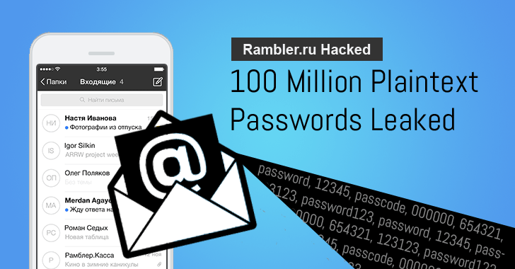

#[fit]Authentication

---

# Objectives
- Explain Identification and Authentication.
- Explain why passwords are terrible.
- Explain what makes a good hashing algorithm.
- Store a password *securely* using BCrypt.

---


^Identification

^Who am I?
^How do I prove it?

---


---


---


---


---


---

#[fit]Storing Passwords

^Plaintext

---



---

#First Rule

---

#Never store passwords in plain text.

---

#Second Rule

---

#**Never store passwords in plain text!**

---

#Always ask: 
#Do I actually need to store this?

^What if there was a way to verify that a password was correct, without knowing the original password?

---


#[fit]Hashing Algorithms

---


^Password is one way.

---


^Hash needs to be the same size.

---


---


^No Collisions!

---


---


^http://www.miraclesalad.com/webtools/md5.php

---


#Are We Safe?

^e10adc3949ba59abbe56e057f20f883e

^http://md5cracker.org/

---


^Rainbow Tables/Precomputed Lookup Tables.

---

#Third Rule

---

#**Never just store hashes!**

---


^Salt Those Passwords

^Demo Salt

^Who would do this?

---


---


---


^ Slowness

---


^Easy Solution

---

#[fit]BCrypt


---

#BCrypt gives us
1. Good cryptographic hashing algorithm.
2. Automatically generated salts.
3. Control over the computational complexity.

---


^The value you submit there is not just the number of rounds that the module will go through to hash your data. The module will use the value you enter and go through 2^rounds iterations of processing.

---

#BCrypt - How It Works

```javascript

bcrypt.hashSync(req.body.password,8)

```

returns 

```javascript

$2a$08$.jEA1FSMXOSGQhLXrKkN9.k9gyad8xN6r76YqOIzoA318fhoqUp7a

```

To Compare

```javascript

bcrypt.compareSync(myPlaintextPassword, hash);

```

^Version/Cost (SaltRounds)/Salt/Hash

---

# Objectives
- Explain Identification and Authentication.
- Explain why passwords are terrible.
- Explain what makes a good hashing algorithm.
- Store a password *securely* using BCrypt.

---

#Questions?


