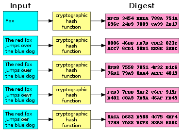
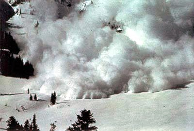

#[fit]Authentication

# [fit]Part2: Storing Passwords

---

# Objectives
- Explain Identification and Authentication.
- Explain why passwords are terrible.
- Explain what makes a good hashing algorithm.

---

> Group Exercise

---

# [fit]Storing Passwords

^Plaintext

---

---

#First Rule

---

#Never store passwords in plain text.

---

#Second Rule

---

#**Never store passwords in plain text!**

---

#Always ask:
#Do I actually need to store this?

^What if there was a way to verify that a password was correct, without knowing the original password?

---

#[fit]Hashing Algorithms

---

^Password is one way.

---

^Hash needs to be the same size.

---

---

^No Collisions!

---

---

^http://www.miraclesalad.com/webtools/md5.php

---

#Are We Safe?

^e10adc3949ba59abbe56e057f20f883e

^http://md5cracker.org/

---

^Rainbow Tables/Precomputed Lookup Tables.

---

#Third Rule

---

#**Never just store simple hashes such as md5 sha256!**

---

^Salt Those Passwords

^Demo Salt

^Who would do this?

---

---

---

^ Slowness

---

Objectives

- Explain Identification and Authentication.
- Explain why passwords are terrible.
- Explain what makes a good hashing algorithm.

---

#Questions?

