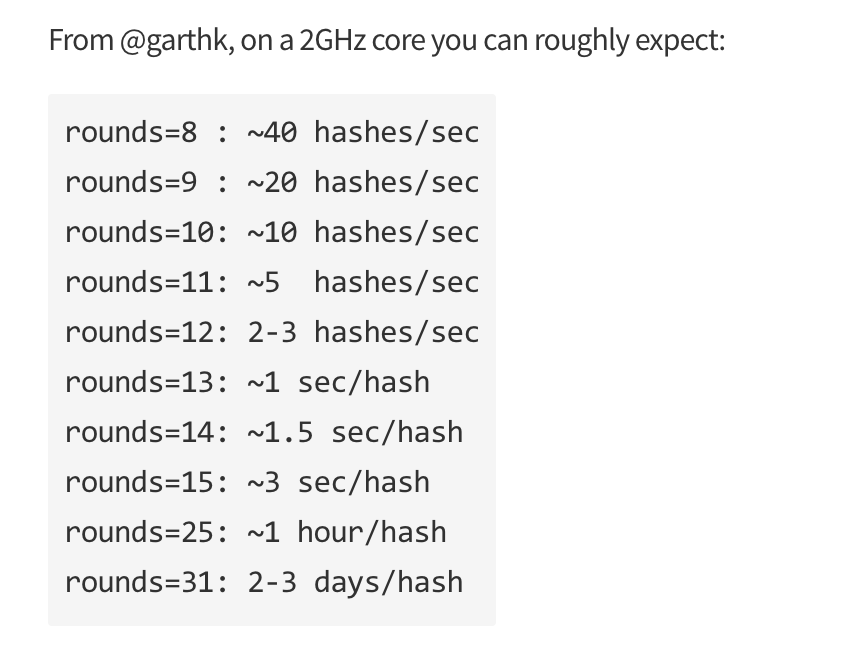

#[fit]Authentication

---

# Objectives
- Explain Identification and Authentication.
- Explain why passwords are terrible.
- Explain what makes a good hashing algorithm.
- Store a password *securely* using BCrypt.

---


^Easy Solution

---

#[fit]BCrypt

---

#BCrypt gives us
1. Good cryptographic hashing algorithm.
2. Automatically generated salts.
3. Control over the computational complexity.

---



^The value you submit there is not just the number of rounds that the module will go through to hash your data. The module will use the value you enter and go through 2^rounds iterations of processing.

---

#BCrypt - How It Works

```javascript

bcrypt.hashSync(req.body.password,8)

```

returns 

```javascript

$2a$08$.jEA1FSMXOSGQhLXrKkN9.k9gyad8xN6r76YqOIzoA318fhoqUp7a

```

To Compare

```javascript

bcrypt.compareSync(myPlaintextPassword, hash);

```

^Version/Cost (SaltRounds)/Salt/Hash

---

# Objectives
- Explain Identification and Authentication.
- Explain why passwords are terrible.
- Explain what makes a good hashing algorithm.
- Store a password *securely* using BCrypt.

---

#Questions?


