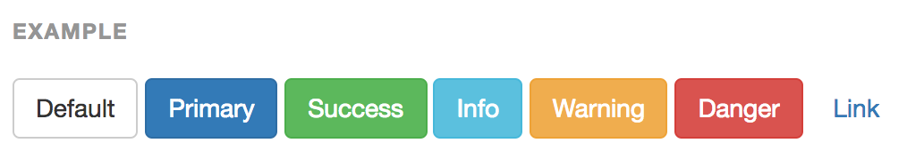

# [fit] Bootstrap

---

# Review

- What is a framework?
- What is a CDN?

---

#Objectives

- Install Bootstrap from a CDN
- Describe the 3 main parts of the Bootstrap grid system [container, row, column]
- Create a responsive grid layout that has 3 columns at a medium screen size and 1 column at the smallest screen size

---

#Install Bootstrap from a CDN

- Get the CDN code
- Link to it from the head of your html file

#[Use the Bootstrap CDN](http://getbootstrap.com/getting-started/)

---

#You do

- Build a basic html page with an `h1` header, a colorful body background-color and a bit of content (make sure to link to your stylesheet if you are using one)
- Include a link to the Bootstrap CDN
- Confirm that the Bootstrap styles are in effect

#[http://getbootstrap.com/getting-started/](http://getbootstrap.com/getting-started/)

---

# Grid System

- container
- rows
- columns

---

# Choose a Container for your Content

- container-fluid (full width)
- container (responsive fixed-width)

^ All Bootstrap content should be in a container. Containers should not be nested inside one another.

---

##container


---


##container-fluid


---

# Rows

- rows are __always__ nested inside of containers

---

# 12 Columns

- columns are __always__ nested inside of rows
- a row has 12 columns
- columns can be responsive
- columns should always add up to 12
- you can include an offset column if you need space (but it still needs to add up to 12)

---


[Grid Demo](./bootstrap_demo/griddemo.html)

---

## What if you want a different grid layout for different sized screens?

---

# You can do that!

---

##col-md-4


---

##col-xs-12


---

# Multiple Grid Layout Example

2 columns on medium screens / 1 column on small screens

```html
<div class="container">
  <div class="row">
    <div class="col-xs-12 col-md-6 bg-danger">
     Hello
    </div>

    <div class="col-xs-12 col-md-6 bg-primary">
     World
    </div>
  </div>
</div>
```

---

# You Do

- Create a grid that has 3 columns on medium screens and 1 column on an extra small screen

---

# Navbar

- Can contain lots of things like buttons, forms, dropdowns
- Can be responsive and resize/move menu based on screen width


---

# Jumbotron
`jumbotron`

- A very basic component to help you quickly style a page
- Anything can go inside
- The component can have margins or extend to the edges of the page


---

# Panel
`panel panel-default`

- Another basic component with borders and padding for quick styling
- It can have titles, headers, footers, tables, and lists that also have default styling


---

# Buttons

- Can be a variety of size `btn-lg` / `btn-sm` / `btn-xs` / `btn-block`
- Can be a variety of colors `btn-default`/ `btn-primary`/ `btn-warning`/ etc.



---

# Images

- Can be made responsive `img-responsive`
- Can be styled `img-rounded`/ `img-circle` /`img-thumbnail`


---

# Additional Classes

- `pull-left` / `pull-right`
- `center-block`
- `text-left` / `text-center` / `text-right` / etc.
- `text-lowercase` / `text-uppercase` / `text-capitalize`

---

#Bootstrap Docs

- Getting Started (Basic templates)
- CSS
- Components
- Javascript (left for a stretch exercise)
- Bootswatch Themes [https://bootswatch.com/](https://bootswatch.com/)
