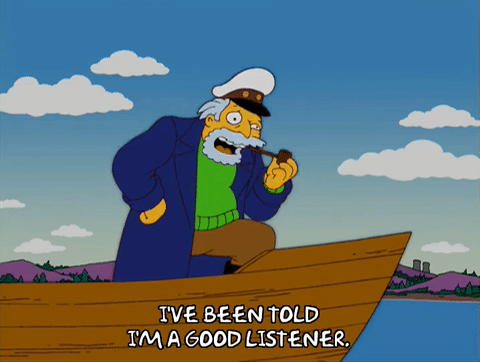
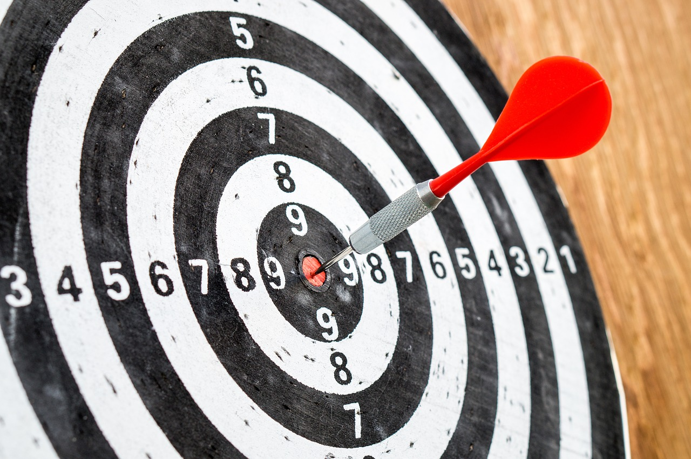
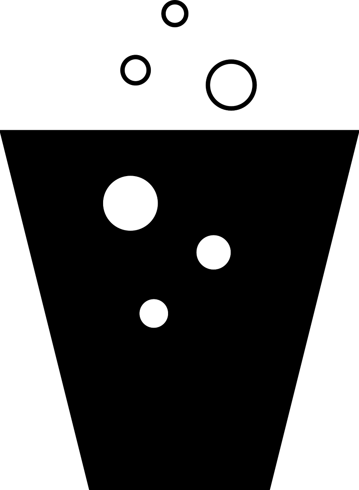

# [fit]DOM

#[fit]Events

---

> By the end of this lesson you should be able to:

- Attach event handlers to DOM elements
- Modify the DOM in response to an event
- Use callbacks in methods like addEventListener
- Explain the difference between `this` and `event.target` in event listeners
- Respond to the event `DOMContentLoaded` event

---

In the console type this:

```javascript
monitorEvents(window)
```

^ Events add interactivity to a webpage and let us do all sorts of fun stuff!

---

Event Types

- Mouse Events
- Keyboard Events
- Drag and Drop Events
- Focus Events

^ Have the groups research event types.

---



# Event Listeners

---

>When *this thing* happens … do *this*.

---

> When this **event** happens … run this **function**.

---

^ When this happens, do this.

^ On their own do the event listener part.  Event Listeners can be attached to DOM nodes.

---

# Event Object


---

# event.target vs this



---

# Event Propagation



^Bubble (down) vs Capture (up)

---

#Questions