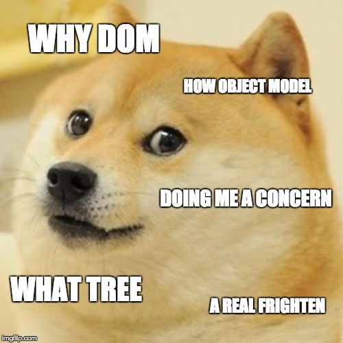
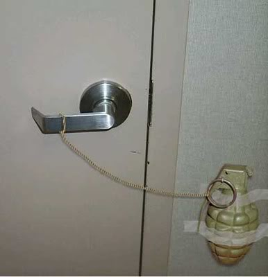
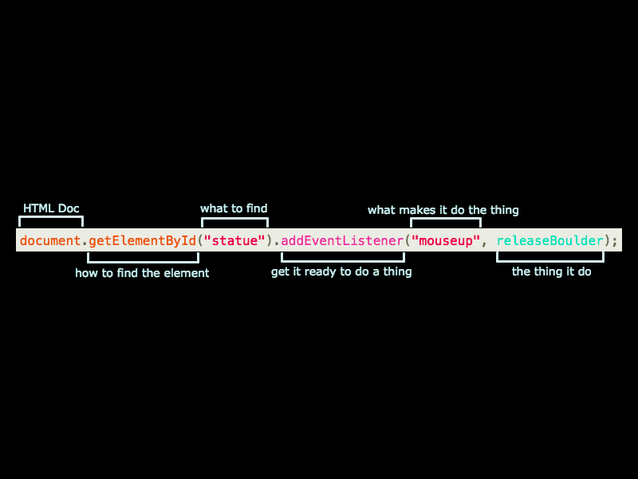
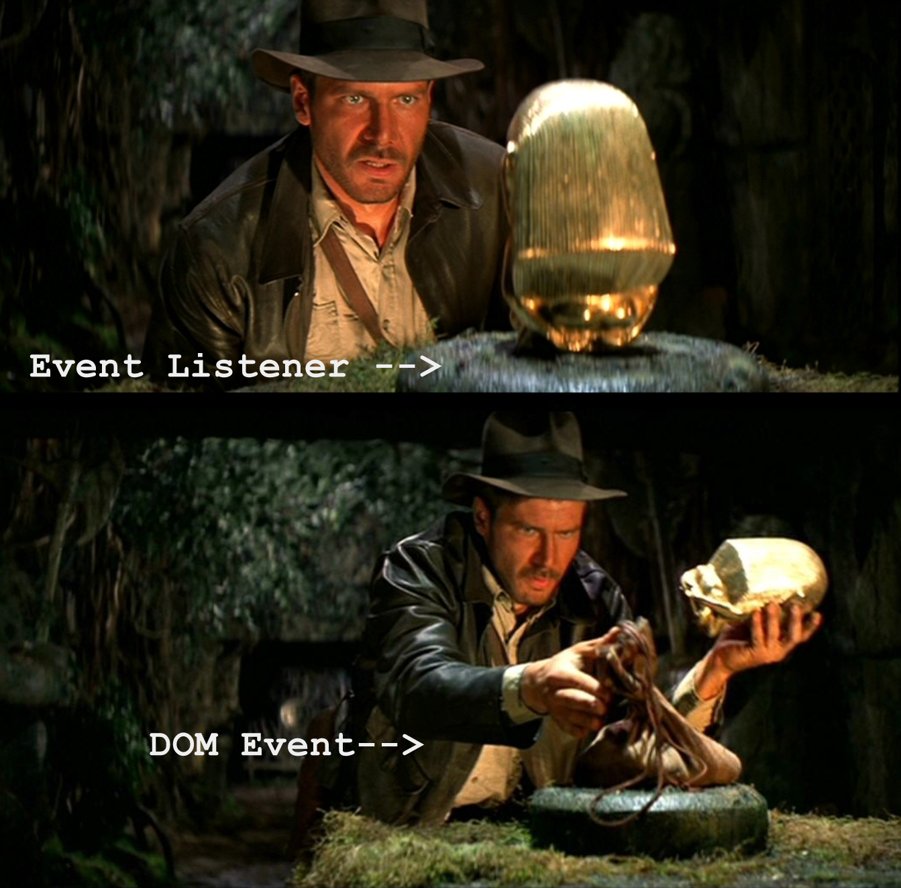
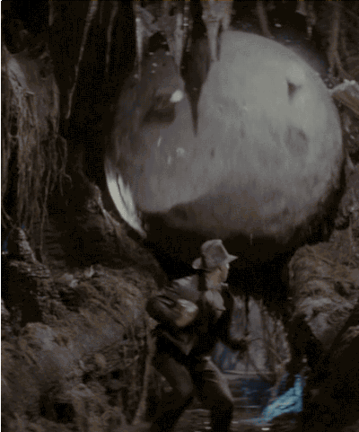
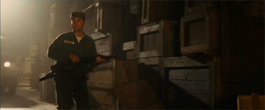
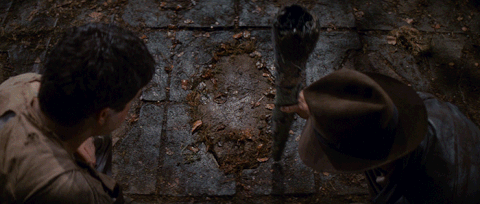
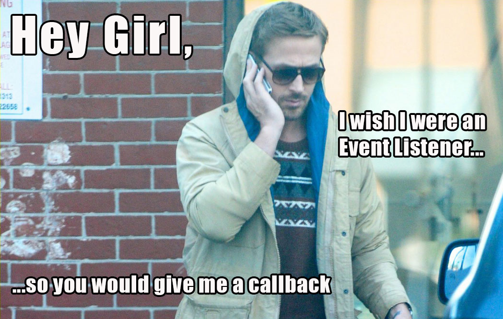
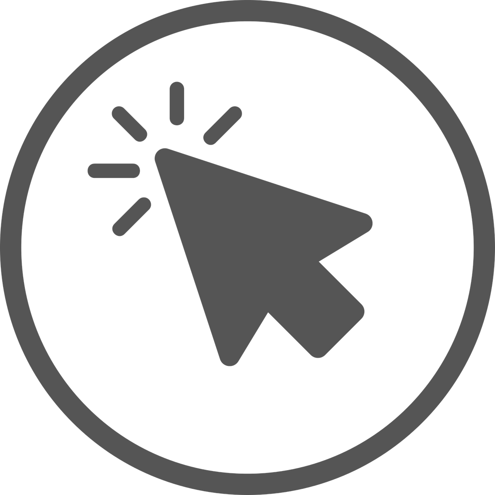

autoscale: true
slidenumbers: true

# [fit]DOM

#[fit]Events

#featuring...

---


---

# By the end of this lesson you should be able to:

- Identify event _targets_, event _listeners_, and event _callbacks_
- Attach _event listeners_ to DOM elements
- Use _callbacks_ with methods like _addEventListener()_
- Explain event bubbling
- Explain the difference between _this_ and _event.target_ in callbacks

---



---



Rather than thinking about the DOM as an abstract concept where things happen inexplicably in some invisible place, think of it as setting booby traps in your fortress of HTML/JS solitude.

---

# Setting the Trap



-
-
-
-
-
-
-
-
-
-
-
On my HTML document, I want the element with the id “statue” to run the function named “releaseBoulder” when the mouse button is release from a click on the element.

---




                                      Event Handler is triggered


---

```javascript
                                      document.getElementById("gun")
```



---

[.autoscale: false]



```javascript
document.getElementById(“tile”).addEventListener(“click”, shootArrow)
```

-
-
-
-
-
-
-
-
-
-
-


```javascript
var shootArrow = function() { loadArrow(); tensionArrow(); releaseArrow(); }
```

---

Every DOM element also has its own `addEventListener()` method, that can listen for common events

_Event Types_

- Mouse Events
- Keyboard Events
- Drag and Drop Events
- Focus Events

Paired research: [Event types](https://developer.mozilla.org/en-US/docs/Web/Events)

---

# How to add/remove
```javascript
// doStuff is a "callback"
var doStuff = function() {
  alert("PARTY TIME");
}
myElement.addEventListener("click", doStuff);

// Or just anonymous function
myElement.addEventListener("click", function(){
  alert("COWABUNGA")
});

myElement.removeEventListener("click");
// Clicky no more worky
```

---



---

# Event Object



Callback functions can take an _event object_ as a parameter. This object represents most everything we need to know about the event that occured. For example we can find out the _target_ of the event (the DOM element that triggered the event)

```javascript
var logTarget = function(event) {
  console.log(event.target);  // Log it
}

var ele = document.getElementById("someElement"); // Grab my element
ele.addEventListener("click", logTarget); // Add listener/callback
```

---

# Event Bubbling

We can place an event listener on a parent element that captures the events from all the children. The event "bubbles up" from the child (_event.target_) to the parent with the attached listener (_this_).

[Codepen example](https://codepen.io/peternsilva/pen/EvXwLa)

---

# Event Bubbling


---

# Best Practice: DOMContentLoaded

The DOMContentLoaded hook is itself implemented with an event listener. Ensure you place _ALL_ your javascript within this block, including your various event listeners.

```javascript
document.addEventListener("DOMContentLoaded", function() {
  // ALL JS IN HERE
  var img = document.querySelector('img');
  img.addEventListener('mouseover', imgLog);
});
```

Who remembers why?
