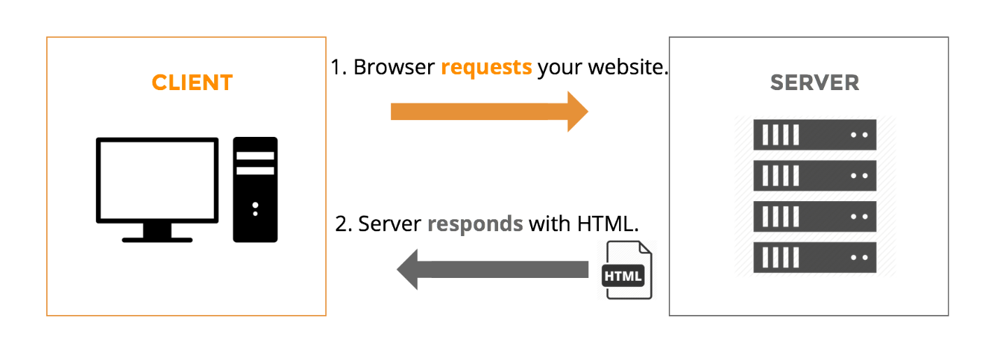

#[fit]Intro to **HTTP**

---

#**H**yper**t**ext **T**ransfer **P**rotocol

---


#What is Hypertext?

>"Hypertext is text displayed on a computer display or other electronic devices with references (hyperlinks) to other text which the reader can immediately access ..." [^1]

[^1]: Hypertext. (2016). En.wikipedia.org. Retrieved 24 October 2016, from https://en.wikipedia.org/wiki/Hypertext

^links to connect the reader to other files that contain hypertext. The most popular hypertext format is, of course, the Hypertext Markup Language.

---


#What is a protocol?

> "... a communication protocol is a system of rules that allow two or more entities of a communications system to transmit information via any kind of variation of a physical quantity."[^2]

[^2]:Communications protocol. (2016). En.wikipedia.org. Retrieved 24 October 2016, from https://en.wikipedia.org/wiki/Communications_protocol 

^ HTTP is quite flexible and is also used to transmit non-hypertext data as well.

---


#HTTP is a 
#**request**-**response** 
#protocol.


---


#**Client** and **Server**.

---



^ Client/Server doesn't refer to the machine type - but what the software is doing.

---

##The **client** sends a *request* and receives a *response*.

##The **server** listens for a *request* and sends a *response*.

---


#Request

---

```
GET / HTTP/1.1
Host: google.com
User-Agent: curl/7.49.1
Accept: */*

```

^ Plain Text
^ Method or Verb
^ Path
^ HTTP Version
^ Headers (Key/Value Pairs)
^ Body (optional)

---


#Methods

- GET
- POST
- PATCH
- PUT
- DELETE
- OPTIONS
- HEAD
- ...

---


#Response

---

```
HTTP/1.1 301 Moved Permanently
Location: https://www.google.com/
Content-Type: text/html; charset=UTF-8
Date: Mon, 24 Oct 2016 02:41:23 GMT
Expires: Wed, 23 Nov 2016 02:41:23 GMT
Cache-Control: public, max-age=2592000
Server: gws
Content-Length: 220
X-XSS-Protection: 1; mode=block
X-Frame-Options: SAMEORIGIN
Alt-Svc: quic=":443"; ma=2592000; v="36,35,34,33,32"

```
^ An HTTP version

^ A status code

^ Key-value headers

^ And an optional body

---

```

<HTML><HEAD><meta http-equiv="content-type" content="text/html;charset=utf-8">
<TITLE>301 Moved</TITLE></HEAD><BODY>
<H1>301 Moved</H1>
The document has moved
<A HREF="https://www.google.com/">here</A>.
</BODY></HTML>

```


^ Break into group and explain status codes. 1XX,2XX,3XX,4XX,4XX

^ https://en.wikipedia.org/wiki/List_of_HTTP_status_codes


---


#Activity

^ Act out the HTTP Request/Response Cycle.  Use any abstraction you want.  One example is ordering food at a restaurant.

---


# JSON

---

```json
'{
    "colorsArray":[{
            "colorName":"red",
            "hexValue":"#f00"
        },
        {
            "colorName":"green",
            "hexValue":"#0f0"
        },
        {
            "colorName":"blue",
            "hexValue":"#00f"
        },
        {
            "colorName":"cyan",
            "hexValue":"#0ff"
        },
        {
            "colorName":"magenta",
            "hexValue":"#f0f"
        },
        {
            "colorName":"yellow",
            "hexValue":"#ff0"
        },
        {
            "colorName":"black",
            "hexValue":"#000"
        }
    ]
}'

```

---

#Serialization

^ The process of translating a program's data to and from a string.

^ JSON is a serialization format. JavaScript objects, arrays, numbers, strings, booleans, and null are all translated into a JSON string. Here's an example of translating a JavaScript object into a JSON string.

```javascript
var hero = {
	name: 'Lego Batman',
	occupation: 'DJ/Crime Fighter',
	favoriteColors: ['Black','Dark Grey']
}

var heroJSON = JSON.stringify(hero);

// Store or transmit the JSON string

```

---

```javascript
var heroJSON = '{
  "name": "Lego Batman",
  "occupation": "DJ\/Crime Fighter",
  "favoriteColors": [
    "Black",
    "Dark Grey"
  ]
}'

var hero = JSON.parse(heroJSON);

console.log(hero.occupation);  // DJ/Crime Fighter
```
^In other words, JSON is what allows two programs to transfer data to each other and guarantee the data remains the same on both sides.

---


#Web APIs

^ An application programming interface, or **API**, is a broad term used to describe any set of protocols for interacting with a computer program. 

^A web API is a contract between a client and a server. According to the contract, a web API allows a client to send specific HTTP requests to a server and the server will send specific HTTP responses back.

^ Have the students do the article - and the example for OMDB

^Show Programmable Web

^ Descript Q1 Project.

---

#Questions?