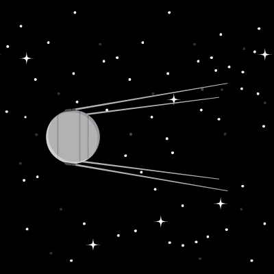
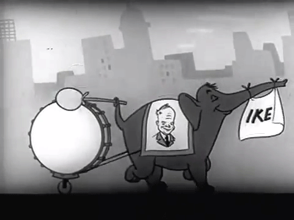
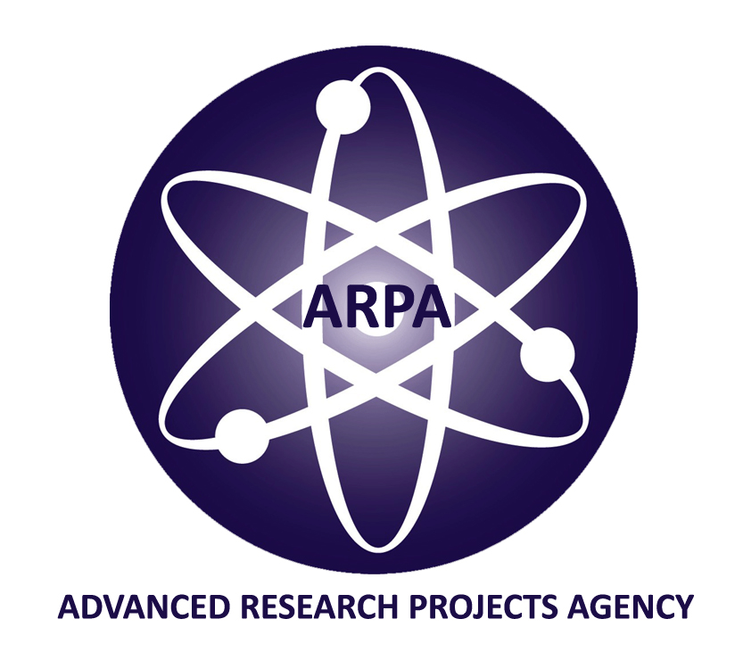
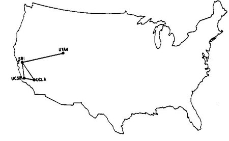
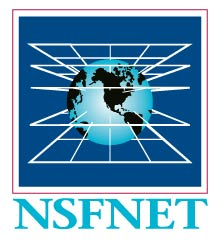
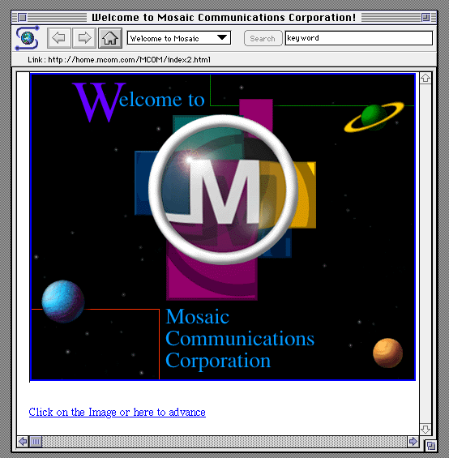
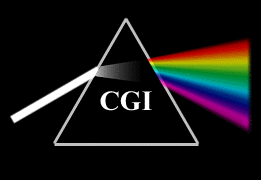
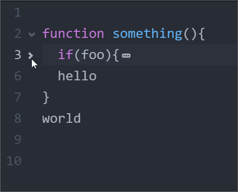
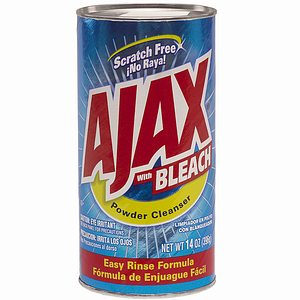
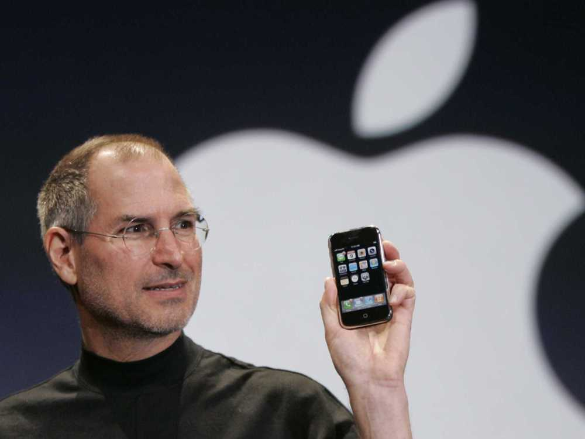

#[fit]History 
#of the 
#[fit]Internet

^The internet is a miracle.

---

#[fit]1957
#Sputnik

---

#[fit]1958
#ARPA

^ ARPA created by President Swight D. Eisenhower.

^ Its purpose was to formulate and execute research and development projects to expand the frontiers of technology and science, with the aim to reach beyond immediate military requirements.

^ ARPA's mission was to ensure U.S. military technology would be more sophisticated than that of the nation's potential enemies.

---

#[fit]1969
#ARPANET

^First to implement TCP/IP.

^Funded by the Advanced Research Projects Agency (ARPA) of the US Department of Defense.

^First meant to solve the problems inherent with long distance communication and create a set of protocols so different types of computers could communicate.

---

^UCLA, Stanford, UC Santa Barbara, University of Utah.

---

#[fit]Packet Switching 
#vs 
#[fit]Circuit Switching

---

#[fit]1974
#TCP/IP

^ 1974 is when a protocol was specified.

^ Worked with both satellite packet based networks and ground radio packet based networks.

^TCP manages breaking the message into packets and reassembling them.

^IP handles the addressing, so the packets get to the right place. IP Doesn't care what order the packets arrived or even if they got there at all.  The sender acknowledges they received the transmission.

^Vinton Cerf and Robert Kahn

---

#[fit]1985
#NSFNET

^ARPA's primary mission was funding cutting edge research and development, not running a communications utility. 

^The DOD spun off the military portions of the ARPANET to create MILNET

^Many other networks were also created in this time.  NSFNET became the 'defacto' backbone of the internet.

^National Science Foundation Network.

^ARPANET and NSFNET provided interconnectivity.

^Many other networks emerged at the time, many of which became a part of the internet backbone.

^ARPANET was decomissioned in 1990.

^Commercial traffic prohibited.

---

#[fit]1989
#World Wide Web

^URLs and Hyperlinks

^HTML

^HTTP

^Wrote the first browser while at CERN

---

## What is the difference between the World Wide Web and the Internet?

---

#[fit]1993
#NCSA Mosiac Browser 
##(Later Netscape)

^ Included images and tex and ran on several popular platforms.

^ Popularized the world wide web.

---

#[fit]1993

#Common Gateway Interface

^ CGI means Common Gateway Interface

^ Offers a standard protocol for web servers to interface with executable programs running on a server that generate web pages dynamically. 

^ Such programs are known as CGI scripts or simply as CGIs; though usually written in a scripting language, they can be written in any programming language.

^ Been replaced by a variety of web programming technologies.

---

#[fit]1993
#CSS Created

---

#[fit]1994
#Standards and W3C

^ First international WWW Conference.

^ University of Minnesota was going to charge license fees for use of the Gopher Protocol.

^ Berners-Lee made the web available freely with no patents and no royalties.  W3C founded and the internet as we know it was defined.

---

#[fit]1995
#Public Internet

^High Performance Computing Act of 1991 - "Gore Bill"

^Meme/Joke - taken out of context

---

#[fit]1995
#JavaScript created at Netscape

---

#[fit]1995 - 1999
#Browser Wars

---

#[fit]1997-2000
#Dot Com Bubble

---

#[fit]1999
##XMLHttpRequest

^ Data exhange between browser and server to avoid full page reloads.

^ Websites before this were based on complete page loads.

^ The concept behind the XMLHttpRequest object was originally created by the developers of Outlook Web Access (by Microsoft) for Microsoft Exchange Server 2000.

^ iframe was an original method to avoid this.

---

#[fit]2002
#Rich Internet Applications

^Plugins: Flash/Java Applet/Silverlight

---

#[fit]2004
#Web 2.0

^ Web 2.0 describes World Wide Web websites that emphasize user-generated content, usability (ease of use, even by non-experts), and interoperability (this means that a website can work well with other products, systems and devices) for end users. 

---

#[fit]2005
#AJAX

^Coined to represent a bunch of web technologies.  

^The term Ajax has come to represent a broad group of Web technologies that can be used to implement a Web application that communicates with a server in the background, without interfering with the current state of the page. 

---

#AJAX 

- HTML and CSS for presentation.
- The Document Object Model (DOM) for dynamic display of and interaction with data.
- JSON ~~or XML for the interchange of data~~.
- The XMLHttpRequest object for asynchronous communication
- JavaScript to tie everything together.

---

#[fit]2007
#Mobile Web

^What considerations need to be made for the mobile web.

---

#[fit]2010
#Responsive Design

^Content should be like water

---

#[fit]2011
#HTML5

^Living Standard

---

#Questions?

