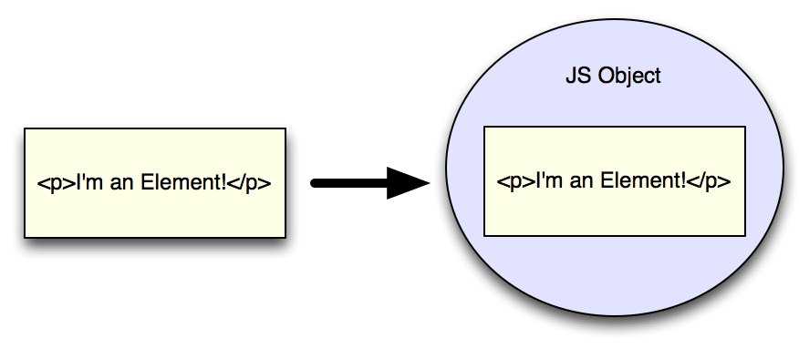
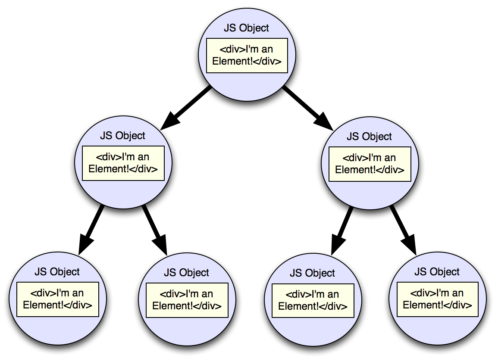

theme: Titillium, 1
autoscale: true
slidenumbers: true
<!-- @author: Pete Silva -->

## Document Object Model
### aka Da DOM

---

## Objectives
- Explain what is the DOM and the relationship between the DOM and HTML.
- What is the document?
- Explore and interact with the DOM using browser dev tools.

---

## The Idea

What if we took every element we find in our HTML and wrapped a JavaScript object around it? It would let us work with the HTML elements programmatically from JavaScript.

---



---

## The DOM is an API

A platform and language-neutral interface that allows programs and scripts to dynamically access and update the content, structure and style of documents. These changes will be reflected on the web page.

---

A document can be represented:

- Textually as HTML, XML, or SVG
- Structurally as represented via the DOM
- Visually as rendered in a browser

---


---

Sample HTML Document

```html
<!doctype html>
<html>
<head>
    <meta charset="utf-8">
    <title>All About Bears</title>
    <style type="text/css">
        h1 { color: blue; }
        #mainpicture { border: 1px solid black; }
        .bearname { font-weight: bold; }
    </style>
</head>
<body>
    <h1>BEARS!</h1>
    <h1>More BEARS!</h1>
    
    <p>The No. 1 Threat To America</p>
    <ul>
        <li class="bearname">Smokey</li>
        <li class="bearname">Teddy</li>
    </ul>
</body>
</html>
```

----


Document as a tree object

.
.
.
.
.
.
.
.
.
.
.

---



---

The DOM represents a document as a Tree Object

- The tree has a root node **(trunk)** aka window object
- The root node has nodes **(branches)**
- A node **(branch)** can have other nodes **(branches)**.

- A node *contained in another* node is known as a **child** node.
- A node that *contains another* node is known as a **parent** node.
- Nodes that have the same direct parent are known as **siblings**.

---

- **window object**
  - **document object**
      - **element object**
      - **element object**
      - **element object**

- The DOM is something a browser uses to represent the nested structure of a document.
- It does not exist in other JS environments like Node.js

Neato. It's a tree? So what? Because JavaScript.

---

Using Dev Tools to explore DOM

CMD+OPT+j to open Chrome Dev Tools
(or CMD+OPT+i)

Article exercise
(sample html on slack)

---

## Objectives
- Explain what is the DOM and the relationship between the DOM and HTML.
- What is the document?
- Explore and interact with the DOM using browser dev tools.
