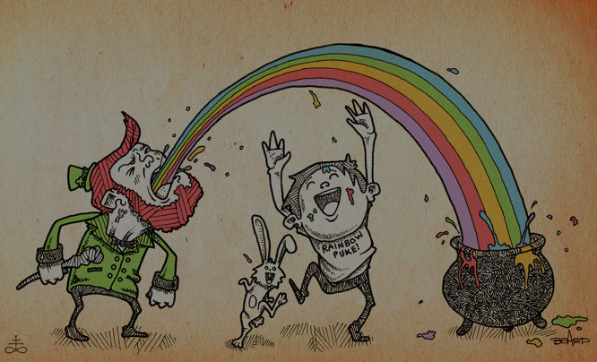

theme: Next, 1
autoscale: true
slidenumbers: true
<!-- @author: Pete Silva -->

# DOM Manipulation


---

## Objectives

- Access properties of DOM elements such as text, html, value
- Set an element’s text
- Add/update/remove attributes on elements
- Add/update/remove styles on elements
- Add/update/remove classes on elements


---

# Try for next 15min
[https://learn.galvanize.com/content/gSchool/browser-dom-curriculum/master/DOM/03-Manipulation.md](https://learn.galvanize.com/content/gSchool/browser-dom-curriculum/master/DOM/03-Manipulation.md)


---

# Modify element properties

```javascript
myElement.innerText = "Cool Story"
myElement.innerHTML = "<p>Call me Ishmael</p>"
myElement.value = "Get Schwifty"
```


---

### Add/update/remove attributes on elements

```javascript
myEle.setAttribute('name', 'Brock Beefbrains')  // add/update
myEle.setAttribute('id', 'person-card')
myEle.removeAttribute('name')
myEle.removeAttribute('id')
```


---

## Research
### How does we modify CSS styles of elements with da DOM?

Hint: more than one way exists, you know one already


---

### Add/update/remove styles on elements

```javascript
// Style property exists on any element
myEle.style.color = 'orange'
myEle.style.color = 'blue'
myEle.style.color = ''

// sets an inline style attribute
myEle.setAttribute('style','border: 10px solid green;')
```


---

## Research
### How do we apply CSS classes to elements with DOM methods?

Hint: more than one way exists, you know one already


---

### Add/update/remove classes on elements

```javascript
// Any element has a className property
myEle.className = 'pretty-fancy'
myEle.className += 'brutally-ugly'
myEle.className = ''

// sets a class attribute
myEle.setAttribute('class','rainbow-barf')
```

Difficult to remove just one class name from class attribute. jQuery helps that.



---

## Objectives

- Access properties of DOM elements such as text, html, value
- Set an element’s text
- Add/update/remove attributes on elements
- Add/update/remove styles on elements
- Add/update/remove classes on elements


