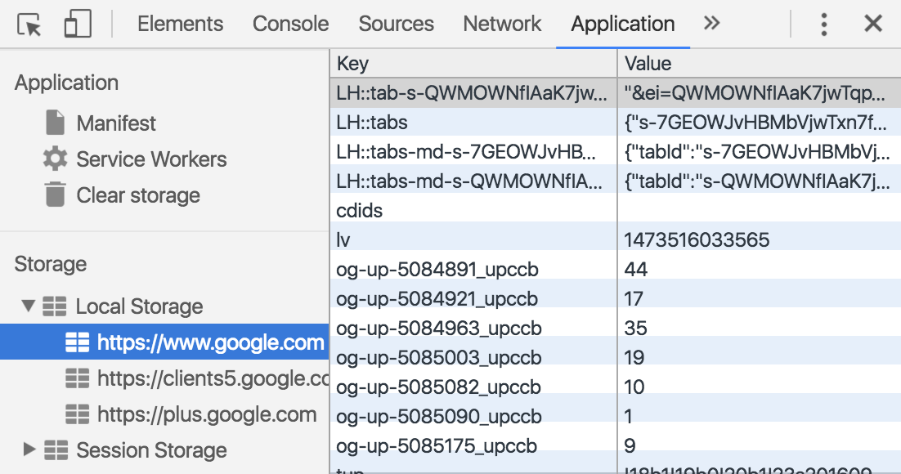

# Local Storage

---

# Objectives

- Explain what localStorage is and the benefits of using it.
- Explain what 4 of the localStorage methods do: (setItem,getItem,removeItem,clear).
- Explain JSON stringify and parse.

---

# What is localStorage?

^ A way to persist data. The data is stored on the user's machine.

---

#Chrome Developer Tools

1. Open Chrome Dev Tools
1. Click on the Application tab
1. Expand Local Storage
1. Click on a domain
1. View all the beautiful data in Local Storage



^ Application tab might be called Resources
Pull up the websites, share why you think they are using it and what they could be using it for. What is the benefit?

---

# setItem(keyName, keyValue)

Set a key/value pair in Local Storage.
Keys and values must both be strings.

```JavaScript

localStorage.setItem('name', 'Danny');

```

---

# getItem(keyName)

Get the value stored at a key in Local Storage.
Will always return a string or null.

```JavaScript

var name = localStorage.getItem('name');

```

---

# removeItem(keyName)

Remove a key/value pair from Local Storage.

```JavaScript

localStorage.removeItem('name');

```

---

#clear()

Completely empty the Local Storage.

```JavaScript

localStorage.clear();

```
---

# Only Strings?

^ The value can look like an object, array, or number, but it is really just a string.

---

```JavaScript
var user = {
  name: 'Danny',
  age: 26
};

localStorage.setItem('user', JSON.stringify(user));

var sameUser = JSON.parse(
    localStorage.getItem('user');
  );

console.log(sameUser.name); // 'Danny'

```

^ We use stringify to convert this object to a string so it can be added to localStorage. When we retrieve it, we must convert it back by using the parse method.

---

#[Time to Try It](https://github.com/gSchool/localstorage-exercises)
