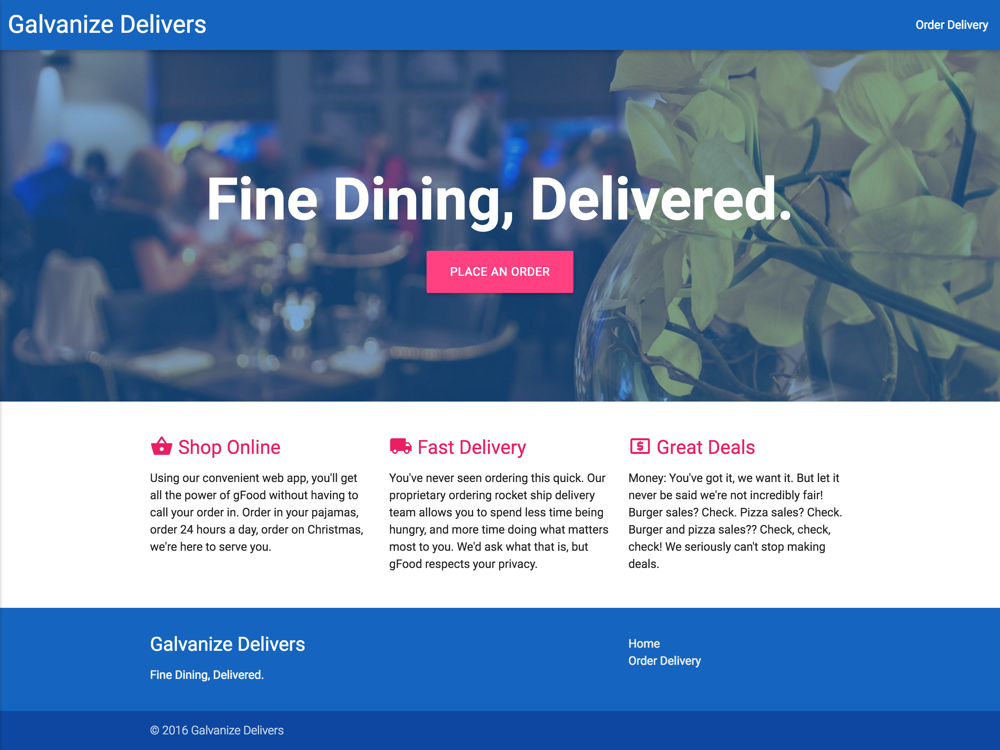

#[fit]CSS
#[fit]Frameworks

---
#Objectives
- Explain what a CSS Framework is?
- What do CSS Frameworks do for us?
- Explain 'The Gap'.
- Compare and contrast Bootstrap and Materialize.

---

#CSS Frameworks  
###are a set of **CSS Rules** that have been defined by an expert to make your site look less **ugly** by default.

---

#Think of it as *less ugly* default styles for your site.

---

#These sensible defaults allow you to concentrate on other things.

---

#The Gap

^ Not only can web developers use both frameworks to create a stunning, unified experience across platforms and device sizes, they can use them to help close the gap between their taste versus their abilities.

---

---

There are dozens of CSS frameworks - but we will talk about two of the most popular ones.

---

---

#[fit]Twitter 
#[fit]Bootstrap

---

^ Made by twitter.

---

#More than CSS

^ It is packaged with plenty of JavaScript which can be used to trigger animations, create modal dialog boxes and more.

---

#CDN

^ Aside

^A CDN (short for Content Delivery Network) is used to cache static content (e.g. JS/CSS files) across a geographically dispersed network of servers. When a user makes a request for a file hosted on the CDN, the server which is geographically closest to the user will serve up the requested file.

---

#Containers
#and
#The Grid System

^ The grid system allows you to easily organize your content into a responsive design based around a 12-column grid. In order to make use of this grid, we need to wrap the main area of our content in one of Bootstrap's container classes: either .container or .container-fluid.

^ To make use of the grid layout, we can add column classes to our divs. Every column needs to be inside of a div with the row class in order for Bootstrap's styling magic to work.

---

# Glyphicons

^Used to create Icons with a class.

---

# Work through the articles.

---

#[fit]Materialize

---

^ Material Design is a visual language developed by Google that's inspired by the study of paper and ink. It uses typography, grids, space, scale, depth, color, and motion to form a user interface that gives hierarchy, meaning, and focus to content.

---

^Give the students a few minutes to check out the documentation.

^Exercise: After having explored the above resources, turn to a partner and explain what Material Design is in your own words.

---

#[fit]Materialize

^ Materialize is a modern, responsive, front-end framework based on Material Design. In short, Materialize has done most of the heavy lifting for you in terms of a cohesive visual language. Materialize provides a default set of stylized components that you can incorporate into your own application and tweak as necessary.

^ Have the students check out the components, then turn and talk.

---

^This weeks project is Galvanize Delivers.

^We will start it today, and you can work on it with your free time throughout the week.  We will still have personal work time on Friday to work on it.

^Read through the articles on these two frameworks and choose one to build your Galvanize Delivers page.  

^Don't dive too deep into both of them, the idea here is to have some basic understanding of the differences between the two and spend your time implementing one of the frameworks.  If you want to dive deeper into the one you didn't choose - that would be great to do with the next assignment.