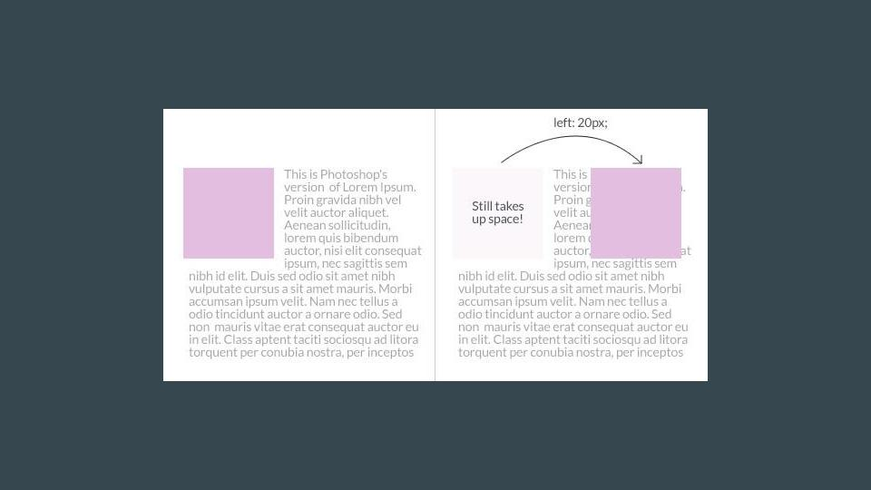
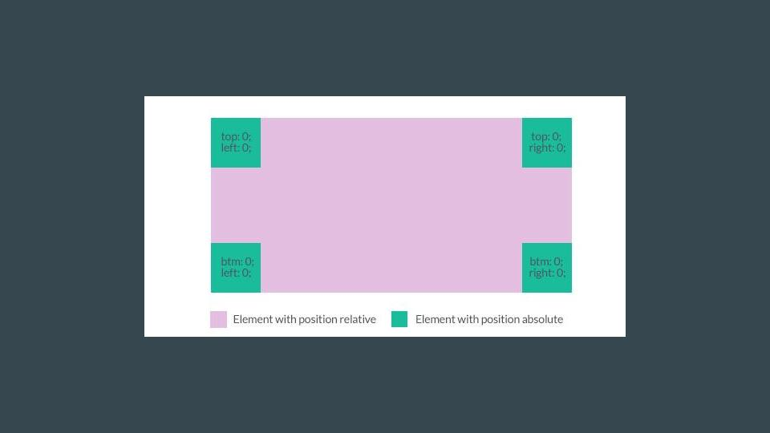
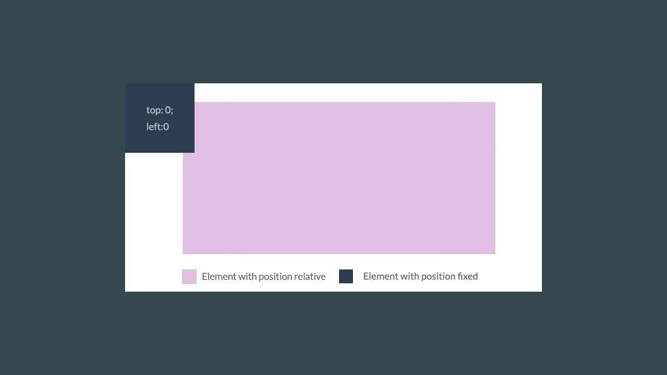

# CSS - Specificity
---

# Objectives

- Explain the Specificity rules
- Determine which selectors will win
- Explain the difference between the 4 CSS positions

---

# Specificity
### In order of importance from least to most

- element (div)
- class (.title)
- inline (style="color: red;")
- id (#title)
- !important

---

# The Dark Side
## Let's look at the three most popular selectors

- element (div) ----> Storm Trooper
- class (.title) ---> Darth Vader
- id (#title) ---> The Emperor

---

#[Specificity Calculator](https://specificity.keegan.st/)

---

# CSS Positions

---

# Static
### `position: static;`

^ All positions are static by default.
They take up the appropriate amount of space they are supposed to take up.
Every element will use this value, unless otherwise stated.
Will not accept top/right/bottom/left value

---

# Relative
### `position: relative;`

^ Nudge elements in different directions with top, right, bottom and left values.
When set to position relative, elements take up the same amount of space at the same exact position it was supposed to take as if its position was static.
It can however, appear to be pushed to a different location visually.

---

---

# Absolute
### `position: absolute;`

^ Position absolute takes the element out of the document flow. This means that it no longer takes up any space like what static and relative do.
When position absolute is used on an element, it is positioned absolutely with reference to the closest parent that has a position relative value.

---

---

# Fixed
### `position: fixed;`

^ Similar to position absolute, an element that has fixed position is taken out of the document flow.
The major difference with position absolute is it always takes its positioning relative to the browser window.

---

