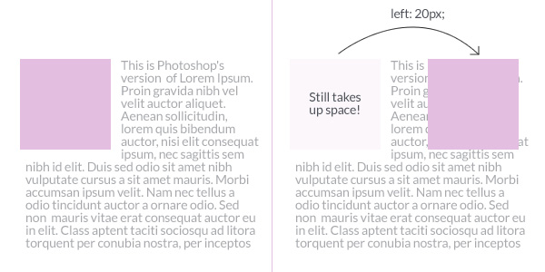
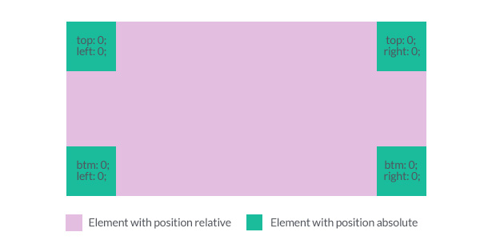
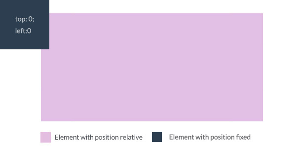

# Intermediate

#[fit] CSS

---

# Objectives

Describe and use the following
- CSS Reset
- CSS Normalizers
- The 4 CSS Positions

---

#[fit] User
#[fit] Agent
#[fit] Stylesheet

^The browser has its own stylesheet - called the User Agent Stylesheet.

^It tries to apply this before any of your stylesheets.

^This is why, for example, h1 tags are bigger than paragraph text by default.

^Each browser's user agent stylesheet is different.

^This can lead to inconsistencies.

---

#[fit] No
#[fit] Problem

---

#[fit]CSS
#[fit]Resets

^Removes all styling.

^Nothing will have padding, margins, etc unless you explicitly state.

^If you include a CSS reset, link it first - so that your overrides take precedence.

---

#[fit] [Using](http://meyerweb.com/eric/tools/css/reset/)

#[fit] [Meyer](http://meyerweb.com/eric/tools/css/reset/)

#[fit] [Reset](http://meyerweb.com/eric/tools/css/reset/)

---

#[fit] You

#[fit] TRY

^Make a copy of a website you have been working on.

^Add the CSS Reset

^Look for changes between the original and css reset versions.

---

#[fit] CSS
# Normalizers

^ Maintains some default styling.

^ Keeps it consistent between browsers.

^ Demo -

^ https://necolas.github.io/normalize.css/

---

#[fit] You
#[fit] Try

^ Make another copy of a website you have been working on.

^ Add the CSS Normalizer.

^ Look for changes between the original and css reset versions.

---

# [fit] CSS

# [fit] Positioning

---

# Types of positioning

CSS positions change the flow of a document.

CSS Position allows up to 5 different values. But essentially only 4 values are commonly used.

- Static /* default */
- Relative
- Absolute
- Fixed
- Inherit /* Not very common */

---

# Static

- All positions are static by default.
- They take up the appropriate amount of space they are supposed to take up.
- Every element will use this value, unless otherwise stated.
- Will not accept top/right/bottom/left value

---

# Relative

---

# Relative

1. Nudge elements in different directions with top, right, bottom and left values.

   When set to position relative, elements take up the same amount of space at the same exact position it was supposed to take as if its position was static.

   It can however, appear to be pushed to a different location visually.

---

# Absolute

---

# Absolute

Position absolute takes the document out of the document flow. This means that it no longer takes up any space like what static and relative does.

When position absolute is used on an element, it is positioned absolutely with reference to the closest parent that has a position relative value.

---

> If no parent element has a relative position, then the absolutely positioned element will take its reference from the browser window.

---

# Fixed

---

# Fixed

Similar to position absolute, an element that has fixed position is taken out of the document flow.

The major difference with position absolute is it always takes its positioning relative to the browser window.

---

# Other attributes available for positioning

| attribute |
| :-------: |
|    top    |
|   right   |
|  bottom   |
|   left    |
|  z-index  |

^ top, right, bottom, left  - Allows you to set the edge of the element with reference to its containing element.  These values can be negative if you want to place them just outside of their containing elements.
^ Z-index controls the vertical stacking order of elements. Takes only numbered integers. The higher the integer, the more forward this element is.

---

