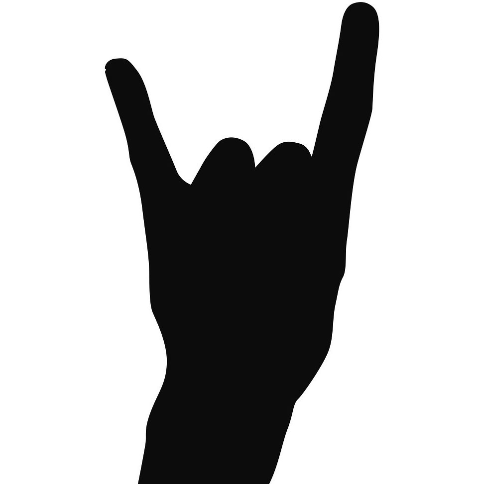
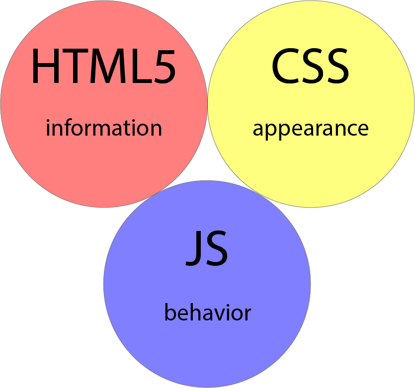
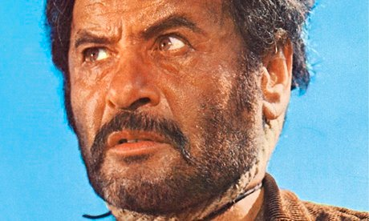
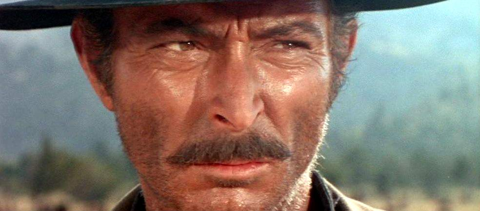
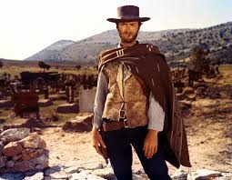

# [fit] Introduction to 

# [fit]CSS


---



# Demos

[A Single DIV](http://a.singlediv.com/)

[The Simpsons](http://pattle.github.io/simpsons-in-css/)

[CSS Creatures](http://bennettfeely.com/csscreatures/)

[CSS Coke Can](http://www.romancortes.com/ficheros/css-coke.html)

---

> Cascading Style Sheets (**CSS**) is a style sheet language used for describing the presentation of a document written in a markup language.

> — https://en.wikipedia.org/wiki/Cascading_Style_Sheets

---



^ CSS is designed primarily to enable the separation of document content from document presentation.

^ This includes aspects such as the layout, colors, and fonts.

^ This separation can improve content accessibility, provide more flexibility and control in the specification of presentation characteristics, enable multiple HTML pages to share formatting by specifying the relevant CSS in a separate .css file, and reduce complexity and repetition in the structural content.

---



# [fit] Adding CSS

# [fit] The 

# [fit]Ugly 

# [fit]Way

^ Inline CSS Tags

---



# [fit] Adding CSS

# [fit] The

# [fit]Bad

# [fit]Way

^ Style tag in HTML document

---



# [fit] Adding CSS

# [fit] The

# [fit]Good

# [fit]Way

^ External CSS file

---

# Selectors

| Selector | Description | Example |
| -------- | ----------- | ------- |
|          | Element     | p       |
| .        | Class       | .active |
| #        | ID          | #name   |
| ,        |             | div,p   |
| (Space)  |             | div p   |
| >        |             | div > p |
| +        |             | div + p |
| ~        |             | ul ~ li |

---

# More Selectors

| Selector                | Description                              | Example         |
| ----------------------- | ---------------------------------------- | --------------- |
| [attribute]             | Selects all attributes with the specified attribute | [src]           |
| [attribute=value]       | Selects all elements with the specified attribute and value. | [target=_blank] |
| [attribute~=value]      | Selects all elements with the specified attribute containing the word specified in value. | [title~=batman] |
| [attribute(pipe)=value] | Selects all attributes with the specified attribute starting with the value. | [lang(pipe)=en] |

^ Actually the pipe key.

---

# Even more selectors

| Selector           | Description                              | Example              |
| ------------------ | ---------------------------------------- | -------------------- |
| [attribute^value]  | Selects every element whose attribute value begins with the value | a[href^="https"]     |
| [attribute$=value] | Selects every element whose attribute value ends with the value | a[href$=".pdf"]      |
| [attribute*=value] | Selects every element whose attribute value contains the substring value. | a[href*="galvanize"] |

---

# Sub Selectors

| Sub Selector | Description | Example        |
| ------------ | ----------- | -------------- |
| :active      |             | a:active       |
| :focus       |             | input:focus    |
| :hover       |             | a:hover        |
| :link        |             | a:link         |
| :visited     |             | :visited       |
| ::after      |             | p::after       |
| ::before     |             | p::before      |
| :checked     |             | input:checked  |
| :disabled    |             | Input:disabled |
| :empty       |             | p:empty        |
| :enabled     |             | Input:enabled  |

---

# Sub Selectors

| Sub Selector   | Description | Example         |
| -------------- | ----------- | --------------- |
| :first-child   |             | p:first-child   |
| :last-child    |             | p:last-child    |
| ::first-letter |             | p::first-letter |
| ::first-line   |             | p::first-line   |
| :first-of-type |             | p:first-of-type |
| :last-of-type  |             | p:last-of-type  |

---

# Sub Selectors

| Sub Selector         | Description | Example               |
| -------------------- | ----------- | --------------------- |
| :in-range            |             | input:in-range        |
| :invalid             |             | Input:invalid:        |
| :lang(language)      |             | p:lang(it)            |
| :not(selector)       |             | :not(p)               |
| :nth-child(n)        |             | p:nth-child(2)        |
| :nth-last-child(n)   |             | p:nth-last-child(2)   |
| :nth-last-of-type(n) |             | p:nth-last-of-type(2) |
| :nth-of-type(n)      |             | p:nth-of-type(2)      |
| :only-of-type        |             | p:only-of-type        |
| :only-child          |             | p:only-child          |
| :optional            |             | input:optional        |
| :out-of-range        |             | input:out-of-range    |
| :read-only           |             | input:read-only       |
| :read-write          |             | input:read-write      |
| :required            |             | input:required        |
| :root                |             | :root                 |
| ::selection          |             | ::selection           |
| :target              |             | #news:target          |
| :valid               |             | input:valid           |


---

# [fit] selectors = where

# [fit] properties = what

---

# Properties

| Type       | Property         |
| ---------- | ---------------- |
| Color      | color            |
| Color      | opacity          |
| Background | background*      |
| Background | background-color |
| Background | background-image |

---

# Properties

| Type   | Property      |
| ------ | ------------- |
| Border | border*       |
| Border | border-color  |
| Border | border-radius |
| Border | border-style  |

---

# Box

| Type | Property   |
| ---- | ---------- |
| Box  | display    |
| Box  | height     |
| Box  | Width      |
| Box  | margin*    |
| Box  | padding*   |
| Box  | position   |
| Box  | visibility |
| Box  | right      |
| Box  | top        |
| Box  | Z-index    |

---

# Tons and tons ...

---

# Specificity

# What happens when you have conflicting selectors?

---

| Place | Selector                                 |
| ----- | ---------------------------------------- |
| 0     | Type selectors (e.g., h1) and pseudo-elements (e.g., :before). |
| 1     | Class selectors (e.g., .example), attributes selectors (e.g., [type="radio"]) and pseudo-classes (e.g., :hover). |
| 2     | ID selectors (e.g., #example).           |

---

# Warning

```css
!important
```

> When an `important` rule is used on a style declaration, this declaration overrides any other declarations.

---

# Display Style

^ Code Demo hr -> span

---


^ Box Model

---

# Questions