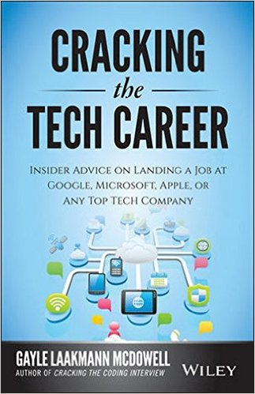
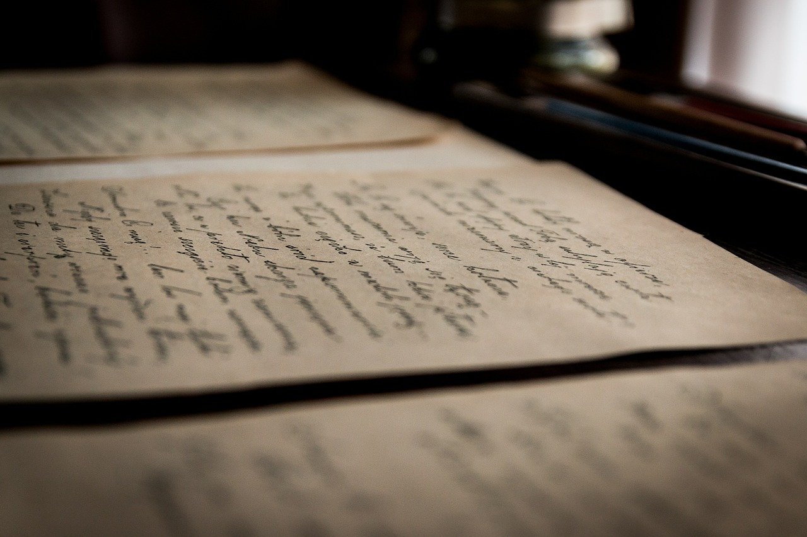

# [fit]Cover Letters

---

>  A strong cover letter will make someone open up your resume to learn more.
>
> — Gayle Laakmann McDowell "Cracking the Tech Career"

---

## Why do companies value cover letters?

---

# A cover letter can:

- build a good case for yourself and why you are a match for the position
- offer context and color to the drab resume
- explain *why*, not just *what*
- explain why you want the job
- provide a writing sample

^ Writing is a valuable tool for almost all professions

---

## The three types of cover letter

^ No matter what type of cover letter you send, they will follow a similar format and have similar goals.  

^ Your goal is to excite the reader enough that when they put down your cover letter, they want to pick up your resume.

---

# [fit]Solicited Cover Letter

^ Responding to an advertised job.

^ The listing likely lists specific skills or backgrounds desired, and your cover letter should appeal to those specific attributes. 

^ The cover letter should explain how you match those qualities, and should provide evidence using prior experience.

---

## [fit]Unsolicited Cover Letter

## [fit]Cold Call Letter

^ Taps the hidden job marker by inquiring about positions that might not be advertised.

^ Sometimes positions are created with a suitably good candidate comes along, often the case with start-ups.

^ Sometimes a new position is in the planning stages, but hasn't officially been defined or advertised.

^ The approach is the same: identify what the company would need and match that.

---

# Do your research:

- other job ads
- ads for equivalent jobs at other companies
- skills of current employees

^ It can be more work - but if successful you will have substantially less competition.

---

# [fit]Broadcast Letter

^ While all cover letters should be tailored - sometimes you have no choice but to make a generalized cover letter.

^ This is often the case using online job boards.

^ Be as specific as possible, while not excluding yourself from any desired positions. 

---

# Structure

^ Most cover letters are mediocre.  They get the job done.  They don't hurt your chances, but they don't help you either.

---

## Introduction

^ Why are you interested in the company?

---

## Who you are

^ What is your background.  If you just restate your resume, this will make your cover letter mediocre.  Its what most applicants do.

^ An exceptional cover letter will state your skills, attributes or accomplishments - but does them in a way that turns you into a person.  It adds color to the background data.

---

## Why you want the position

^ Don't be afraid to say you want the job.  

^ Show your enthuasism for the company, culture, products, etc - not just for a paycheck.

^ Gives you the chance to make your cover less generic.

---

## Five traits of a strong cover letter

---

## Tailored

^ Recruiters are busy and looking for an excuse to filter out applications.

^ They want to hire too - their job depends on it.

^ Idealy, you should write a fresh cover letter for each application.

---

> What if there is no job description?

^ You will need to guess at the preferred skill set.

^ Try and find out what languages or technologies the team or company uses.

^ Look at ads for similar jobs in the company.  Look at previous jobs the company might have advertised.  Look at ads for jobs in the company that aren't similar.  Look for similaraties - this will clue you into company values and culture.

---

## Supported with evidence

^ Don't just say it - prove it.

## Structured and consise

^ Long cover letters won't be read.

^ Structure and brevity is valued at work, so an overly long cover letter reflects poorly on you.

^ Keep it under 250 words (half a page)

---

## Simple, direct writing

^ Write to communicate, not to impress.  If people need to reread what you're saying to get the point, it's not good writing.

---

## Professional

^ This is often the best and only writing example a company has.

^ You should adress the letter to the individual, if you know their name.

^ If you don't know who is reading it - don't assume a gender.

---

# Questions