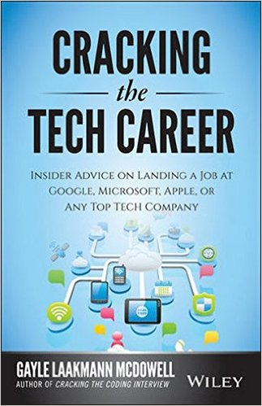

# [fit] Big vs Little

# [fit]Is a start-up right for you?

---

# [fit]Risk 

# [fit]and

# [fit]Reward

^ Start-Ups are high-risk and high-reward.

^ For the right person with the right opportunity a start-up opportunity can be fantastic. 

---

# [fit] The Good

^ Speed, Innovation, risk, learning and impact.

^ Some people love start-ups.

---

# [fit]Diversity of Skills

^ Start-ups never have enough people to fill every roll.

^ The smaller the company the more hats you will have to wear. 

^ You will get to develop a more diverse skill set, which will help you in your future job search.

---

# [fit]Leadership 

# [fit]Opportunities

^ When, or if, your start-up grows you will be in a great position to lead your own team.

^ Many people join start-ups and find that within months they are expected to move into managing new hires. 

^ At bigger companies it can take years for this opportunity.

---

# [fit]Control 

# [fit]and 

# [fit]Influence

^ Would you rather have a small influence on a small tool at a big company, or drive a major project at an obscure start-up? 

^ Both are valid answers.  

---

# [fit]Rapid Results

^ You won't have to wait years to see your work out in the real-world.  

^ This can enable you to learn from your mistakes (and successes) much faster.

---

# [fit] High Reward

^ All the risk isn't for nothing.  

^ Start-ups can make you very very rich if you are lucky.  

^ Its much more likely to do absolutely nothing for you financially.

---

# [fit]The Bad

^ Start-up burning out is a real thing.

---

# [fit] Long Hours

^The bare minimum isn't enough.

^Start-ups will fire underperformers.

---

# [fit] Lower Pay

^ Lower pay compensated with stock options.

^Most companies fail making options worthless.

---

# Unclear Job Description

^ Not my job isn't acceptable.

^Start-ups are short on staff.  Everyone needs to pitch in.

---

# [fit] Limited Credibility

^ If the company fails you could be looking for work with a no-name company on your resume.

---

# Less Mentorship

^ Start-ups lack the resources and knowledge to do this.

---

# [fit]Instability

^ This is the norm.

---

# [fit] The Ugly

^ Things can get messy.

---

# [fit]Broken 

# [fit]Promises

^ Very often the promotion, assistant, team, or the project you were promised is never reality.  

^ Many times these promises were well meaning, but overly optimistic.

---

# [fit]Bad Management

^ Many start-up CEOs and managers are first time managers.  

^ Leadership is a trait, management is a skill.  

^ They are going to screw up - a lot.

---

#[fit] Lost Work

^ Cancelled projects before or after launch are a part of the tech industry.  Its much more common at start-ups.  

---

# Questions?