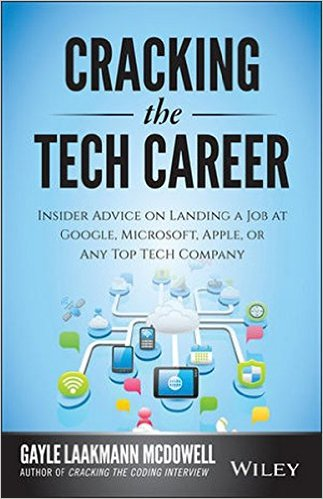

# [fit]Resumes

---

> "Most resumes are broken"
>
> — Cracking the Tech Career

---

### A good resume highlights a candidates relevant skills.

---

### It presents the candidate in the best possible light.

---

### It is the first chance to persude the reader you are the best candidate for the job.

---

# How Resumes Are Read.

^ Most people don't understand how resumes are read.

---

## Resumes aren't read, but glanced at.

^ A recruiter/screener will pick up your resume, skim it and make a snap judgement.

---

## You get 10 seconds to impress the reader.

^ Your resume must be designed to highlight your best accomplishments with only a brief skim.

---

### "Will this convince an employer to interview me?"

---

## Nine Hallmarks of a powerful resume.

^ Each and every line needs to contribute.

---

## Short and sweet

^ Many of the longest resumes are by candidates with less experience.

^ Keep your resume to one page if you have less than 10 years experience.

^ If you have more than ten  years experience, you *might* be able to justify that second page.

^ Longer resumes make you look worse.  If you add more content, but its worse content it brings down your average.

^ If something great is on the second page - the reader might miss it.

^ Avoid large blocks of text.  Readers will tend to skip over paragraphs.

---

# [fit]Accomplishment oriented

^ Resumes should highlight what you did, not what you were supposed to do.

^ Watch out for words like *contributed to, participated in* or *helped out with*. This reads more like job responsibilities not accomplishments.

---

#[fit]Quantifiable results

^ If you are going to discuss results … quantify them.

^ Quantifing results makes them meaningful by showing the impact you had.  

---

# [fit]Well targeted

^ At one time a generalized resume could be forgiven.  Now with resumes being easy to tweak and printed tailoring your resume gives you an edge.

^ The resume should be tailored to the position and to the company.

^ What does the company value?  Does it want its developers to wear many hats? Are they data focused?

---

# Targeting can be done in three ways

- Targeted to the company's product
- Targeted to the job description
- Targeted to the company values.

^ Research - website and job description.

^ Ask yourself - what are the company's biggest issues?  How would my role impact those? Even if you haven't solved the exact problem before - you might have transferable skills that one would need to solve them.

---

# [fit]Universally meaningful

^ Watch the jargon.

^ The resume should be meaningful to recruiters, managers and teammates.

^ Avoid acronyms and translate highly technical terminology to plain english.

^ It can't be perfect, but make sure everyone can get the gist of your resume.

---

# [fit]Professional

^ Many recruiters will toss your resume for a single typo.  

^ If you can't write a resume correctly, will you be able to write good e-mails and work documents?

---

## Make sure you check your resume for the following issues

- Spelling and grammar
- Consistency
- No first person
- No personal details

^ Make sure you have someone who is strong in grammar and spelling check your resume.

^ You can use either commas or semicolons to separate items on a list … but be consistant.

^End every bullet with a period or don't - but be consistant.

^ Avoid using I, me, or myself.  Use third person throughout except the objective statement which first person is expected.

^ Personal details like marital status, age or gender.

---

## Well formatted

^ If the reader can't find the information they are looking for, they are likely to toss it and move on.

---

# Formatting

- Columns
- Text Formatting
- Margins
- White space

^ Have distinct columns for your job title, companies and dates.

^ Think through how to format the text.  Small formatting changes can matter.

^ Margins should generally be .75 inches or greater - and certainly lot less than .5 inches.

^ Using ample white space will make your resume easy to read.  

---

## List your projects and extracurriculars

^ Include things that show other skills, show initiative and make you special.  

^ Don't include fluff - but include those things that show a different side of you.

---

# [fit]Be different

^ It's ok to be a little unique.z

^ Your goal is to show why you would make a great employee. 

^ Ideas - show a picture of the project you created on the resume.

---

# [fit]Structure

^ Chronological resumes tend to always have an Employment (or Work History) section and an Education section - but may also include Objective, Summary, Technical Skills or Projects.  What sections you choose depend on your skills, background and desired position.

---

# [fit]Objective

^ Objectives take up valuable space.  They are not necessary and should only be used if they add important information.

^ If you are transitioning careers, an objective might be valuable.

---

# [fit]Summary 

^ or Key Accomplishments

^ A well written summary can wow the reader, but they are usually so vague they have no impact at all.

^ Your summary should read more like key accomplishments.

---

# Work Experience

^ For many candidates this is the most important section of the resume.

---

# At a minimum should list

- Job title
- Company name
- Location
- Dates of employment.

^ Most recent job should hav eabout four or five bullets of one to two lines each.  Each bullet should focus on accomplishments, not responsibilities, and should be backed up with numbers.

---

# [fit]How far back should I go?

^ Without showing gaps - only go as far back as the positions are relevant - and no more than 3 to 5 jobs.  A resume does not need to be a complete employment history.

---

# Projects and leadership experience

^ If you have projects, you should list them.

^ For recent graduates or current students - this is a great way to diversify your resume and show some additional accomplishments.

---

# [fit]Education

---

# Should include -

- University/School name
- Dates Attended
- Location
- Major, minor, degree, certificate (if applicable)
- GPA (if applicable)
- Activities
- Related Course Work
- Awards

---

# [fit] High school almost **never** belings on a resume.

### The rule of thumb for students is: Education before work experience.

---

# [fit]Skills

---

# This is a **must** for technical positions.

# Should list

- Software
- Programming Languages
- Foreign Languages
- Other specific skills

^ It is useful to organize this list into appropriate categories.

^ Don't list obvious skills.

---

>  If you list it - make sure you can back it up.

---

# [fit]Awards and Honors

^ If you do list these, include the dates and why you received the awards.

---

> Will this be a key differentating factor between you and other candidates?

---

## How do I shorten my resume?

---

- Start from scratch.
- Cut your college experience
- Reduce time on older jobs
- Look for dangling words
- Reduce paragraphs
- Think about what matters
- Cut your objective/summary
- Evaluate a new format.

---

# [fit]Resume Action Words

^ Using strong words can give your resume a bit more oomph

---

# Questions?