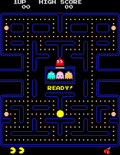
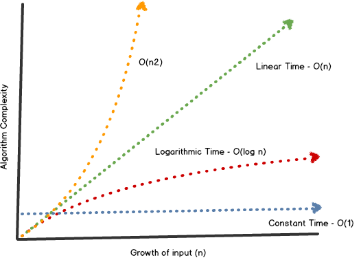

# Intro to algorithms

---

# Objectives

- Describe what an algorithm is
- Understand the vast genreral use of algorithms

---

### Algorithm (noun)

Word used by programmers when...

They do not want to explain what they did.

---

I'm  thinking of a number between 1 and a 100

---

If there were a hundred items, why didn't it take a more like fifty or a  hundred guesses?

---

Suppose you have a sorted list of 128 names.  What's the maxmimum number of steps it would take to find a name?

---

Talk and Turn: What is an algorithm?  What are some real world examples?

---

## Algorithms

- Have a goal (deterministic)
- Terminate at some point in time
- Take an input
- Produce output

---

How does the ghost in pacman know how to find you?



---

A litte math....

```
y = 5       => constant
y = x       => linear
y = x * x   => quadratic
y = log x   => logarithmic
```

---

### In order to understand Algorithm performance, you need to get comfortable with Big O Notation



