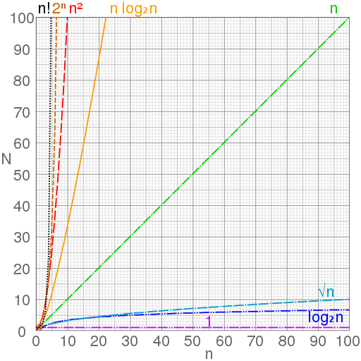

build-lists: true


# Big-O
# Notation

---

# A personal appeal
- Growing up I never imagined being a programmer or computer scientist.
- I loved video games and board games maybe too much though..
- Really enjoyed obsessing over how things would play out making decisions.
- Finding the shortest route driving across down, playing with habits and personal routines, puzzles (not actual puzzles, but life puzzles).

---

# Cont...

- Maybe you are a resourceful person who finds creative solutions.
- I don’t want to buy a canvas, so I’ll paint on a piece of wood.
- Washing underwear every week is silly, so I’m just not going to wear underwear anymore?
- Bring that mindset to computer science and programming. That is why we are here!

---


# Objectives

- Describe Big-O notation and what it represents
- Compare searching and sorting algorithms with tables and visualizations
- Explain the names and time complexity of the following giving examples of each: O(1), O(log(n)), O(n), O(n log(n)), O(n^2)

---


# Describe Big-O notation and what it represents
## Take 10 minutes using these resources and write down your answer
- [Free Code Camp: Big-O Notation](https://medium.freecodecamp.com/my-first-foray-into-technology-c5b6e83fe8f1#.r12trqao5)
- [Learn: Big-O Notation](https://learn.galvanize.com/content/gSchool/computer-science-curriculum/master/Unit-1/02-big-o-notation.md)
- [Big-O Cheatsheet](http://bigocheatsheet.com/)
- [Big-O Notation in Plain English](http://stackoverflow.com/questions/487258/what-is-a-plain-english-explanation-of-big-o-notation)
- [Wiki.C2: Big Oh](http://wiki.c2.com/?BigOh)

---

# Cold Call
- Q: Describe Big-O notation and what it represents
- A: Big O notation is used to classify algorithms according to how their running time or space requirements grow as the input size grows. "O" is for order or order of the function. This is an upper bound or worst case scenario running time.

---


# Big-O is the worst case

---


# Why is Big-O important?
- Application performance
- We are going to talk about searching and sorting next
- Interviews
- Interesting and fun

---


# Compare searching and sorting algorithms with tables and visualizations

---

# We need 8 volunteers in front of the class with their name on whiteboards!
- Unsorted linear searching O(n)
- Finding person, not finding person
- Graph inputs and outputs
- How can we make this easier?

---

### Big O searching / sorting table with _unsorted_ linear search:

| name | big O | input size | output time |
| --------- | -------- | --- | --- |
| Linear search | O(n) |  8 | 8 |

*NOTE* That input size is "n"!

---

# Sorting makes searching faster
- Sorted linear searching
- Can "short-circuit" now, but still worst case is O(n)

---

### Big O searching / sorting table with _sorted_ linear search:

| name | big O | input size | output time |
| --------- | -------- | --- | --- |
| Unsorted linear search | O(n) |  8 | 8 |
| Sorted linear search | O(n) |  8 | 8 |

*NOTE* That input size is "n"!

---

# Binary search
- Finding person, not finding person
- Discuss worst case for binary search being O(log(n))
- Remember, log is the inverse of an exponent
- Base 2 because we cut the input in half each iteration
- 2 to the what power equals 8?

---

### Big O searching / sorting table with binary search:

| name | big O | input size | output time |
| --------- | -------- | --- | --- |
| Binary search | O(log(n)) | 8 | 3 |
| Linear search | O(n) |  8 | 8 |

*NOTE* That input size is "n"!

---

# The simplest sort: bubble sort O(n^2)
- Illustrate swap with students in chair
- Show nested for loop style bubble sort
- Discuss highest "bubbling" to top

---

### Big O searching / sorting table with bubble sort:

| name | big O | input size | output time |
| --------- | -------- | --- | --- |
| Binary search | O(log(n)) | 8 | 3 |
| Linear search | O(n) |  8 | 8 |
| Bubble sort | O(n^2) |8 | ? |

*NOTE* That input size is "n"!

---

# CFU

- Remember that "n" is input size and bubble sort is O(n^2)
- Turn and talk with your neighbor
- Q: How many comparisons would take place using bubble sort with an input size of 8?
- A: Bubble sort is order n^2, so if n is 8, it would take 8^2 or 64 comparisons

---



---


# Bubble Sort Folk Dance Video

---


---

# Explain the names and time complexity of the following:
- O(1)
- O(log(n))
- O(n)
- O(n log(n))
- O(n^2)

---

# Exercise

Make a copy of [this template](https://docs.google.com/document/d/1NjiRE5sRegDawe5CdkXI3KpnNabFZn0rtunm_x9M3GE/edit?usp=sharing) and fill it out as we go.

*Note: Email me (sean.helvey@galvanize.com) your completed notes if you want to attend part 2 of this series, a searching and sorting workshop where we will practice coding these algorithms.*

---


$$O(1)$$ or *Constant Time*

Example: Accessing an element by the index.

---


Still $$O(1)$$

```javascript

function print50nums() {
  for (var i = 0; i < 50; i++) {
    console.log(i);
  }
}

```

---


$$O(\log n)$$ / *Logarithmic time*

Example: Binary Search

---


$$O(n)$$ or *Linear Time*

Example: Finding an item in an unsorted array.

---


$$O(nlg(n))$$ / *What about nlg(n)?*

Example: Mergesort & Quicksort.

---


# Mergesort Video

---


---


$$O(n^2)$$ / *Quadratic time*

Example: Bubble, insertion, selection sorts.

---

#Objectives

- Describe Big-O notation and what it represents
- Compare searching and sorting algorithms with tables and visualizations
- Explain the names and time complexity of the following giving examples of each: O(1), O(log(n)), O(n), O(n log(n)), O(n^2)
