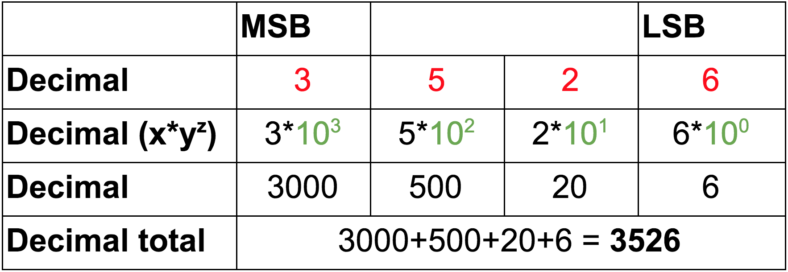

theme: Titillium, 1
autoscale: true
slidenumbers: true
<!-- @author: Pete Silva -->

## Binary, Hexadecimal, and other Numeral Systems

---

### Objectives

- Be able to convert numbers binary to decimal
- Be able to convert numbers hex to decimal
- Be able to convert numbers from any base to decimal

---

### What we know: __Decimal__

- Decimal is latin meaning "denoted by tens"
- AKA "base-10" numbering, because we have 10 possible digit values (0-9)
- While most of the world has settled on "Arabic numerals" (0-9) for counting, many cultures throughout time have used different numeral systems with different bases. For example the Mayans used a vigesimal (base-20) numeral system.

---

# Each glyph represents a different digit

Also see: [Egyptian numerals](https://en.wikipedia.org/wiki/Egyptian_numerals)

---

## "__Radix__" is another term for the "base" of a numeral system.

- So for decimal the radix is 10.
- You can have a numeral system based on any radix, so long as you have enough glyphs to denote different digits

---

### __Binary__

- Binary numbers have a __radix of 2__. There are only 2 possible digits in any position: 0 or 1
- Computers are made of IC chips which are made of billions of transistors. A transistor can only be in 1 of 2 states: __On__ (True/High/1) or __Off__ (False/Low/0). Therefore all data processed by a computer gets converted to binary numbers which sets the state of these transistors.

---

### __Hexadecimal__

- Hex numbers have a __radix of 16__. 16 possible digits: __0-9, A-F__
- Example: 0088FF
- Colors are often represented as hex numbers.
- The hex range for any color channel (RGB) is 00 - FF. In decimal thats 0 - 255, or 256 individual values for that color channel. Combine all possible values between all color channels yields 16.7 million possible colors (256\*256\*256)

---

### How

### General formula: __digit * radixposition__

- When considering the position of a digit we start counting position from the Least Significant Bit (LSB) towards the Most Significant Bit (MSB). In most numeral systems, MSB is the left-most digit. In the decimal number __1234__, the digit 1 is the most significant, while the digit 4 is least significant.

---

### How do we evaluate base-10 numbers?

---

### Binary to Decimal

---

### Hex to Decimal

---

### __Decimal to Binary__
- Start with decimal 171
- What is the largest power of 2 that fits in 171? (27=128)
- Keep subtracting away the largest powers of 2 that fit
- 171-128-32-8-2-1 = 0
- Convert to xy notation: 171-27-25-23-21-20
- Mark 1's for those positions, 0 for all others: 10101011

---
### __Radix Economy__

The larger the radix (# of different glyphs) of your numeral system, the less digits your overall number will be. So going from base2 to base10, 10101011 becomes 171. So we can experiment with even higher radices to represent large values with less digits. Hence why hexadecimal came into fashion with computers.

---

### Base 36? What glyphs are possible?

Youtube uses a radix beyond 36 to uniquely id videos while keeping the number itself short:
https://www.youtube.com/watch?v=8Aviwr73XB4

---

### Objectives

- Be able to convert a number binary -> decimal
- Be able to convert a number hexadecimal -> decimal
- Be able to convert a number from any base to decimal

[https://www.wikihow.com/Read-Binary](https://www.wikihow.com/Read-Binary)
