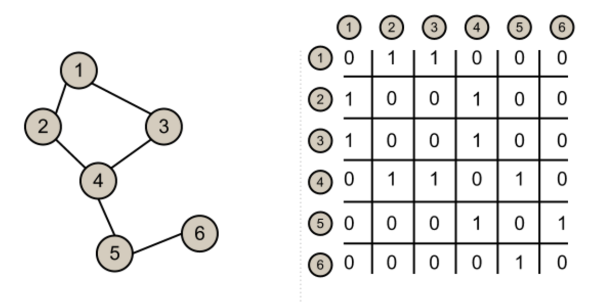

#Graphs

---

#Objectives

- Explain the structure and components of a graph.
- Identify directed vs undirected edges.
- Identify weighted and unweighted graphs.
- Identify cyclic vs acyclic graphs.
- Identify connected vs disconnected graphs.
- Create and use an Adjacency Matrix

---

#Linear Data Structures
- Array
- Linked List
- Stack
- Queue

^ Data is arranged in a sequential manner.

^ Strictly ordered ... one item follows another item.

---

**Non-linear Data Structures**

- Tree
	- A tree with N nodes has exactly (N-1) edges.
	- One edge for each parent/child relationship.
	- All nodes in a tree have a parent, except the root node.
	- All nodes must be reachable from the root
	- There must be exactly one path from the root to a given node.  

^ A tree is a hierarchical structure.

^ Not linear.

---

^Very much linked lists and trees, graphs are a collection of nodes.

^Nodes represent any kind of information and edges represent a connection between those two pieces of information.

^Edges represent a connection between those two pieces of information.

^Unlike linked lists and trees, there are no rules for how nodes can be connected.

^ In graphs any node can be both

^ connected to any node, including itself.

^ connected to any number of nodes.

^A tree and linked list are graphs with special constraints.

---

#Pros: Flexibility

#Cons: Flexibility

^Pro: Its easy to model real world systems and problems as graphs.  

^Cons: This flexibility also introduces complications when writing algorithms to solve graph problems. 

---

^Edges in graph can be either undirected or directed.

^In an undirected graph every edge can be traversed in both directions.

^In a directed graph every edge can be traversed in only one direction.

^In a directed graph every edge can be traversed in only one direction.

---

^Question: Describe the edges in this graph.

---

^Question: Describe the edges in this graph.

---

#Vocabulary

Digraph: A graph with all *directed* edges.

Undirected Graph: A graph with all *undirected* edges.

^Typically entire graph is either undirected or directed.

---

#Weighted vs Unweighted

---

^So far, we've only seen graphs where each edge has the same weight.

^In unweighted we only care if an edge exists or not.

^In a weighted graph, we assign values to each edge, which typically represents the cost of traveling between two nodes.

^Question - what is the shortest length from 1 to 2 in the left graph.(1 - you can also go at a length of 3)

^What about the right graph.  Instead of counting the number of edges - we count the edge weights.

^This makes the graphs more flexible.

^Think of maps as weighted vs unweighted.  Google maps.  Might have something to do with traveling salesman problem.

---

#Cyclic vs Acyclic

---

^A graph is said to be cyclic if you can get from any one node, back to that same node. 

^Question: Is this graph cyclic?  Nope.

^How can we make this graph cyclic?  By reversing the direction of the edge from node 1 to node 2.

^you can travel from 1 -> 3 -> 4 -> 2 -> 1, creating a cycle.

^By definition all undirected graphs all have cycles.  

^Question: What is an example of a Acyclic graph?  A Tree.

^Directed Acyclic Graphs, sometimes called DAGs, have special properties that can be explioted to make some task more efficient.

---

#Connected vs Disconnected

---

^A connected graph is a graph where you cannot divide the nodes into two sub-graphs which have no paths between them.

^A disconnected graph is a graph made out of two or more sub-graphs which do not have any paths between the sub-graphs.

^The roads in England and The United States can be modeled with a disconnected graph. 

^There are roads in England and there are roads in the USA, but there is no way to drive your car on a road from England to the USA.

---

^Directed/Undirected?
^Weighted/Unweighted?
^Cyclic/Acyclic?
^Connected/Disconnected?

---

#Adjacency Matrix

---

^An adjacency matrix is a square matrix.

^Each row represents a node, each column represents a node.

^The value in matrix[row][col] represents the edge between the row node and the column node. 

^In this image, a 0 represents no connection between two nodes and a 1 represents a connection.

---

^This is an unweighted graph, so -1 isn't a cost -- it's a way to represent the fact that there IS an edge between these nodes, but that it can't be traveled in the 2 to 1 direction.

^What's the advantage and disadvantage of using -1.

---

^How can we fix this -1 problem.  

---
#Objectives

- Explain the structure and components of a graph.
- Identify directed vs undirected edges.
- Identify weighted and unweighted graphs.
- Identify cyclic vs acyclic graphs.
- Identify connected vs disconnected graphs.
- Create and use an Adjacency Matrix.

---

#Questions?
