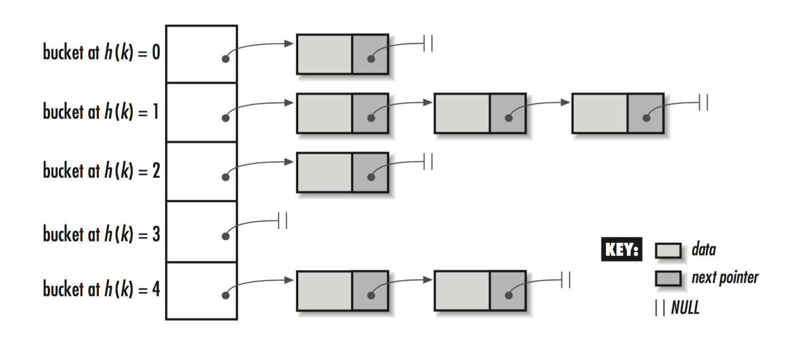

footer: Hash Table Basics
slidenumbers: true

# Hash Tables
## In pursuit of *O(1)* searches

---

- Define what a key value pair is
- Define what a hash function is
- State the big O for:
  1. Linear array searches
  2. Hashing a key
  3. Addressing an array by numeric index.
- Use hash tables for fast data lookups in *O(1)* time

---

# Case study

- Count word frequency in a large document
- Compare different storage and search strategies
  1. Unsorted linear array
  2. Hash table
- Compare execution time with data of non-trivial size.

---

# Key value pairs

    Key     |  Value  |
---------------| -----------
     "apple"   |     3
    "orange"   |     2
    "pear"     |     4

---

# An array, with hypothetcial address in memory

  Address      |      Key     |  Value  |
---------------| :-----------: | -----------: |
0x7fff5d8ccc00 |     "apple"   |     3
0x7fff5d8ccc32 |    "orange"   |     2
0x7fff5d8ccc64 |    "pear"     |     4

*...and so on*

---

# Method 1: Linear search through an array

Given a list of words `parsed_words` parsed of a document, and an array `word_counts` like the previous slide.

- for each `word` in `parsed_words`
  1. if `word_counts` contains `word` then increment the count by 1
  2. else append `word` to `word_counts` and set the initial value to 1

NB: `word` can only appear once in the `word_counts` array.

`[[word1, count1], [word2, count2], ... , [wordN, countN]]`

---

# [fit] Discuss with neighbors

- What is the Big O of traversing a list of words.

- What is the Big O of directly indexing into an array by its address?

- What is the Big O of inserting or modifying a word count in the array.

---

Direct address into array is:

$$
O(1)
$$

Hence, a linear search through an unsorted array would be (dropping constant 1)

$$
O(N)
$$

**Even if** you sorted it, and did a binary search you would still have

$$
O(log N)
$$

---

# [fit] Discuss with neighbors

If you were to do a binary search:

- You could not simply append to the list. What do you need to do instead?
- How would that slow insertion?

---

# But we can do better by using

# [fit] hash tables and hash functions

---

# What's a hash function? Part 1

$$
h(k) \to address
$$

Where

- k is a key, such a string, in our case a word to count.
- address is a memory address in an array in which to store the value
- h(k) runs in constant time

---

# What's a hash function? Part 2

*Keys can collide*
- `h('kiwi') -> 0x7fff5d8ccc96`
- `h('new zealand') -> 0x7fff5d8ccc96`

*A couple ways to deal with this.*
- Chained hash table (we'll discuss this)
- linear probing

---

# Livin' the O(1) dream

Since

- *h(k)* is constant and
- Array address indexing is constant

then you get constant time access into your hash table!

JS implements hash tables with objects.

---

# Method 2: Using a hash table

Given a list of words `parsed_words` parsed of a document, and an array `word_counts` like the previous slide.

- for each `word` in `parsed_words`
  1. if `word_counts` contains key of `word` then increment the value by 1
  2. else add key `word` to `word_counts` and set the initial value to 1

`{word1: count1, word2: count2, ... , wordN: countN}`

---

# [fit] Discuss with neighbors

- What is the Big O of traversing a given list of words?

- What is the Big O of insertion into the hash table.

---

# Now let's take a deep dive...

- Hash tables can have many considerations.
- Most of these are abstracted away from you.
- But more in depth thought is good CS and systems architecture practice.

---

When *h(k)* collides: chained hash tables [^100]

[^100]: Loudon, K. Mastering Algorithms in C. Pg. 143

---

# [fit] Discuss with neighbors

# What are the data structures in this diagram?

# Where are the bottle necks?

---

# Big O for chained hash tables, part 1:

Given the following variables, we obtain [^101]:

- *k* Table size (the size of the array)
- *n* Number of keys

$$
O(1 + \frac{n}{k})
$$

[^101]: [Wikipedia on hash table performance analysis](https://en.wikipedia.org/wiki/Hash_table#Performance_analysis)

---

# Big O for chained hash tables, part 2:

In the case of a huge table, we have

$$
k >> n
$$

which yields

$$
\frac{n}{k} \approx 0
$$

---

# But if you have

- A crappy hash function
- A small table
- A lot of collisions

Then this means something is wrong and once again, you will get.

$$
O(n)
$$

A truly sad day indeed. But you don't need to worry about that.

---

# [fit] Thankfully
## [fit] this is taken care of for you!

The point is that I wanted you to see that the analysis can go deep.

---

- Defined what a key value pair is
- Defined what a hash function is
- Stated the big O for:
  1. Linear array searches
  2. Hashing a key
  3. Addressing an array by numeric index.
- Used hash tables for fast data lookups in *O(1)* time
- Saw Rigorous Big O analysis on complex data structures
