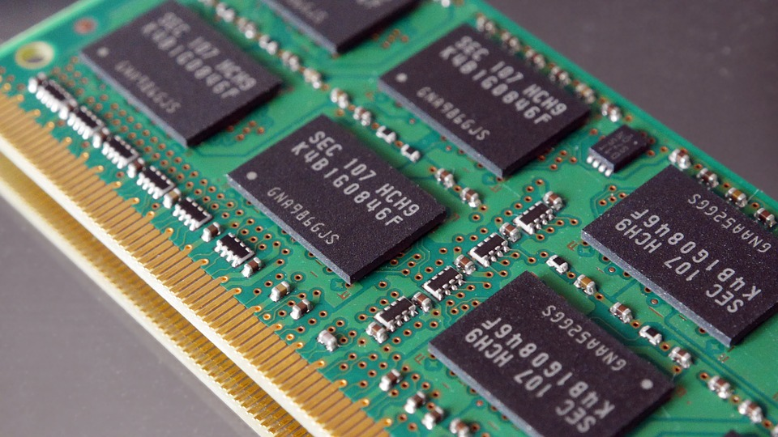

# Intro to Memory

---

### Objectives

Define and describe the purpose of:
- Heap
- Stack
- Threads
- Garbage Collection

---

#[fit]What is Memory?

^Memory refers to the "working space" a program has available to it to store values and do calculations on those values. 

^When we store strings, arrays, numbers, or objects- these items are kept in a computer's memory. 

---

^There are 4 major memory storage levels we are concerned with the first two.

---

# Internal Memory

^Processor Registers - the individual places that our processor stores small amounts of information in order to do calculations on them. 

^L0-L4 Caches, which are where larger pieces of information are stored in order to be broken down and operated upon. 

^You can't load an entire array of a few thousand numbers into this kind of storage, it would be broken down and processed in pieces. 

^We're abstracted away from dealing with this by our operating system, but in some lower-level languages (such as COBOL) we have some access to this kind of memory.  

---

# Main Memory 

^Main Memory is the level of abstraction most programmers spend time thinking about. 

^This refers to RAM (Random Access Memory) which is sometimes called Volatile Memory because it does not retain the information stored when it's not powered. 

^When your program runs, the variables and files it reads and data it's working with is stored in RAM. 

^RAM is where the Heap lives.

---

#Online Mass Storage

^Might sound like cloud storage but its not.

^This is actually "removable media" like hard disks.

^The processor does not have direct access.

^Hard disks are non-volitile.

---

#Offline Bulk Storage

^This does refer to cloud services (like dropbox), but it also refers to databases hosted on another computer or a backup service.

^Not meant to be frequently read/written to.

^The offline means it isn't physically connected to the computer.

---

#Memory Management

^High level languages - automatically manage many things.

^One of these things is memory management.

^In a langage like C or C++ you must manually allocate and deallocate memory as you use it.

^Memory Allocation really just means that you reserve some space in memory, telling the operating system to reserve that space for your program. 

---

#Garbage Collection

^Garbage collection (GC) is a form of automatic memory management. 

^The garbage collector attempts to reclaim memory occupied by objects that are no longer in use by the program. 

^Anything in memory that doesn't have a way for you to refer back to it (such as through a variable, or in a property, or as a parameter) gets deallocated, and then that memory space can be used by other programs. 

---

#Threads

^Think of thread as a line of execution.  Like the JavaScript execution stack.

^Single-threaded means the process can only do 1 thing at a time.

^Multi-threaded means the process can do multiple things at once.

---

#[fit]Stack & Heap

^Two of the most essential concepts in memory management are the Stack and the Heap.

---

# Stack

^The is the memory set aside as scratch space for a thread of execution.

^Example JavaScript Execution Stack

---

# Heap

^Memory set aside for dynamic allocation.

^No enforced pattern.

^Commonly one stack per execution thread, and one heap for the application.

---

Wilson, Mark. "​MultCloud Ties Together All Your Cloud Storage Services." Lifehacker. Lifehacker, 25 July 2014. Web. 04 Aug. 2016. <http://lifehacker.com/multcloud-ties-together-all-your-cloud-storage-service-1610906407>.