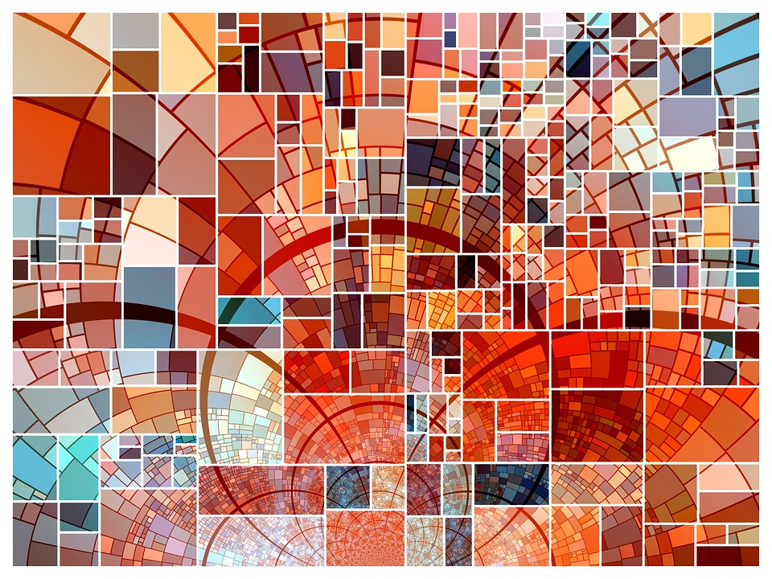
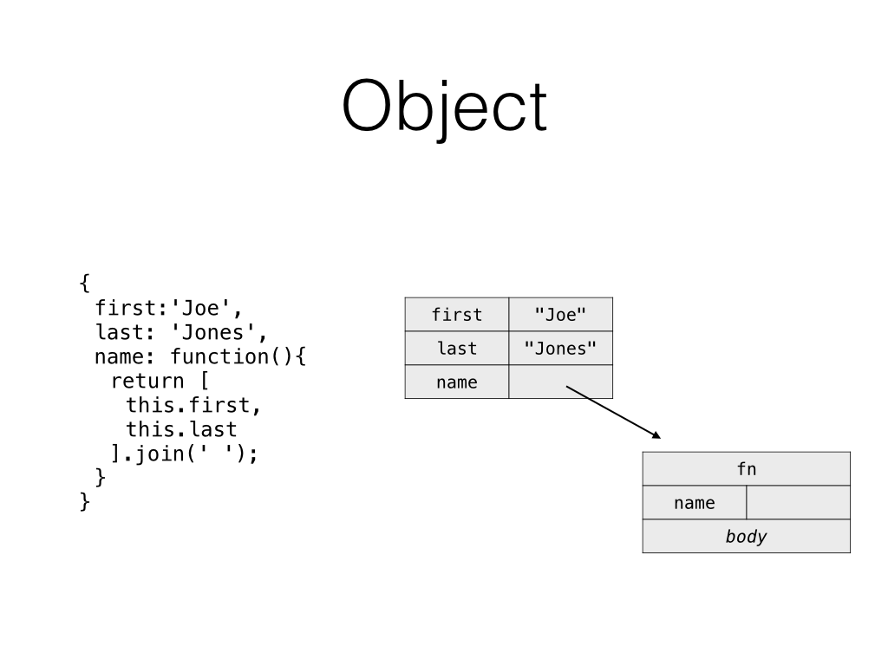
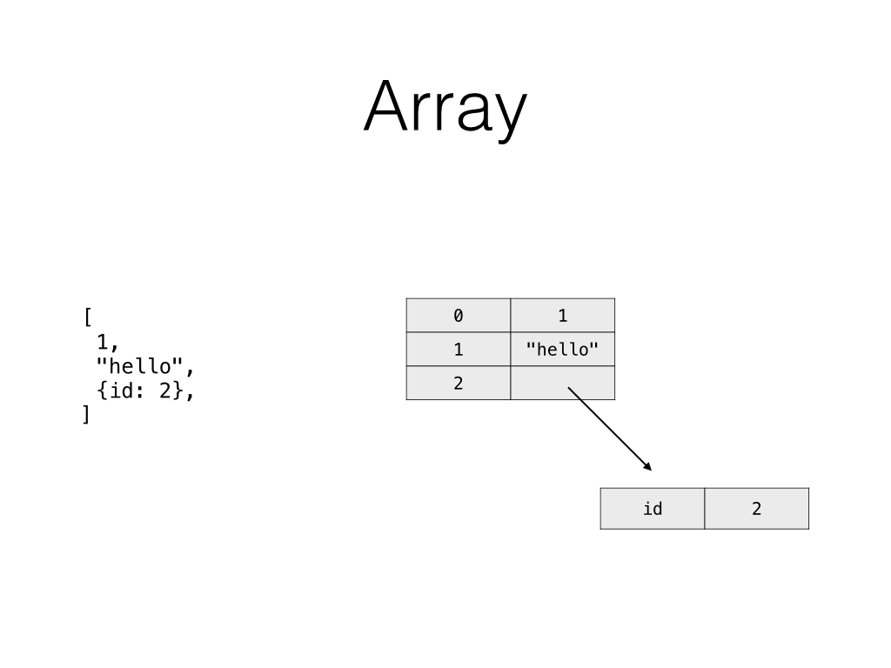
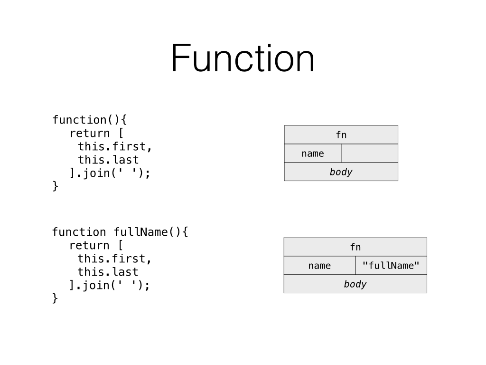
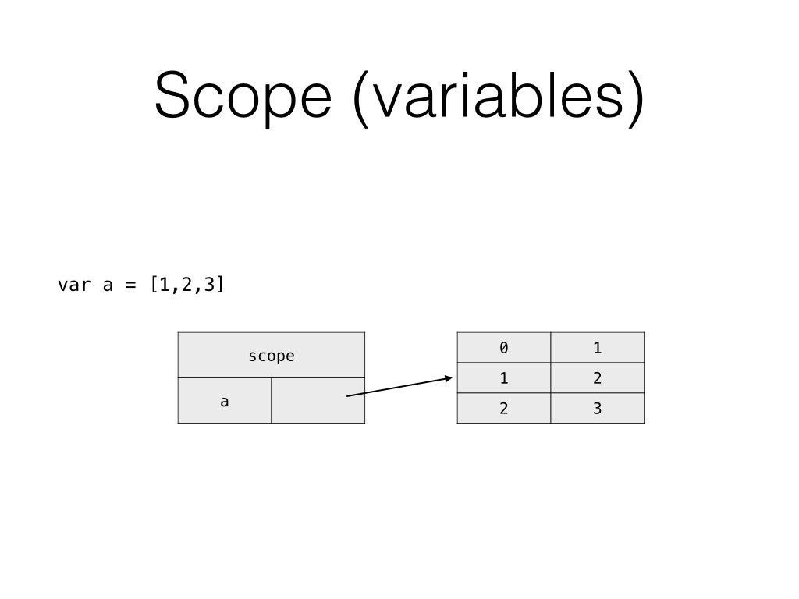
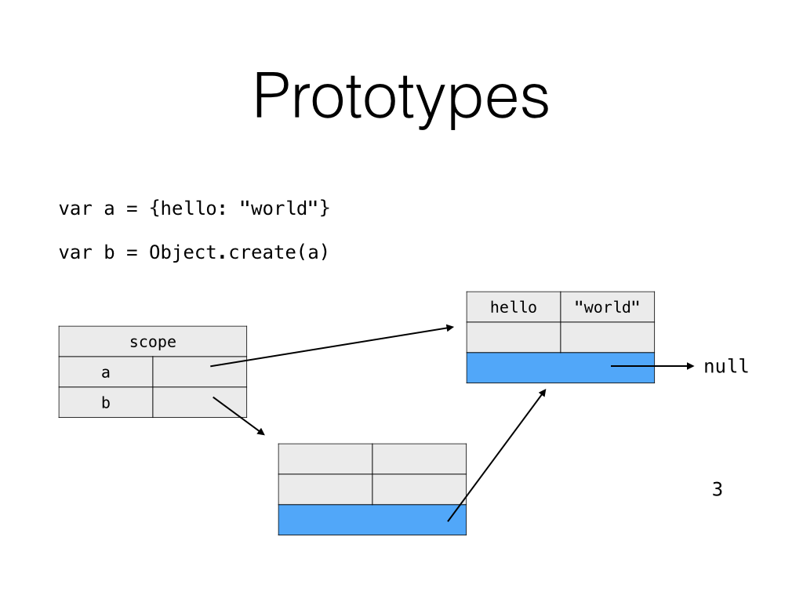
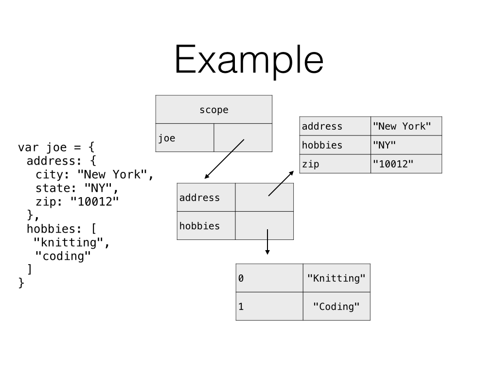

# Memory Diagrams

---

# Objectives

- Represent "static" objects, arrays, functions and variables in diagrams.

- Draw a diagram of the result of calling a function.

- Explain the difference between mutable values and immutable values.

---

# How

---



^To start, whenever you see an object, draw it as a table of key / value pairs.

^Embed immutable values (strings, numbers, booleans) in the table for brevity

^Draw mutable values (objects, and hence arrays, functions etc...) outside the table and just point to them.

---



^Arrays are just objects with specialized behaivor.

^CFU - What specialized behaivor do arrays have?

---




^If you want to make notes about the contents of the function, add the body across the bottom.

---



^Scope looks like an object.

^But since variables aren't quite as simple as objects, and you can't reference the scope directly, you'll probably want to label that one as "scope" to not be confused. Same rules apply for objects:

^embed immutable values
^point to mutable values

---



^Draw a dark line at the bottom to represent prototypes, and an arrow to point to the object's prototype.

---

```javascript

var joe = {
	address: {
		city: "New York",
		state: "NY",
		zip: "10012"
	},
	hobbies: [
		"knitting",
		"coding"
	]
}

```

---

