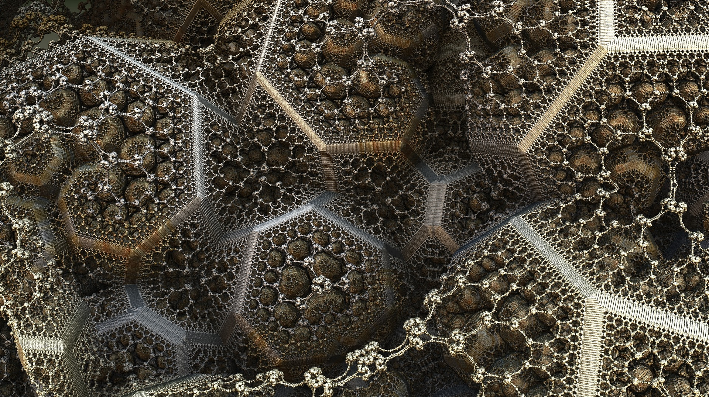
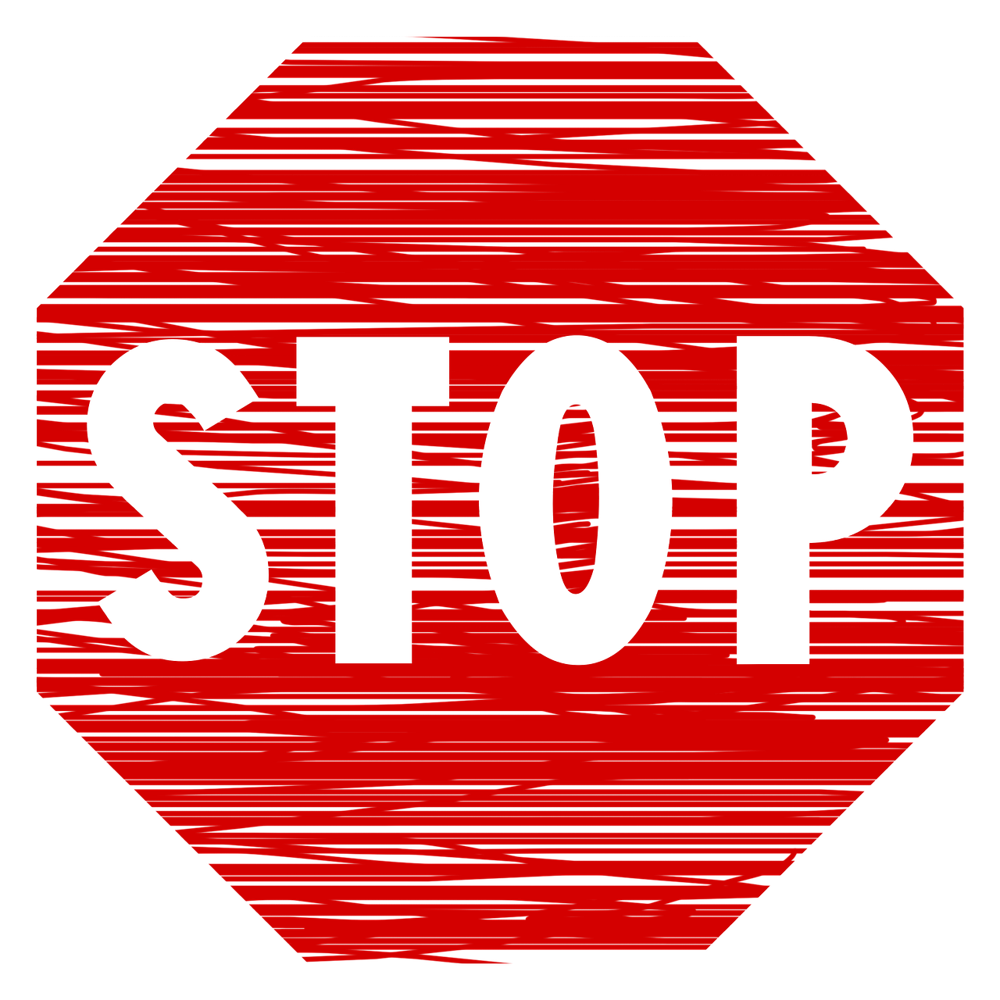
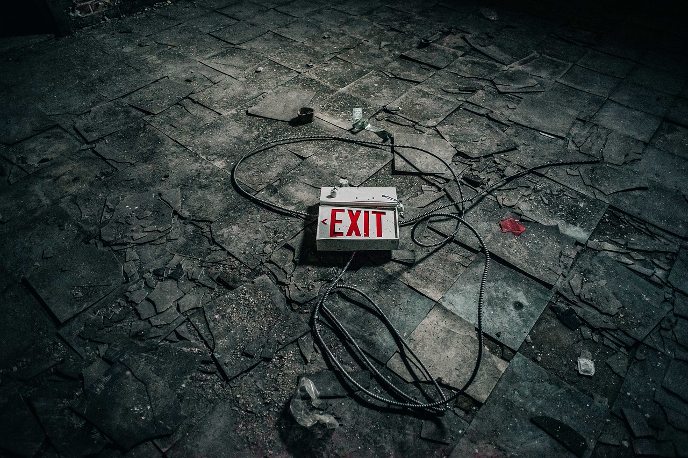
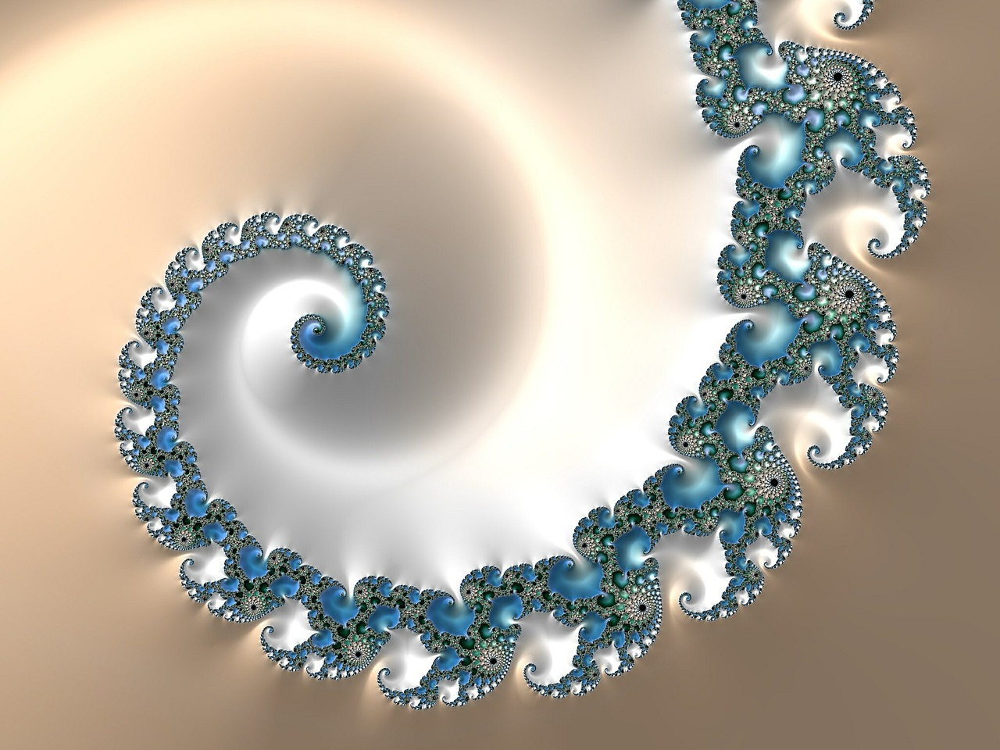
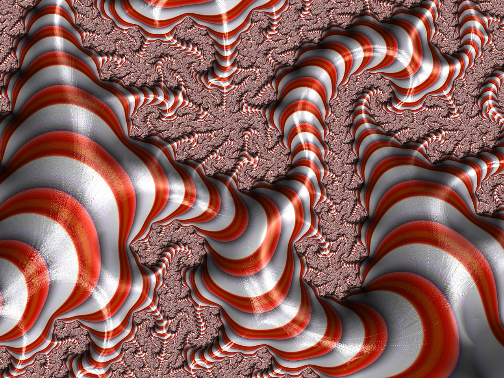

# Recursion

---

# Objectives
- Review what a recursive function is
- Explain what an exit condition is
- Explain what to pass as an argument to your function
- I do, we do, you do more :smile:

---

# What is a Recursive Function?

---

### it is a function that calls itself

^ We have been looking at recursive functions which is the first step. Now it is time to talk about how to construct a recursive function

---

# How do you STOP?

---

## Know your exit condition!
### a.k.a your base case.

---

## Same function
## Different Data

^ If you don't change the input to the function, it will never stop because nothing has changed!

---

# For Example

---

# Factorial
- 5!
- 5 * 4!
- 5 * 4 * 3!
- 5 * 4 * 3 * 2!
- 5 * 4 * 3 * 2 * 1

^demonstrate at the white board

---

# We do
### 99 Bottles of Beer

^ demonstrate in code in Atom

---

# You Try It
### Unit in Learn

