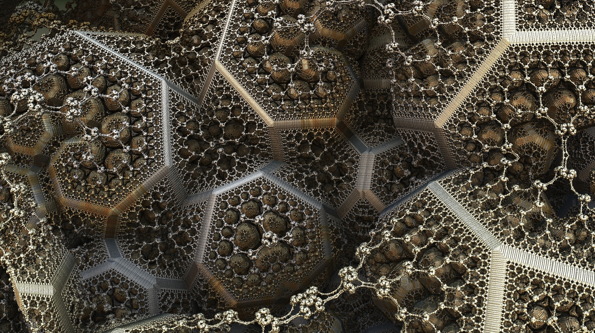

# Recursion

---

# Objectives

By the end of this lesson, you will be able to:
- Define recursion
- Explain a step-by-step process for writing a recursive solution
- Answer possible interview questions related to recursion

---

# [What is a Recursive Function?](http://lmgtfy.com/?q=recursion)

---

# Recursion

###  _n.  See recursion_

---

### it is a function that calls itself

^ We have been looking at recursive functions which is the first step. Now it is time to talk about how to construct a recursive function

---

# Steps

- Understand the problem
- Figure out the ‘base case’ and write the return statement
- Figure out which variable can be decreased
- Call the function in an else statement and pass in the variable that can be decreased

---

# Write a function to reverse a string
## Use recursion

^ Give students some time to work on the problem step by step. Check in - do they know the problem and have they come up with sample inputs and outputs. Check in - have they figured out the base case? Have them write code for just the base case. Check in - have they figured out which variable needs to be decreased or changed? Final check in - have they called the function with the new data? https://repl.it/KBsP

---

# Write a map function
## Use recursion

^ Same steps as the last problem. This one will need more time. Some students may want to use the built in map function. Point out that they should be implementing the map function. On the final step show two possible solutions. One where they return a concated recursive call and the other where they pass an accumulator. https://repl.it/KBsP https://repl.it/KCMm

---

# Possible Interview Question

1. When would you use a recursive solution over an iterative solution?  
1. What is meant by "recursive depth?"
1. What is a "stack overflow" (the concept, not the website)? And why is that relevant to a recursive problem?

^ Have students pair up to research and discuss. Possible answers - 1- If I knew the data-set will be larger than the call-stack. If recursion speaks to readability. If tail-call optimization is available. 2- How many functions deep are you? Greatest depth. 3 - If you call too many functions inside each other, you will run out of room on your call stack.
