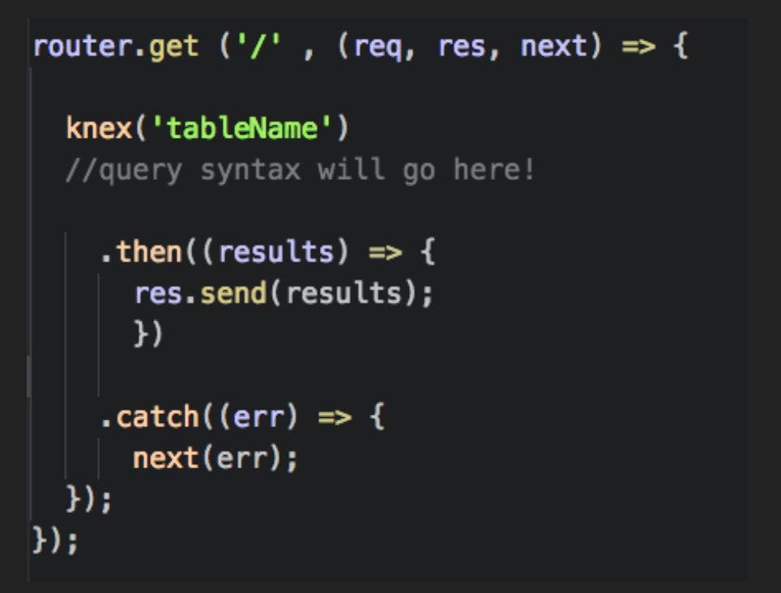
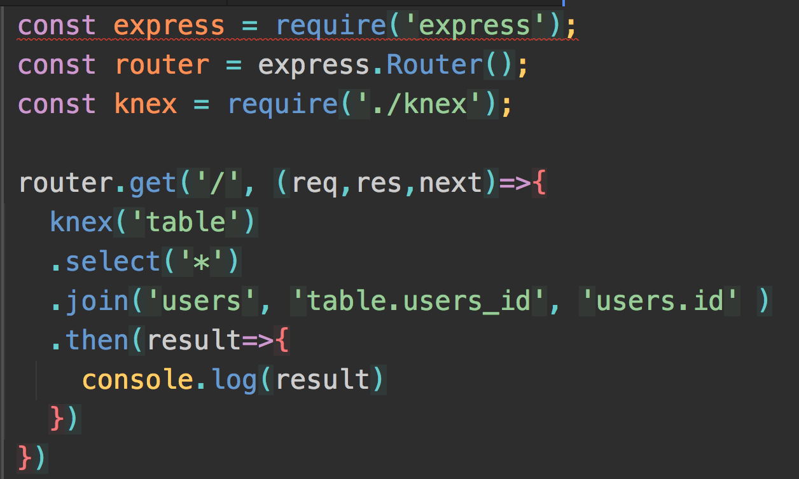
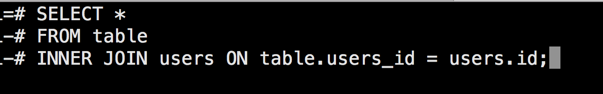

---

## Objectives

+ Understand what Knex.js is
+ Explain why we use Knex.js
+ Represent rows of a database in JavaScript
+ Create, read, update, and delete rows from a database within a server-side application
+ Respond, retrieve, and format rows from multiple tables

---

# What is Knex?

- It is a 3rd Party JavaScript library
- Builds SQL Commands (Database Queries)
- Sends database queries to PostgreSQL Database
- Catches Errors
- prevents against SQL injection attacks
- Hosted on GitHub

^ Just like jQuery builds and sends HTTP requests to an HTTP server, Knex builds and sends SQL queries to a PostgreSQL server. Just remember that jQuery runs inside a web browser while Knex runs outside a web browser using Node.js.

^A SQL injection attack occurs when user input is not filtered for escape characters and is then passed into an SQL command. This results in the potential for a malicious user to manipulate the database commands that a web application performs

---

#First some structure

```javascript
knex('movies')
.then((result) => {
  console.log(result);
  knex.destroy();
})
.catch((err) => {
  console.error(err);
  knex.destroy();
  process.exit(1);
});
```

^ you've seen most of this before. Then and Catch are promises and error handlers. The Result goes into a callback function. That function tells you to do something

^Just like how jQuery uses a promise to handle an HTTP response from an HTTP server, Knex uses promises to handle a SQL response from a PostgreSQL server. In fact, nearly all the functions in Knex return a promise as the preferred way of handling SQL responses. The main difference from jQuery is that Knex promises use the then() and catch() asynchronous functions instead of done() and fail().

---

[.autoscale:true]

#Get your pens out, we are making a checklist!


1. Install with NPM
	- ```npm install --save knex```
2. Install Node Module to use PostgreSQL database
	- ```npm install pg --save```
3. Touch knexfile.js
	- ```module.exports = {
		development : {
		  client: 'pg',
		  connection: 'postgres://localhost/movie_junkie_dev'
		}
	      };```


---

[.autoscale:true]

#Get your pens out, we are making a checklist!

4. Touch knex.js
	- define environment variable
	- require knexfile.js and connect environment variable
	- require knex.js
	
	'use strict';
	
	const env = 'development';
	const config = require('./knexfile.js')[env];
	const knex = require('knex')(config);
	
	module.exports = knex;


---

#Get your pens out, we are making a checklist!

5. Require Knex in your Route files

	- To close connection:
		+ knex.destroy()
		+ res.send(results)
	- To catch errors:
		+ .catch(err) => {console.log('error');
		+ next(err) => {console.log('error');


---

#Checklist!

6. Add a Route

7. Insert table name

8. Build out your code!



^Use the express.Router class to create modular, mountable route handlers. A Router instance is a complete middleware and routing system; for this reason, it is often referred to as a “mini-app”.

---

#So what's with the SQL

- Chain in query language inside of your code
	+ .select
	+ .insert
	+ .update
	+ .delete
- What does this remind you of?!?!


---

#JIGSAW ACTIVITY

[.autoscale:true]

- Break into groups of 4
- Each person will take one of these topics
	- select
	- insert
	- update
	- delete

- Objectives
	- functionality	
	- Arguments
	- return anything special
	- does '*' apply?
	- Whiteboard example

---

#Joins?


---

#Joins?



^Joins and knex syntax is very similar but instead of the equals sign each value is separated by a comma


---

## Objectives

+ Understand what Knex.js is
+ Explain why we use Knex.js
+ Represent rows of a database in JavaScript
+ Create, read, update, and delete rows from a database within a server-side application
+ Respond, retrieve, and format rows from multiple tables


---

#Links/Resources

[Knex Query Lab](http://michaelavila.com/knex-querylab/)
[Knex.js Docs](http://knexjs.org/)

Please go check out how to Insert, Update, and Delete data from multiple tables based on user input

As well as configure your environment for production