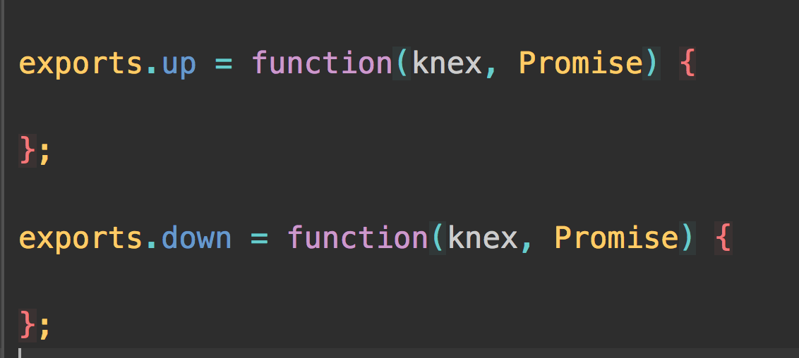
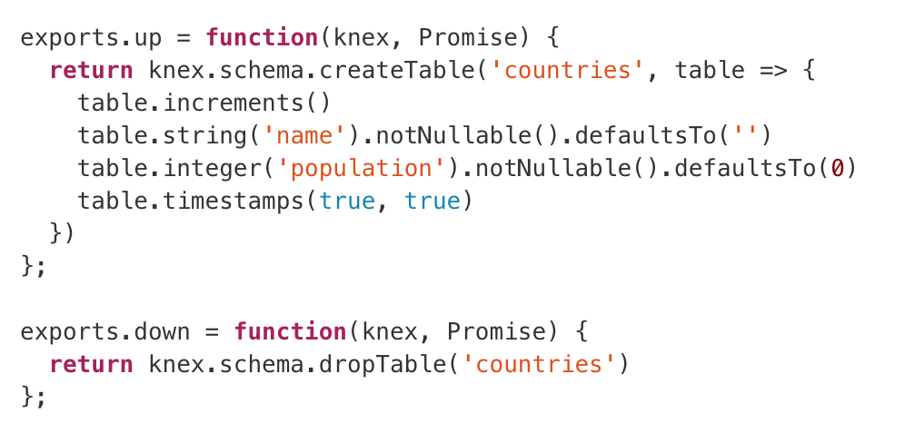
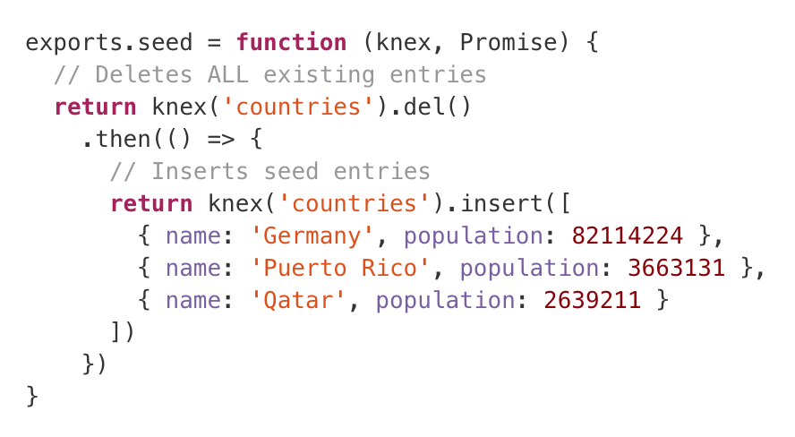
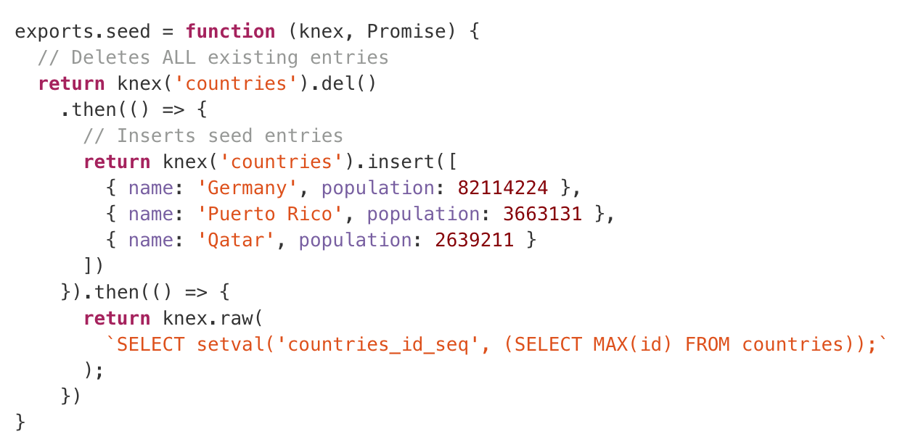
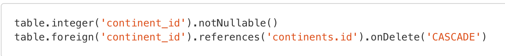

# Knex Seeds and Migrations

---

## Objectives

- Describe the purpose of migrations and seeds
- Create migrations with schema definitions for a single table
- Create seeds for a single table
- Create seeds for 1 to many tables
- Create seeds for many to many tables

---


---

# Migrations

[.autoscale:true]

- A way to handle a streamline database	across many environments
- Ensures all changes to the Schema are reproducible
	- Prevents inconsistencies from user error
	- Team can have same schema
	- Can make a change once and team will have it 
- Manages incremental changes in a schema
	-You can add, remove and change columns to existing databases
	-You don’t have to blow away a production database to change the schema
- Allows you to rollback to specific times in your schema
	-You can undo a migration if it broke your database

^Knex migrations are a consistent and convenient way to automate the management of database tables.
^ Turn and Talk and explain in your own words what you think a migration is and the benefits of using migrations

---

# Seeding
- Populate default data into a database
	- A countries table should come populated with countries
	- Any lookup table should have some lookups predefined
- Great for testing
	- Put test data into a database for testing purposes
	- Everyone can have some data to work with when developing and testing
	- Everyone can have the same data to work with when developing and testing

^When we develop on an application, we often want to test it using data. Many web applications run on user-inputted data, so developing with existing data in our development databases can allow us to manually test new features more easily.

^By creating seed files, it is easier for us to test out our applications. Simply put, they are files that add often fake data into our database. While there are scenarios where a production will require seeded data, more often than not it is only for development purposes.

---

# Creating Migrations

First install Knex
```npm install -g knex```

In package.json

```{
    "scripts" : {
	"knex": "knex"
    }
}
```

---

# Creating Migrations

On the Command Line:

- knex migrate:make **<name>**

** Make sure you run this command in your project directory**

---

# Creating Migrations

In newly created migration file



---

# Creating Migrations

Add your schema



^ The up() function will create a table with an id, a name column, a population column, and two columns to created when the record was created and when the record was last updated. The down() function will simply drop the table (i.e. the opposite of creating the table).
^ Don't forget to include the return keyword when writing Knex migrations!

---

# Creating Migrations

Lastly...

In command Line

-knex migrate:latest

^Code Along

---


---

# Seeding Data

In the command Line:
- knex seed:make **<name>**

***NOTE*** when creating table names know the order these tables may have to be joined. Your database reads them in your file alphabetically and numerically.

---

# Seeding Data



---

# Seeding Data

Lastly

- knex seed:run

---

#Seeding and IDs



^In the above slide, you are creating these ids. But if you are using these ids as foreign keys to another table when you re-run your seeds they will auto-increment and the ids will start at the net serial number that was assigned. To prevent this we use this knex command that has raw SQL in it

---

#Dealing with Primary and Foreign Keys



^ In your schema you are referencing foreign keys. The keyword in your table migration is .reference.
^ If you are join one or multiple table remember the order. The primary key needs to be created before referencing the foreign key. 
^In other words, the value of the primary key needs to be present before you can reference in another table. 
^So if you were to create a many to many relationship, your join table needs to be created after all the tables you are referencing have been created

---

#Heroku

- now let's complete your checklist for heroic

```
heroku create:addons heroku-postgresql
```

---

## Objectives

- Describe the purpose of migrations and seeds
- Create migrations with schema definitions for a single table
- Create seeds for a single table
- Create seeds for 1 to many tables
- Create seeds for many to many tables

---

# Exercise

- Will be split into pairs
- Fork and Clone Repo
- Work through skit and creating migrations and seeds
- [GitHub](https://github.com/gSchool/knex-migration-seed-music-script)
