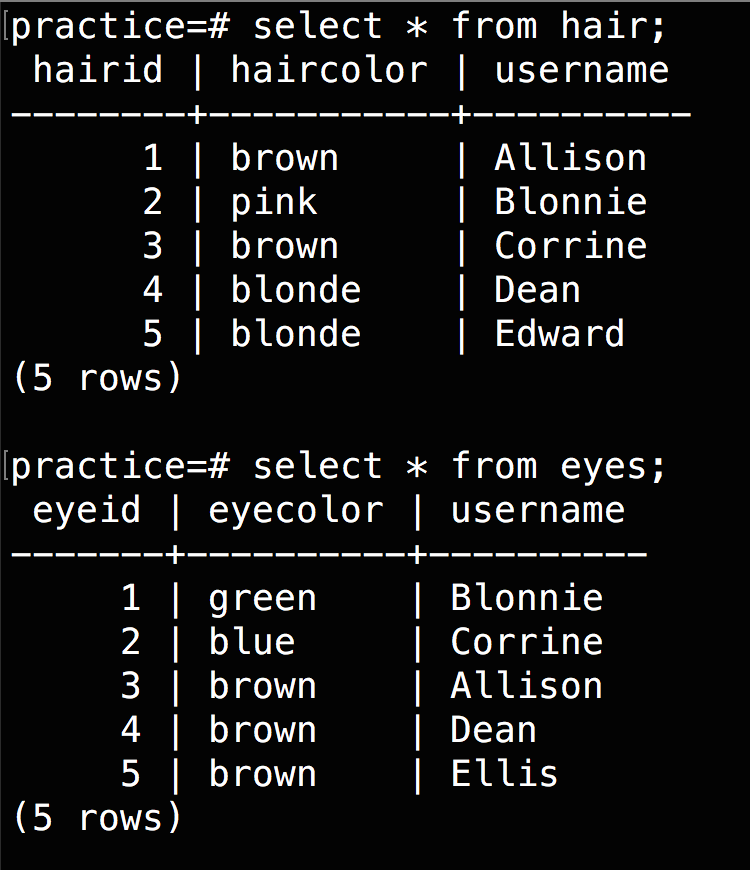
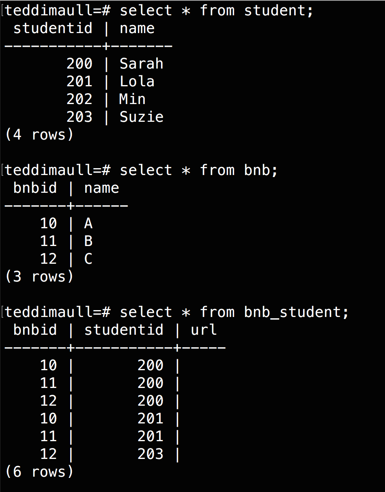

# Joins


---


# Joins are where SQL gets magical.


---

# Joins are how you utilize the relational part of the database.


---

# Without joins, your database is essentially useless


---

## Objectives

By the end of this lesson you will be able to:

- Explain what a primary key is
- Explain what a foreign key is
- Explain the difference between inner and outer joins
- Perform a join using SQL

---

# Primary Key

```sql
CREATE TABLE student(
  id    INTEGER PRIMARY KEY,
  name TEXT
);

CREATE TABLE bnb(
  bnbid    INTEGER PRIMARY KEY,
  name TEXT
);
```

^ primary key is the field that makes the record unique

---

# Foreign Key

```sql
CREATE TABLE bnb_student(
  id INTEGER PRIMARY KEY
  bnb_id INTEGER,
  student_id INTEGER,
  FOREIGN KEY(bnb_id) REFERENCES bnb(id),
  FOREIGN KEY(student_id) REFERENCES student(id),
  url TEXT
);
```
^ foreign key is the primary key that a field references from another table

---

# Inner and Outer Joins

- JOIN is equivalent to INNER JOIN and returns only what the tables have in common
- FULL OUTER JOIN returns all combinations
- a CROSS JOIN is all combinations of a single table joined with itself

---

# Left and Right

- LEFT JOIN and RIGHT JOIN are both OUTER joins and return all combinations
- Left - Returns SELECT's rows
- Right - Returns JOIN's rows
- use the WHERE clause to exclude rows

---


^ Let's talk about these:
left, left with a constraint
right, right with a constraint
inner
full outer, full outer with a constraint

---



^ -- everyone who has both eye and hair color listed
--everyone in both lists
--everyone who has a hair color listed
-- everyone who has an eye color listed
-- who do we still need an eye color for? We can't find this out by the eye table alone. We need to join the hair and eye tables to get the data we require.
-- who do we still need hair color for?


---


What will the following queries give us?

Cross Join

```sql
SELECT *
FROM hair AS hair1, hair AS hair2;
```

---


What will the following queries give us?

Inner Join

```sql
SELECT *
FROM hair INNER JOIN eyes
ON hair.username = eyes.username;
```

Full Outer Join

```sql
SELECT *
FROM hair FULL OUTER JOIN eyes
ON hair.username = eyes.username;
```
---


What will the following queries give us?

Left Join

```sql
SELECT *
FROM hair
LEFT JOIN eyes
ON hair.username = eyes.username;
```

Right Join

```sql
SELECT *
FROM hair
RIGHT JOIN eyes
ON hair.username = eyes.username;
```
---

# Join Table [Many to Many]



What if you have a join table and want to output a table that has readable information? What will the following query give us?

```sql
SELECT bnb.name
AS "BnB Name", student.name AS "Student Name"
FROM student
JOIN bnb_student
ON bnb_student.studentid = student.studentid
JOIN bnb
ON bnb_student.bnbid = bnb.bnbid;
```

---

#Review Objectives

- Explain what a primary key is
- Explain what a foreign key is
- Explain the difference between inner and outer joins
- Perform a join using SQL

---

# [Time to Practice](http://www.sqlzoo.net/wiki/More_JOIN_operations)

^ More practice - read the join article and do http://www.sqlzoo.net/wiki/More_JOIN_operations.
