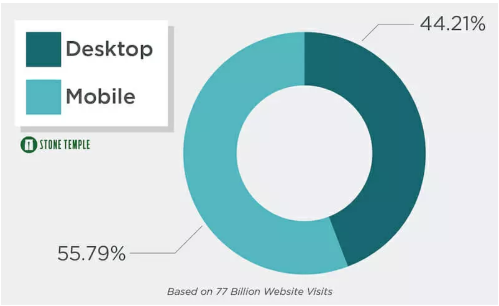

# Responsive Design

---

# Objectives
- Understand the importance of designing for multiple size devices
- Use "Mobile First" to design an app
- Identify rules for mobile UI

---

# Website Traffic Stats

---

# Mobile First
Designing for mobile is no longer a "Nice to have".  Failing to implement in a site in a responsive fashion will alienate half the audience.

---

# Discuss
- What is Mobile First Design?
- Compare SouthWest.com to mobile.southwest.com. Find 10 or more UI differences that contribute to a better mobile experience?

---

# Tips
- Right Size Graphics
- Change colors when performing action (example after click)
- Round Corners
- Focus on what the User actually needs to do an apply 80/20 rule
- Keep it Simple

---

# Tips (continued..)
- User Large easy to read Fonts with good contrast
- Pad well
- When in doubt Center
- Buttons should be large and colorful
- Be Consistent
- Review Platform UI Guidelines

---

# Pair Research (20 Minutes)
[Google - Responsive Web Design Basics](https://developers.google.com/web/fundamentals/design-and-ux/responsive/)
[Learn Layout - Media Queries](http://learnlayout.com/media-queries.html)
[MDN - Using Media Queries ](https://developer.mozilla.org/en-US/docs/Web/CSS/Media_Queries/Using_media_queries)
[CSS Tricks - Logic in Media Queries](https://css-tricks.com/logic-in-media-queries/)

---

# Objectives
- Understand the importance of designing for multiple size devices
- Use "Mobile First" to design an app
- Identify rules for mobile UI
