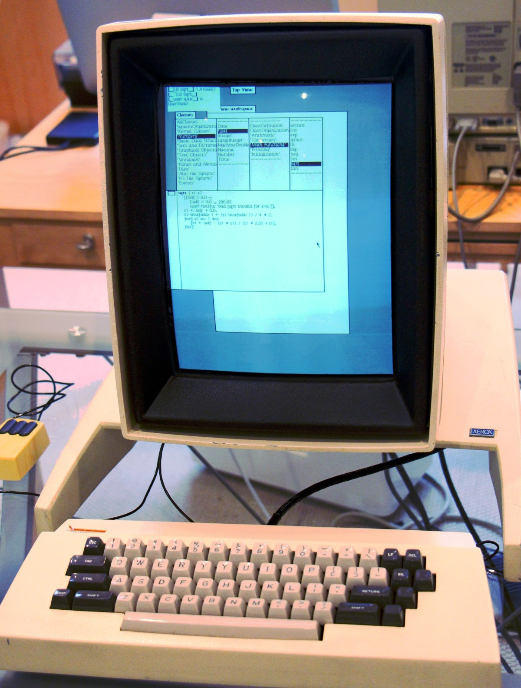
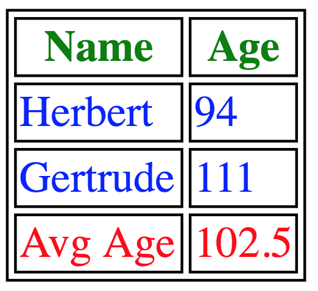

theme: Next, 1
autoscale: true
slidenumbers: true
<!-- @author: Pete Silva -->

#<HTML>

---

# Objectives

- Describe what HTML is and how it's structured
- Create valid HTML code using paragraph, heading, image, list, table and link tags
- Know which tags are self-closing or not

---

# Quick History

- __1945__: Manhattan Project collaborator Vannevar Bush publishes landmark essay __"As We May Think"__, outlining his concept of the __"Memex"__ and laying the conceptual groundwork for __"hypertext"__.
- __1960__: Project Xanadu, the first digital hypertext project


---

- __1968__: Stanford researcher Douglas Englebart gives the __"Mother of All Demos"__ where he introduces many fundamental elements of modern personal computing: graphical windows, workable hypertext, navigation, file linking, revision control, collaborative word processing, video conferencing, and the first computer mouse.


---

- __1973__: Xerox PARC creates the Alto, first computer to use a desktop metaphor (GUI)
- __1984__: Apple "borrows" the ideas of the Xerox Alto and introduces the Macintosh



---

- __1987__: Apple HyperCard: Stacks of "cards" that were similar to web pages, built visually. Very powerful.
- __1990__: At CERN, Sir Tim Berners Lee and Robert Cailliau in part inspired by HyperCard create the World Wide Web: A marriage of the ideas of URLs, HTTP, and HTML. The first HTTP server was born and the first web browser.


---

#What is HTML?

- __HyperText Markup Language (HTML)__ is the standard language to create webpages.
- HTML describes the __content__ and __structure__ to a page.
- Browsers parse and then render the HTML so that it's human-readable.

---

## Tags & Elements

* Opening tags start with a `<`, have a label, and end with `>`.
* Closing tags start with a `</`, have a label, and end with a `>`.
* Some tags are __self-closing__ and do not need a `</label>`, like `<input>` and `<br>`.

Tags come with a set of default styles defined by the browser. When tags are read by the browser, they become an HTML element.

---

__Between opening and closing tags exists optional content.__
Content can be text or other tags.

- `<p> Text content </p>`
- `<button><a> Yea buddy </a></button>`

-

We can see that by nesting tags representing elements, we get a tree-like structure (parents with children)

---

## Common Tags (Paired Discuss/Research)

* `<html>`, `<head>`, `<title>`, `<body>`
* `<div>`, `<span>`
* `<ul>`, `<ol>`, `<li>`
* `<form>`, `<input>`, `<textarea>`
* `<p>`, `<h1>`, `<a>`, ``

---

## Tables

### Easy rule: only for tabular data, like a spreadsheet. NEVER for layout.



---

```html
<table>
  <thead>
    <tr> <th>Name</th> <th>Age</th> </tr>
  </thead>
  <tbody>
    <tr> <td>Herbert</td> <td>94</td> </tr>
    <tr> <td>Gertrude</td> <td>111</td> </tr>
  </tbody>
  <tfoot>
    <tr> <td>Avg Age</td> <td>102.5</td> </tr>
  </tfoot>
</table>
```

---

## Validating HTML

You should get into the habit of using a  [validator](https://html5.validator.nu/) to inform you of incorrect HTML.


---

# Objectives

- Describe what HTML is and how it's structured
- Create valid HTML code using paragraph, heading, image, list, table and link tags
- Know which tags are self-closing or not


