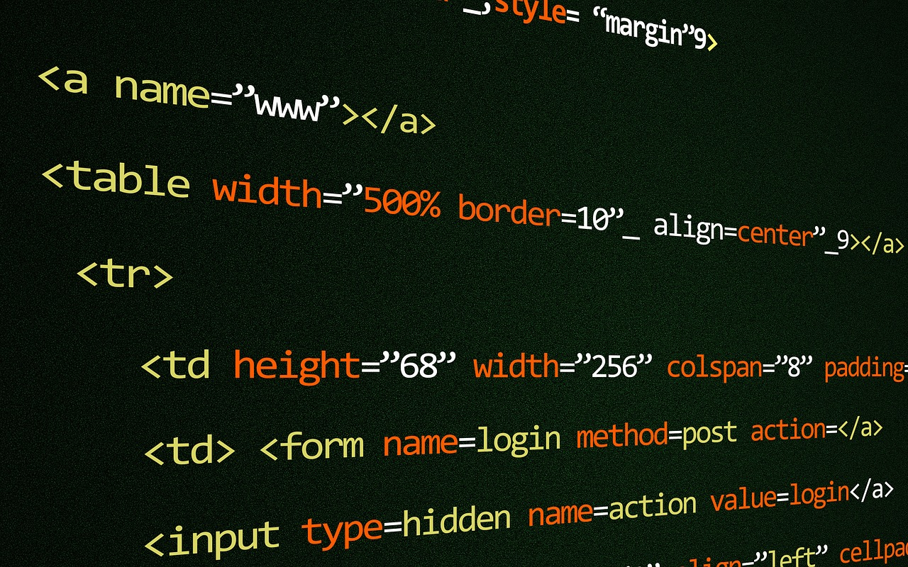

#Intro to HTML

---

#What is HTML?

- HyperText Markup Language (HTML) is the standard language to create webpages.

- HTML describes and applies structure to a page; it's the skeleton.

- Browsers parse and then render the HTML so that it's human-readable.

---

#How does HTML Fit in?

---

#Syntax

- Tags make elements (when rendered).

- Tags wrap content.

- Some tags are self-closing

- Tags have attributes.

---

#HTML Structure

- HTML can be thought of as a tree.

- Like a family tree.

- Elements can have parents (or container), children and siblings.

- Doctype <!DOCTYPE html> - self closing and servers to tell the browser what type of HTML the file is written in.

- HTML

- HEAD -> Metadata about the document.

- title

- body - the content thats displayed.
