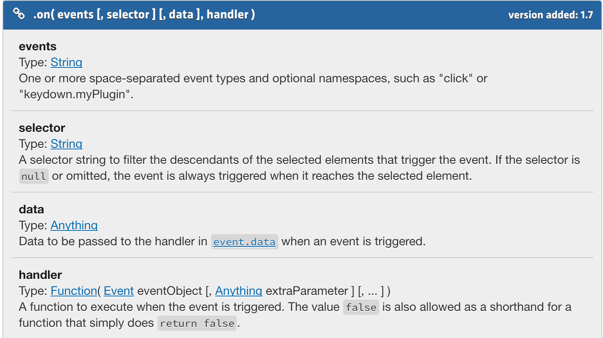
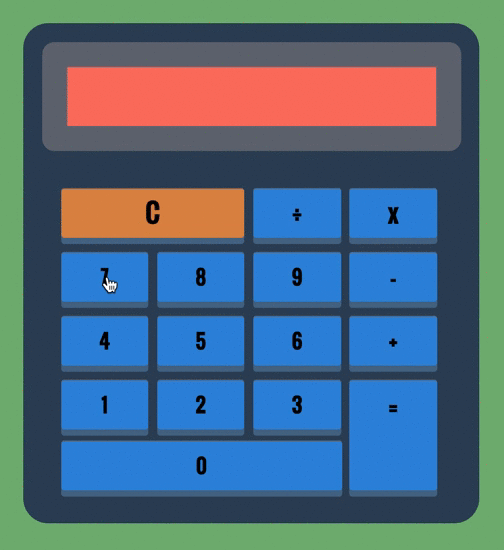

#[fit] What can jQuery do for you?
#[fit] Handle DOM Events...

---

# Objectives

- Review what jQuery events are.
- Review the on() event listener syntax.
- Dissect a project.


---

##[fit] What are Events?
## interactions that users have with the web page


---

# Why are jQuery Events Useful?
## Simple event handling.
## One method for all.

---

# Generic Event Listener Syntax: `on()`

```javascript

$(‘.this-thing’).on(“click”, function(){
	$(‘.that-thing’).show();
});

```

^ You may see the different event handlers all over the web, but the newer versions of jQuery have the generic .on event listener now.

---

# Reading the Docs



^ optional parameters are in square brackets. Parameters are named and the expected type is listed. Additional detail is provided.


---

# Make a Calculator




---

# Planning a Project

- Open the jQuery Calculator project.
- What will it take to complete?
- What don't you know how to do?
- What resources do you have at your disposal?
