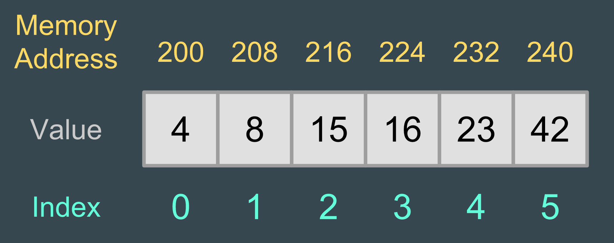

theme: Titillium, 1
autoscale: true
slidenumbers: true
<!-- @author: Pete Silva -->

# Arrays & Iteration (Loops)


-
Beyond primitive data structures

---

### Objectives


- Create and manipulate arrays
- Write a loop to iterate over an array
- Describe built-in properties/methods for arrays

---

### Array


###_Data structure that contains multiple values. We call these members._



---

### Paired research


How do we create an array in Javascript?
How do we set values in an array, and access them later?

Use the article, MDN, and Google

---

### Array creation


```javascript
var myArray = []
var myArray = ["Craig", "Alicia", "Pete"]
var myArray = new Array("Craig", "Alicia", "Pete")
```

---

### Array get/set values


```javascript
// Get at index 2
var x = myArray[2]
console.log(x)

// Set at index 2
myArray[2] = "Sally"
```
You can set an array index to any valid expression. We start counting indexes from zero.

---

### Paired research


Arrays have some handy built-in abilities. Briefly look up some examples of properties and methods available for arrays in Javascript.

**Hint:** A method is just another term for a function. A function performs an action. A property does not perform an action, typically just holds data, like a variable.

---

### Array built-in properties/methods


```javascript
myArray.length // Gives the number of members

myArray.indexOf("Pete") // Return index of a value in the array
```

---

### Array built-in properties/methods


```javascript
myArray.push("someNewValue") // Tack on new value to the end

myArray.pop() // Remove the last value and return it

myArray.shift() // Remove & return member at start of array

myArray.unshift("Platypus") // Add to front of array
```

---

### Splice vs Slice


What is the difference between

_myArray.splice()_

and

_myArray.slice()_

?

---

### Splice vs Slice


```javascript
// Remove members at a given index
myArray.splice(index, numItems)

// Return members between index range, up to but not including end
myArray.slice(begin, end)
```
- splice() modifies the original array.
- slice() does not.

---


```javascript
var myArray = ["Craig", "Alicia", "Pete", "Tara"]
var chunk = myArray.slice(1, 3)
myArray.splice(1, 2)
```
What is value of "chunk"?
What is value of myArray after calling splice()?

---

### Traversing arrays


```javascript
var myArr = [40, 50, 60, 70]
```
Given the above array, how could we add 5 to each value using loops?

---


```javascript
// myArr.length gets me # of members in array
for (var i = 0; i < myArr.length; i++) {
  myArr[i] = myArr[i] + 5
}

// or...

var i = 0;
while (i < myArr.length) {
  myArr[i] = myArr[i] + 5
  i++
}
```

---

### Objectives


- Create and manipulate arrays and objects
- Write a loop to iterate over an array
- Describe built-in properties/methods for arrays
