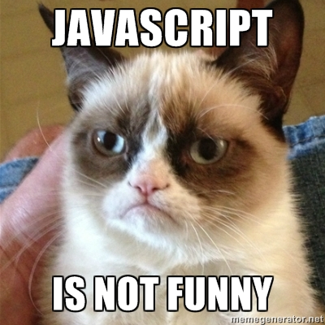

theme: Scherzkeks, 2

# Javascript Data Types and Control Flow



---

# Objectives...

---

- Use Node to execute (REPL) Javascript
- Know the Primitive data types in javascript
- Assign data to variables
- Use operators to perform calculations and create expressions
- Write control flow using if/else statements.
- Write for loops to repeat code
- Write while loops to repeat code
- Write switch statements

---

# Research with Partner (15 minutes)...

### Note: https://developer.mozilla.org "MDN" docs are the source of truth for Javascript

---

- What are the primitive data types and what is an example of each?
- What is a variable? How do you assign data to a variable.
- What is the difference between =, ==, and === in JavaScript?
- What are the falsey values in Javascript?
- How is the % operator used to check if a Number is odd or even?

---

[slides](http://slides.com/isaacmillercodes/jsexpressions#/)

---

For Loop Exercise

- Declare a variable that holds a string
- Write a for loop that uses console.log to print the string 10 times

---

# While Loop Exercise

- Rewrite your for loop with a while loop
- Hint: you will need an "incrementer" variable declared outside your loop and you will probably want to used one of these operators: ++ -- += -=


---

# Switch statement Exercise

- Rewrite this code to use a switch statement
- Save it to a file and execute your file on the command line

```
var season = "Summer"
if (season === "Summer") {
  console.log("Hot and Sunny")
}
else if (season === "Spring") {
  console.log("Warm and Sunny")
}
else if (season === "Fall") {
  console.log("Cool")
}
else if (season == "Winter") {
  console.log("Snowy")
}
else {
  console.log("Unknown Season")
}
```

---

# Slides...

http://slides.com/lizh/intro-to-javascript
http://slides.com/isaacmillercodes/js-conditionals-and-loops

