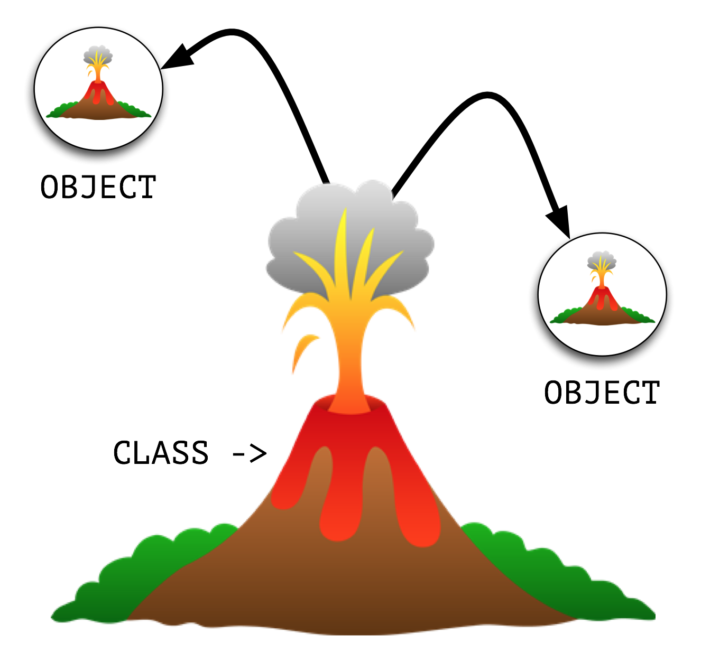
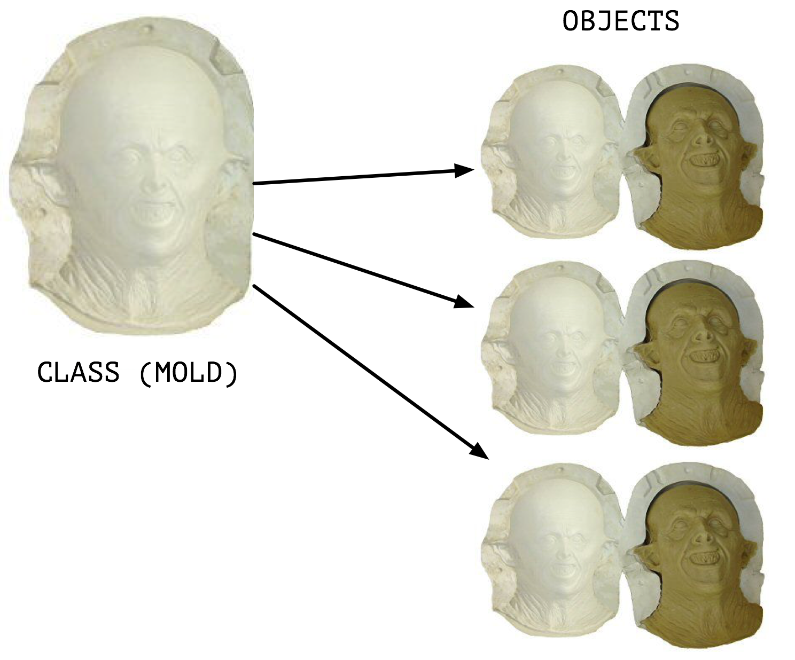
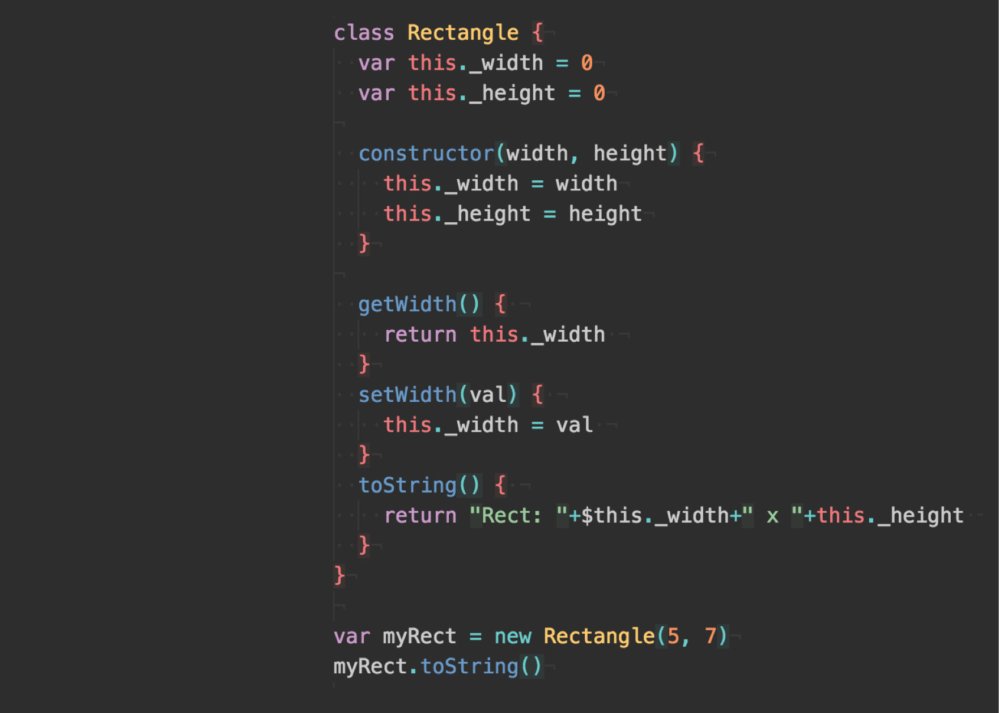
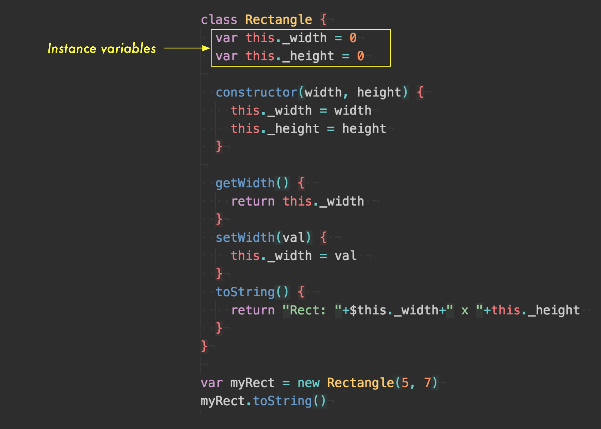
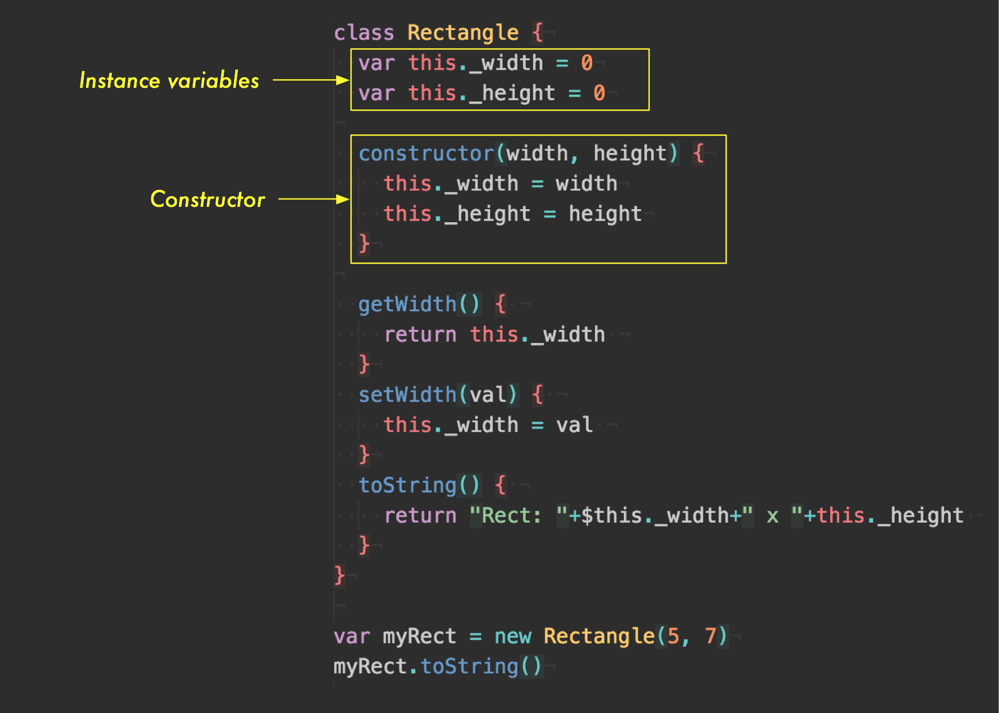
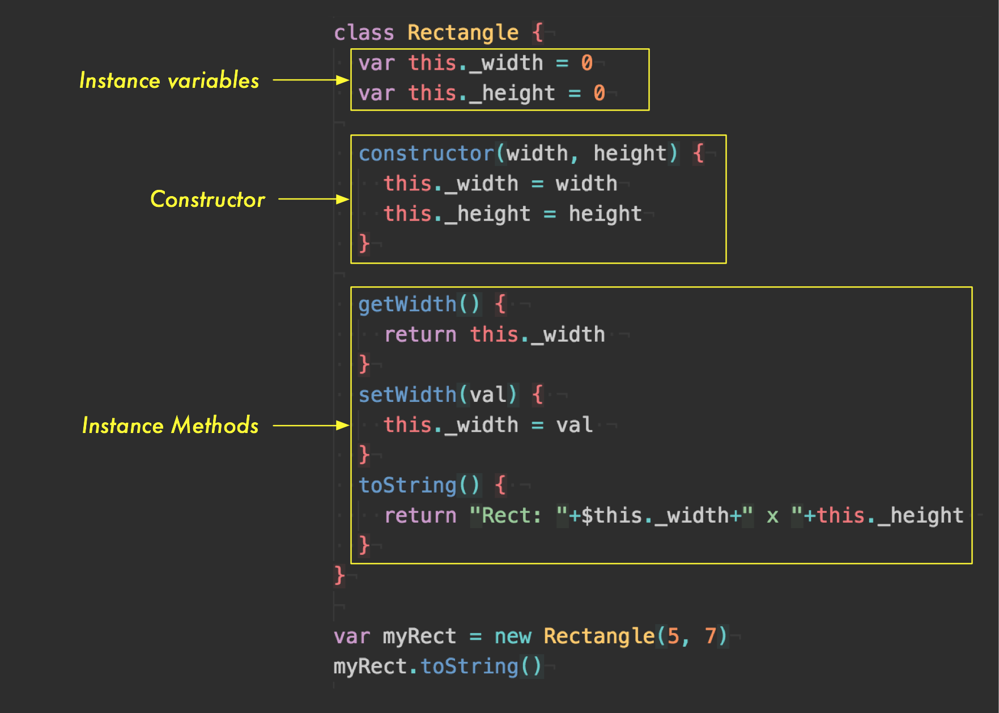
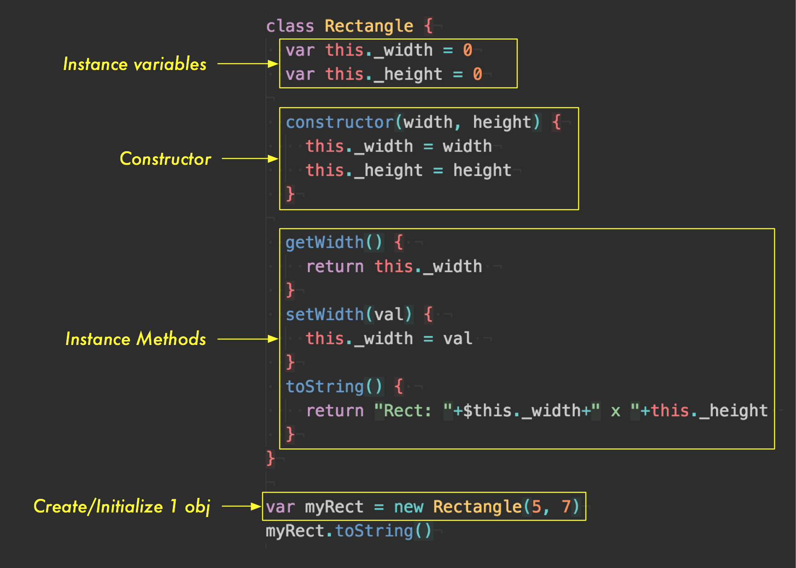
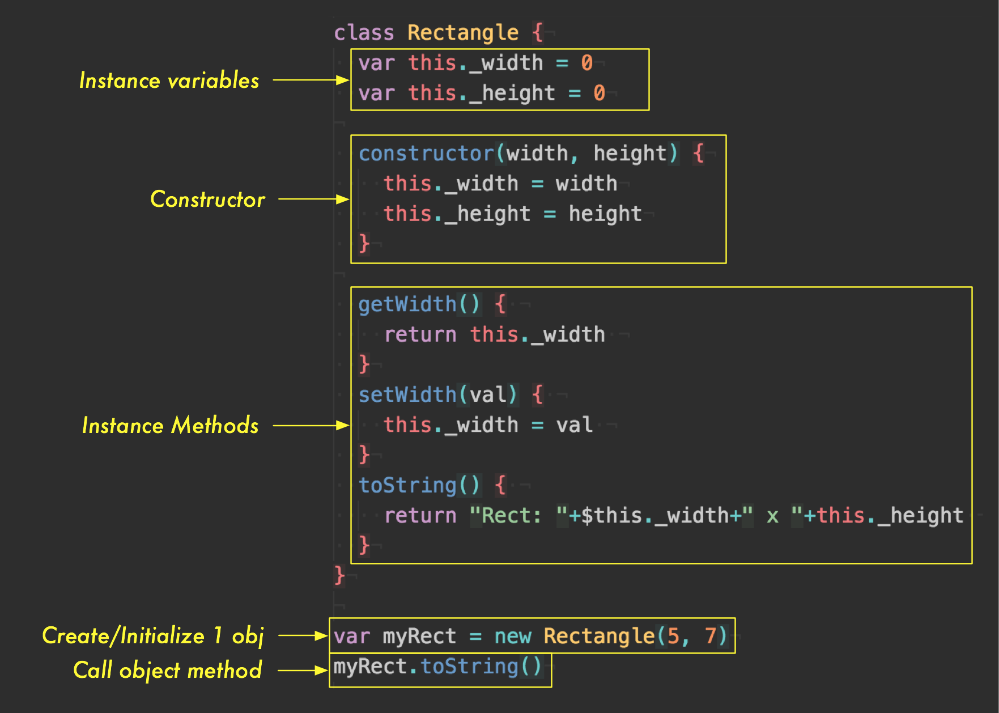

theme: Titillium, 1
autoscale: true
slidenumbers: true

## Object Oriented Programming


-
Basic intro

---

### Objectives


- Explain what programming in an Object-Oriented way means
- How to create a basic Class from which we spawn objects
- Be able to write/use a constructor function
- Be able to use keywords: class, new, constructor

_Stretch:_

- Be able to do class based inheritance
- Be able to use/explain keywords: super, extends

---

### Compare: Procedural to OO programming


Let's research together the differences

---

### What's an object?

Objects are key to OOP. Look around right now and you'll find many examples of real-world objects: your dog, your desk, your television set, your bicycle.

Real-world objects share two characteristics: They all have state and behavior. Dogs have state (name, color, breed, hungry) and behavior (barking, fetching, wagging tail). Bicycles also have state (current gear, current pedal cadence, current speed) and behavior (changing gear, changing pedal cadence, applying brakes). Identifying the state and behavior for real-world objects is a great way to begin thinking in terms of object-oriented programming.

---

### OOP, Why? Advantages?


Bundling code into individual software objects provides a number of benefits, including:

1) Modularity:

The source code for an object can be written and maintained independently of the source code for other objects. Once created, an object can be easily passed around inside the system.

---


2) Information-hiding:

By interacting only with an object's methods, the details of its internal implementation remain hidden from the outside world.

---


3) Code re-use:

If an object already exists (perhaps written by another software developer), you can use that object in your program. This allows specialists to implement/test/debug complex, task-specific objects, which you can then trust to run in your own code.

---


4) Pluggability and debugging ease:

If a particular object turns out to be problematic, you can simply remove it from your application and plug in a different object as its replacement. This is analogous to fixing mechanical problems in the real world. If a bolt breaks, you replace it, not the entire machine.

---

### Visually

Classes "spawn" or "instantiate" objects. Classes are like a mold, and from that mold we bring into existence, objects.

---



---



---

### Paired Research


In your own words,
what is a constructor?

---

### Anatomy of JS classes

- Instance variables
- Constructor method
- Instance methods
- _
- Create + initialize object (invoke constructor)
- Invoke object methods

---



---



---



---



---



---



---


---

### JS (ES6) Class Syntax


[https://codepen.io/peternsilva/pen/eRmwzw](https://codepen.io/peternsilva/pen/eRmwzw)

---

With a partner, let's write a class for a Person

```javascript
class Person {
  constructor() {
    // what's a person have
  }
  // what's a person do?
}
```

---

### Inheritance


---

More like this...


---


Subclasses inherit properties
and methods from parent classes


---

### Inheritance


In a subclass' constructor, always call "super()" first.

This special function call, calls the superclass' constructor.

It connects the "this" keyword to also refer to props/methods of the superclass.

---

### Inheritance Example


[https://codepen.io/peternsilva/pen/xrbvVX](https://codepen.io/peternsilva/pen/xrbvVX)

---

### Sidenote


Objects are implemented atop native JS "prototypes". For now think of protoypes as a similar concept to classes, but with different syntax. Facilitates inheritance.

---

### Objectives


- Explain what programming in an Object-Oriented way means
- How to create a basic Class from which we spawn objects
- Be able to write/use a constructor function
- Be able to use keywords: class, new, constructor

_Stretch:_

- Be able to do class based inheritance
- Be able to use/explain keywords: super, extends
