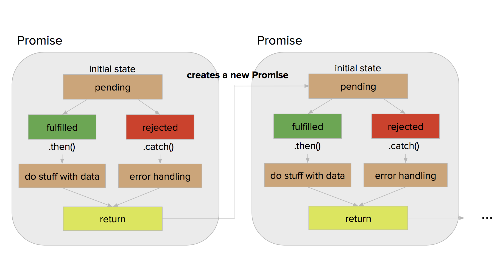

# Promises

---

# Objectives

- Explain what a Promise is
- Explain the difference between rejected and resolved
- Use the catch method to handle errors
- Identify when to chain Promises
- Identify when to use Promise.all


---

# Promise

A promise is an object, which will be fulfilled at some (usually uncertain) time in the future. Promises also have a then method, which executes once the promise is fulfilled and have access to the fulfilled promise's data.


---

# Part of it is done

You will typically use promises that are created for you rather than creating your own using the Promise constructor.

---


# States of a Promise: Three states

- Pending - initial state
- Resolved - operation completed successfully
- Rejected - operation failed

---



---

# Pending
### The promise has not been resolved or rejected

---

# Resolved
### Use .then to get the results or it's still just a Promise object


```JavaScript
greet(true)
.then(result => console.log(result))
```

---

# When a Promise is Rejected
## Use .catch to catch it!

```JavaScript
greet(true)
.then(result => console.log(result))
.catch(err=> console.log(err)) //catch that error!
```

^ explore playground/greetPromise.js with a partner

---

# Promises are Composable

####First a contrived example ;)

```js
add()
  .then(result => result) //returns 1
  .then(result => result + 1) //returns 2
  .then(result => result + 10) //returns 12
  .then(result => console.log(result)) //logs 12
  .catch(err=> console.log(err))
```

---

# Something a little more realistic

```js
getAnimals()
  .then(animals => {
    let randomAnimal = animals.data[getRandomInt(0,4)]
    return getQuote(randomAnimal)
    })
  .then(result => {
    console.log("random quote:",result.data[0])
    })
  .catch(result => console.log("random quote error:", result.response.data))
```
---

# I don't care what order you do it in, just get it all done
### Promise.all

---

# Promise.all

```js
Promise.all([greet("Alex"), greet("Eliza"), greet("Philip")])
.then(results => console.log(results))
.catch(results => console.log(results))

```

^ explore playground/greetPromiseAll.js with a partner

---

# Promises are an idea
## the implementation may be different

- ajax
- axios
- knex
- native Promises

^look at the docs for exact syntax

---

# Review Objectives

- Explain what a Promise is
- Explain the difference between rejected and resolved
- Use the catch method to handle errors
- Identify when to chain Promises
- Identify when to use Promise.all
