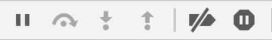

# [fit] Javascript Errors

---

# Objectives

- Identify and resolve common JS errors by reading a stack trace and identifying the cause of the error
- Catch exceptions using a try...catch block and handle them
- Explain the 6 debugger actions (resume,step over, step into,step out,breakpoints, exceptions).

---

# TypeError

Thrown when a variable or parameter is not of a valid type. For example:

```javascript
var person;
person.name;
// Uncaught TypeError:
//Cannot read property 'name' of undefined
```
---

# SyntaxError

Thrown when the JavaScript syntax is wrong. For example:

```javascript
var greet = function {
  console.log('Hello world');
};
// Uncaught SyntaxError: Unexpected token {
```
---

# ReferenceError

Thrown when attempting to access something that has not been declared. For example:

```javascript
wishfulThinking();
// Uncaught ReferenceError: wishfulThinking
// is not defined
```

---

# RangeError

Thrown when the maximum call stack size is exceeded. Like when a recursive function calls itself too many times. For example:

```javascript
var factorial = function(n) {
  if (n === 1) {
    return 1;
  }

  return n * factorial(n - 1);
}

factorial(30000);
// Uncaught RangeError: Maximum call stack size exceeded

```
---

# Try...catch

```javascript
try {
    var arr = new Array[-1]; // Throws RangeError
}
catch(err) {
    console.log(err); // This IS the RangeError
}
```

---

#[fit] Chrome Developer Tools

^logging is putting console logs in your code, debugging is setting break points and stepping through your code

---

#[fit] Elements tab

- look at the DOM & styling
- make changes to HTML and CSS in real time


---


---

#[fit] Console tab


- see errors
- test JS

---


---

#[fit] Networks tab


- see if elements have loaded
- see request/response

^(useful in quarter 2)

---


---

#[fit] Sources tab


- view the code your page has loaded
- add break points and inspect variables

---


---

# Debugger Actions


- **resume** - resume execution until the next breakpoint
- **step over** - run highlighted line then step over to the next line of code
- **step into** - go down into whatever function is being called
- **step out** - return from the current function and go to its caller



---


# Debugger Actions

- **breakpoints** - deactivate all breakpoints in the code
- **exceptions** - pause on an exception


---


# [Debugging Activity](https://github.com/gSchool/identify_and_fix_common_js_errors_assessment)
