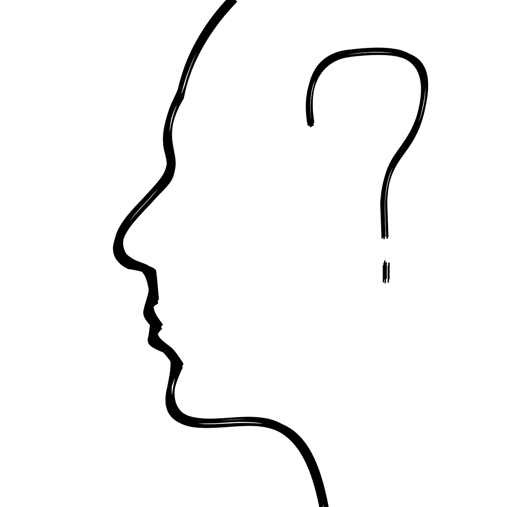

### [fit]What's `this`?

---

>  `this` is the current execution context of a function.

---

# 4 function invocation types:

- function invocation
- method invocation
- constructor invocation
- indirect invocation

---

# Function Invocation

^ function hello(name) {    return 'Hello ' + name + '!';}

^ this is the **global object** in a function invocation.

^ this` is **undefined** in a function invocation in strict mode.

^ 2.3. `this` in an inner function

---

# Method Invocation

^ A **method** is a function stored in a property of an object. 

^ `this` is the **object that owns the method** in a method invocation

---

# Constructor Invocation

^ `this` is the **newly created object** in a constructor invocation

---

# Indirect Invocation

^ **Indirect invocation** is performed when a function is called using `myFun.call()` or `myFun.apply()` 

^ `this` is the **first argument** of `.call()` or `.apply()` in an indirect invocation

---

# Arrow Functions

^ `this` is the **enclosing context** where the arrow function is defined

^ Where its defined, not where its used.

---

# Questions

