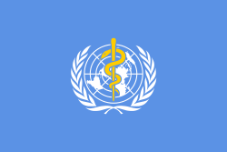

#[fit] Checklists

#[fit]Learning to Learn

---

# [fit]Checklists are for

# [fit]everyone

- **Pilots**
- **Investors**
- **Surgeons**
- **etc**

---

---

# [fit]Checklists Save Lives

---

## **A year-long study was commissioned to study checklist safety outcomes.**

---

## **The study was led by researchers from the Harvard School of Public Health in collaboration with the World Health Organization.**

---

## **The rate of major complications in the study operating rooms fell from 11% to 7% after introduction of the checklist, a reduction of more than one third.**

---

## Deaths following major operations fell by more than 40 percent (from 1.5% to 0.8%) with implementation of the checklist.

---

> **Why doesn’t everyone use them?**

---

# [fit]**Checklists Are Magic!**

---

# Two kinds of checklists 

- **Read-Do**
- **Do-Confirm**

---

# Tips

- **Keep it simple.**
- **Make it usable. (like in a format you can actually check off)**
- **Iterate when necessary.**

---

# Questions?