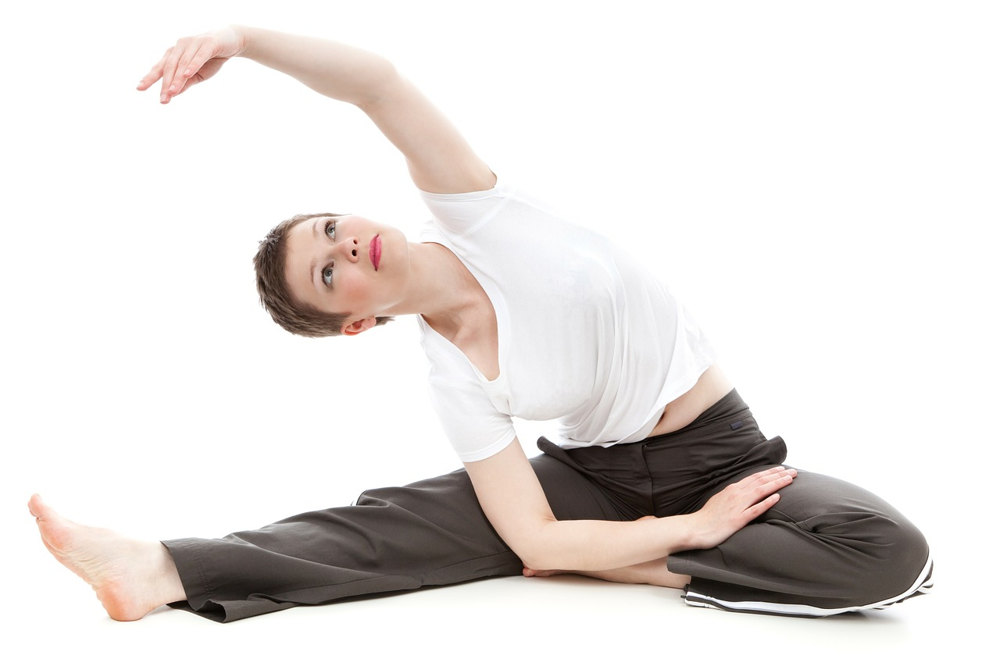
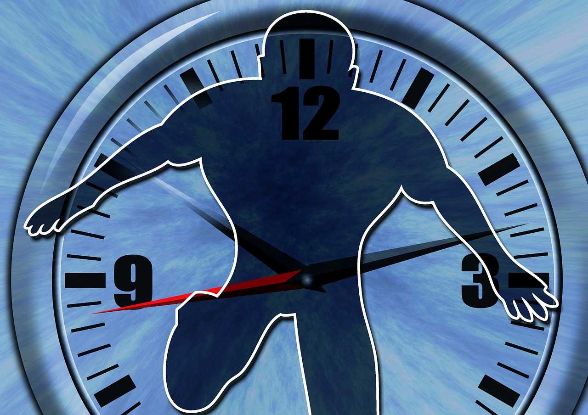

# Deliberate **Practice**

---

# What is **deliberate practice**?

^ Drilling

^ Challening yourself to get a little better every day.

---

# Set a **stretch** goal

^ Something just beyond your reach, but attainable with effort.

---

# Focus

^ Block out all distractions

---

# Seek **Feedback**

^ Experts are more interested in what they did wrong, rather than what they did right.  

^ Feedback should be immediate and informative. 

^ It needs to be diagnostic.  It should pin-point aspects of performance to work on.

---

# **Reflect** and **Refine**

^ Reflect on what has been learned, and what needs more work.  Take that knowledge and repeat deliberate practice until the goal is achieved.

---

# Set a **new** stretch **goal**.

