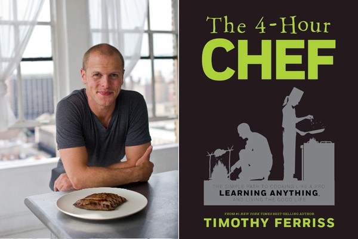
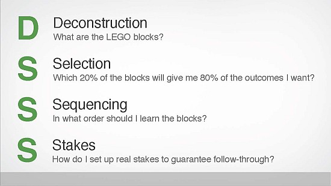

# DiSSS and CaFE

---

Tim Ferriss’ frameworks for mastering new information-based topics

___

# DiSSS

1. Deconstruction
1. Selection
1. Sequencing
1. Stakes

---

1. D for Deconstruction.

What is the minimum useful unit of knowledge?

For a foreign language, it would be a word.

---

2. S for Selection.

What 20% of those minimum units will lead to 80% of your desired outcomes?

For cooking, it would be basic knife handling skills.

---

3. S for Sequencing.

What’s the most effective order for learning these units?

For cooking, most cookbooks have the wrong sequence for beginners, since what newbie really wants to cook 6 chicken dishes in a row?

---

4. S for Stakes.

What psychological and social mechanisms can you setup for discipline and motivation?

For example, you could publicly announce your goal and a deadline, and have your friends keep you accountable.

---

# CaFE:

1. Compression
1. Frequency
1. Encoding

---

1. C for Compression.

Can I compress the most important 20% into an awesome cheatsheet?

---

2. F for Frequency.

What is the best duration and frequency, knowing my personal limits and goals?

Setup a SCHEDULE. 5 minutes/day won’t do squat since you’ll barely warm up your brain before time’s up.

---

3. E for Encoding.

How do I create mental anchors & tricks to make sure I remember stuff? "CaFE" and "DiSSS" are great examples of an encoding

---

Credit: http://www.kevinhabits.com/disss-and-cafe-tim-ferriss-approach-to-quick-mastery-of-any-topic/