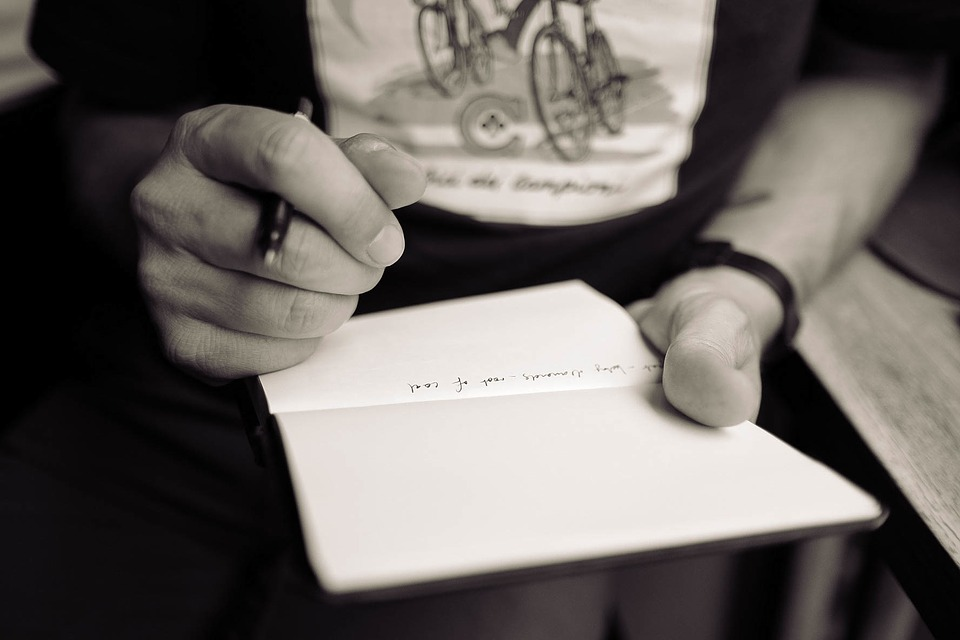
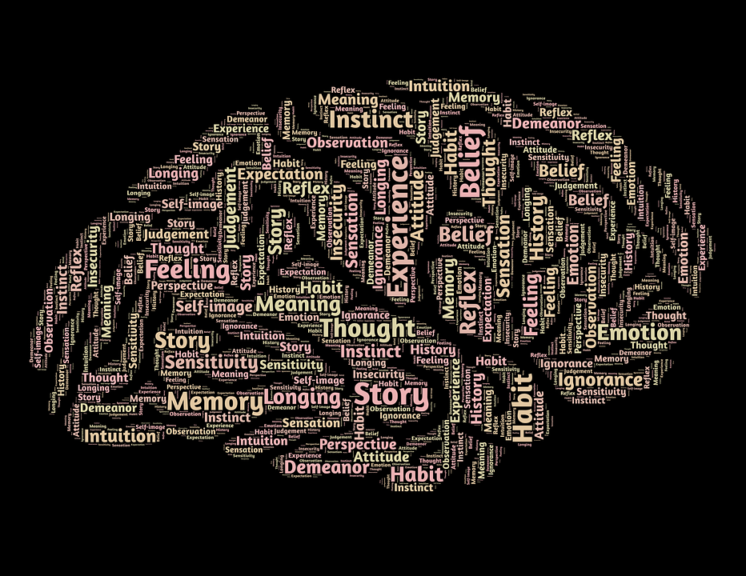

# [fit]Learning
# [fit]To Learn
# [fit]Handwritten Notes

---

>Students who used longhand remembered more and had a deeper understanding of the material.[^1]

[^1]: May, Cindi ["A Learning Secret: Don’t Take Notes with a Laptop"] (http://www.scientificamerican.com/article/a-learning-secret-don-t-take-notes-with-a-laptop/) *Scientific American*

---

> Multiple studies have demonstrated this.[^2]

[^2]: Muller, Pam A., Oppenheimer, Daniel M. ["The Pen Is Mightier Than the Keyboard"] (http://pss.sagepub.com/content/25/6/1159) *Psychological Science*

---

> One group of studies included hundreds of students from Princeton and UCLA.

---

> Students were given a lecture where some students typed notes, and other students wrote notes.

---

> The students were later tested to evaluate retention.

---

> Some studies did immediate tests.  

> In other studies testing was delayed a week and students were allowed to study their notes.

---

> In every scenario the group that hand wrote notes retained more information.

---

---

# [fit]Taking notes by hand

# [fit]requires different types

#[fit] of cognitive processing

#[fit] than taking notes on a laptop.

#[fit]

#[fit] Those different processes
#[fit] have consequences for learning.

---

> Writing by hand

> Is slower.

> More cumbersome.

> But requires you to listen, digest and summarize content.

---

> Handwriting engages the brain.

---

> Typing allows you to capture content without much thought.

---

