#[fit] Learning
#[fit] To Learn

---

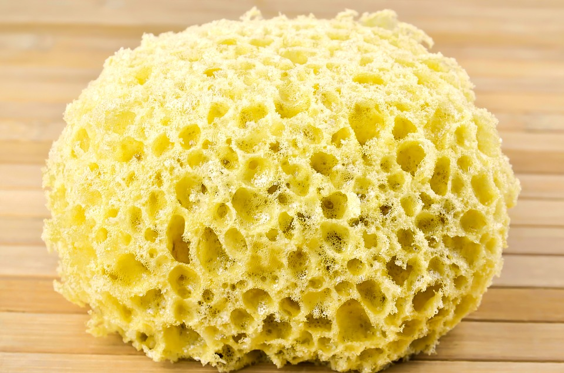

#[fit] How to be a sponge

---

# Learning Objectives

By the end of this workshop, you will be able to...

- Discuss the 3 stage learning process

- Identify your personal strengths and areas of growth in the 3 stage learning process

---

---

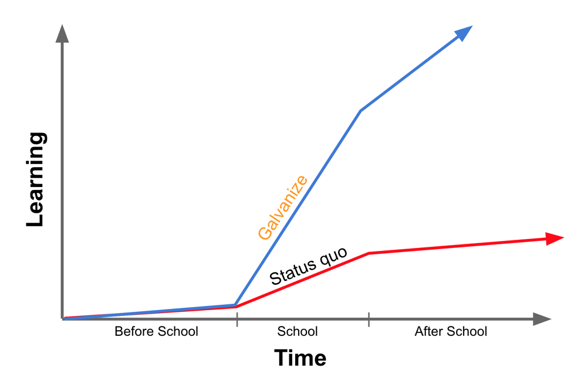

---

## Differentiated
## Instruction

^Differentiation means giving students multiple options for taking in information.

^CFU - Turn and Talk - Your learning style.

---

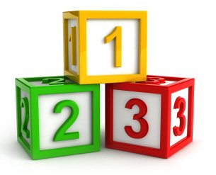

^The 3 step learning process.  Easy as 1-2-3.

---

#[fit] Step 1

---

#[fit] Set the stage

---

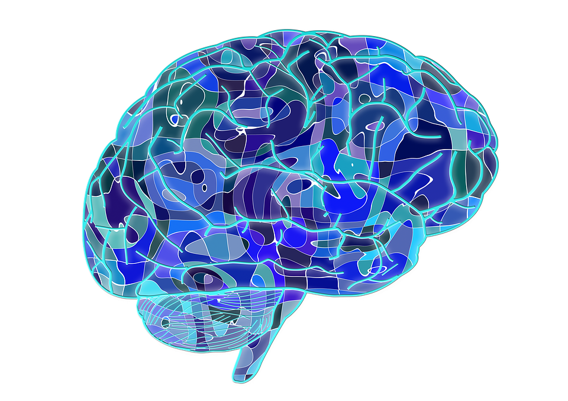

#[fit] Prime Your Brain

---

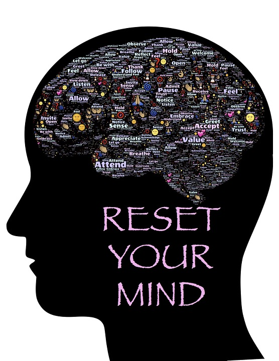

#[fit] Clear the Stage

#[fit] Reset Your Working Memory

---

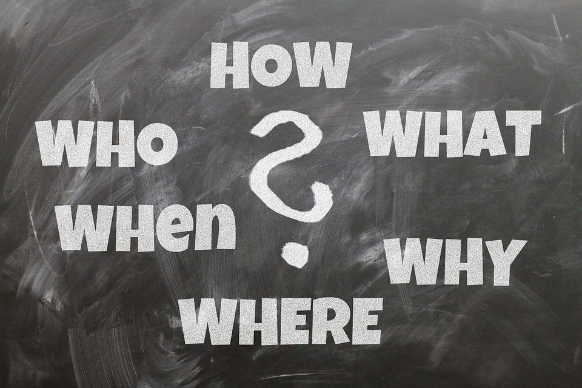

#[fit]Clarify
#[fit]the **What** and
#[fit]the **Why**

---

#[fit] Process
#[fit] *over*
#[fit] product

---

#[fit] Focused practice
#[fit] is the key

---

#[fit] Step 2

---

#[fit] Play!

---
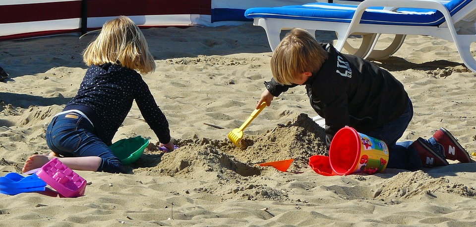
#[fit] Dig In!

---

#[fit] Wrestle With It

---

#[fit] Strive For Fluency

---

#[fit] Take
#[fit] Risks

---
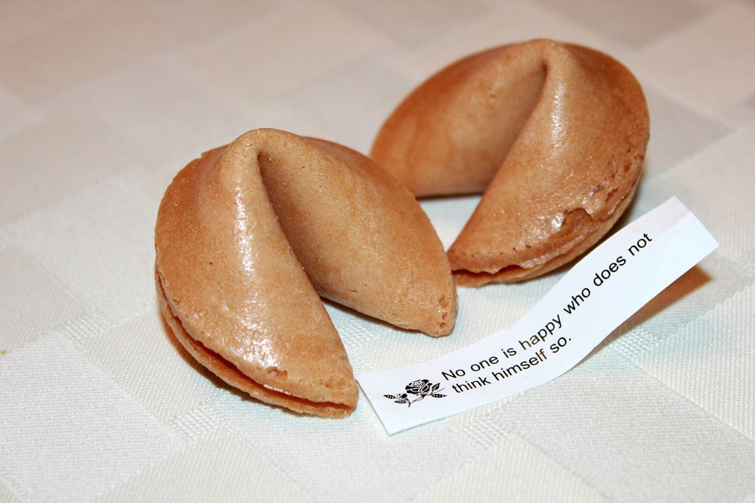
#[fit] Fortune
#[fit] favors
#[fit] those who try.

---

#[fit] Have fun!

---

#[fit] Step 3

---

#[fit] Reflect
#[fit]
#[fit] Be your Own
#[fit] Teacher

---
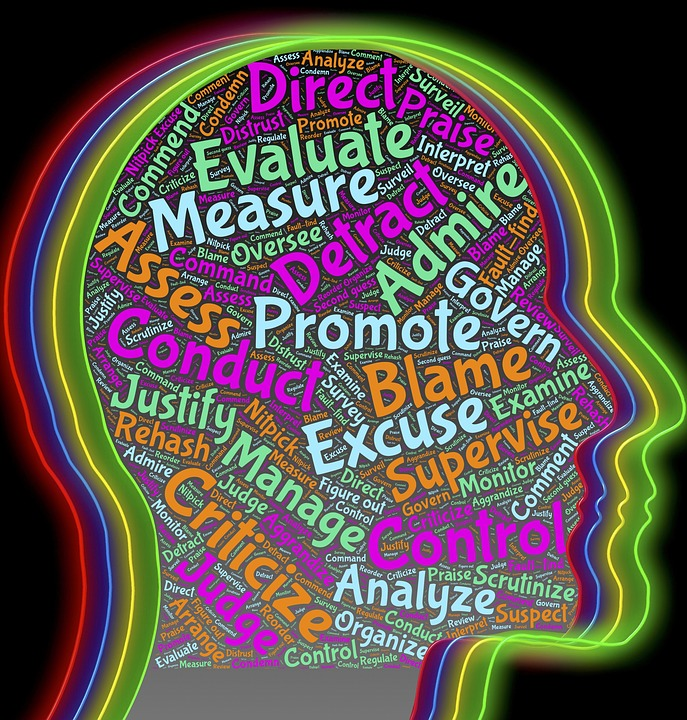
#[fit] Self Assess

---

#[fit] Ask New
#[fit] Questions

---

#[fit] Repeat

---

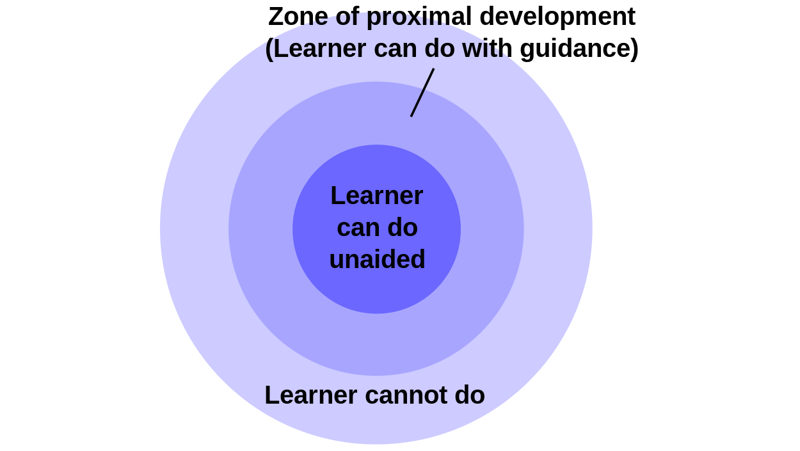

---

^Blooms Taxonomy is a framework for teachers to focus on higher order thinking.

^It is like a stairway - where each level represents a higher level of thinking.

^If a student masters a higher level, then it is assumed they have mastered the lower levels.

---

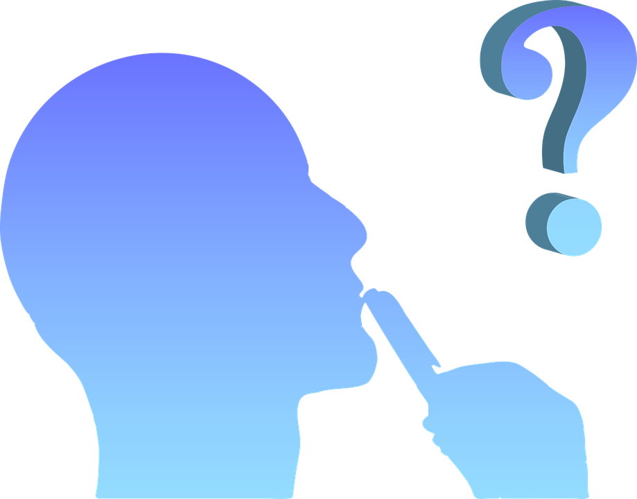

^Questions

---

####Blooms Taxonomy. Digital image. Bloom’s Taxonomy. Vanderbilt University, n.d. Web.
####[<https://cft.vanderbilt.edu/guides-sub-pages/blooms-taxonomy/>](https://cft.vanderbilt.edu/guides-sub-pages/blooms-taxonomy/).
