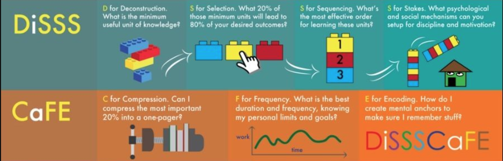
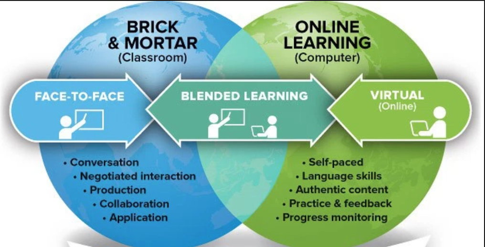
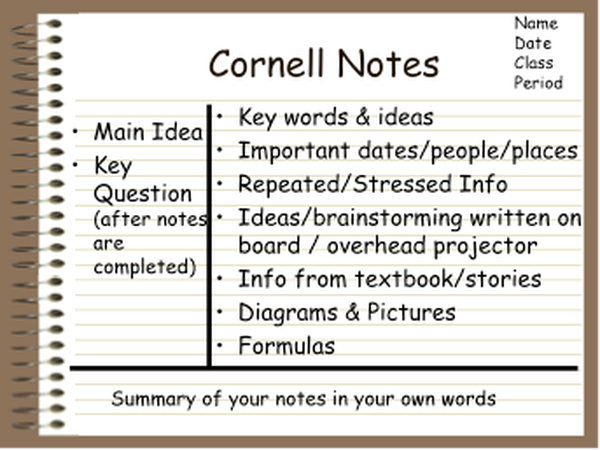

# Objectives - Galvanize Learning Model

- Define Blended Learning
- Understand the Zone of Proximal Development (ZPD)
- Describe how Note Taking benefits learning
- Define Culture of Error

---

# DiSSS and CaFE

^ We use industry aligned curriculum
^ We have done the DiSSS steps, so you can be confident this will give you a solid foundation

---

^ This class will be hard, what you get out of it will be proportional to what you put into it

---

# Blended Learning

^ you will be doing in class lessons and exercises, but also working on your own a lot!

---

# Note Taking
## Talk and Turn, what are some advantages to taking notes?

^ notes help you to remember things now
^ gives you a way to reflect on what you are learning
^ the C in Compress is for compressing/summarizing your knowledge

---

# Spaced Repetition

^ spaced repetition is required to cement programming skills
^ Do things more than once, otherwise it's like working out by doing 1 push up.
^ That's not enough to engrain it and make it your own

---

# Culture of Error

^ It is OK to make mistakes
^ If you are in your ZPD you will be making mistakes
^ This is a safe environment