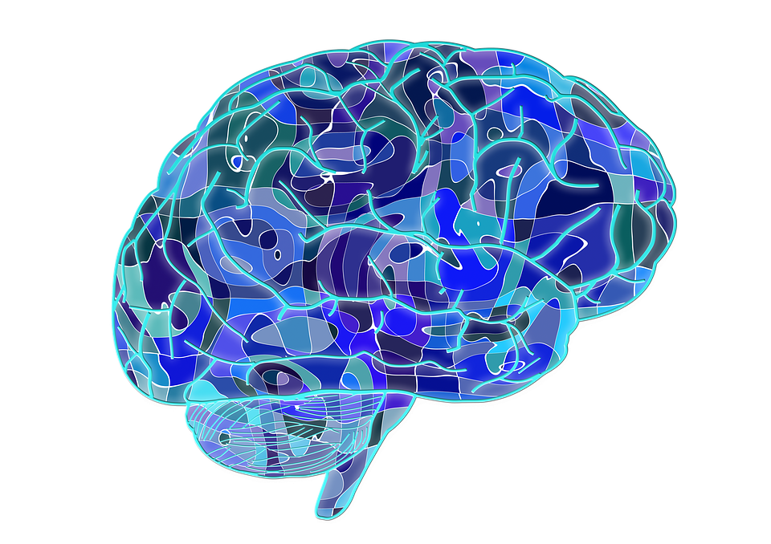
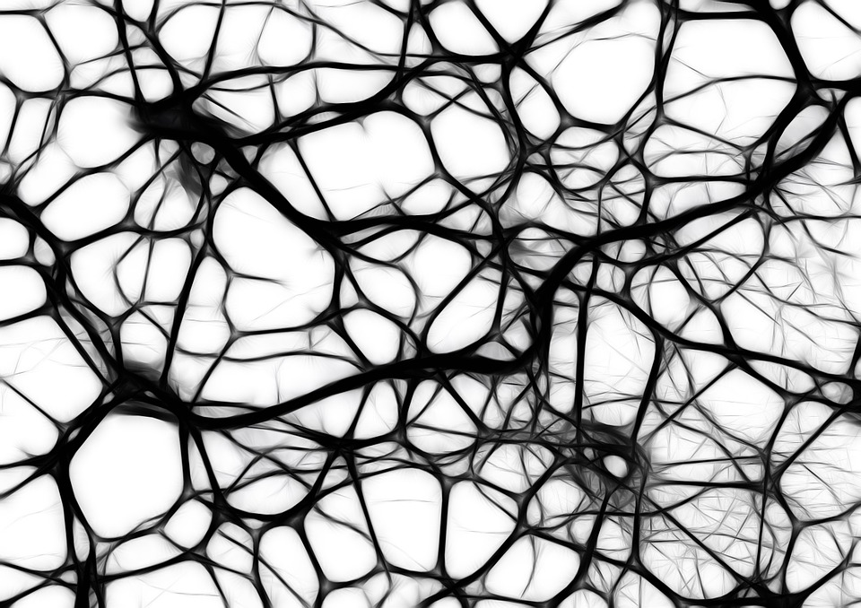
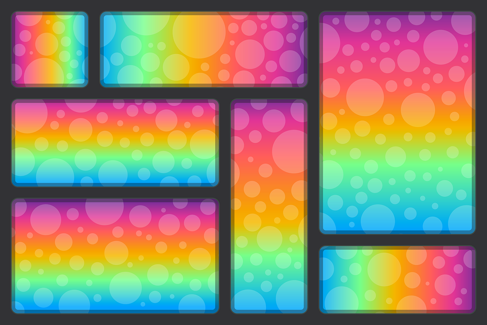

#[fit] Learning to Learn
#[fit] Practice Makes Permanent

---

# Practice
# Makes
# Perfect

---

#Practice
#makes
#permanent

^If you practice the wrong way to do something - you will just become really good at doing it wrong.

---

# Practice
# doing
# things
# correctly

---

#[fit] **SCIENCE**
---

# **Neurons become linked through repeated use.**

---

# The more abstract something is, the more important it is to practice.

^Even abstract ideas get built and strengthened  through practice.

---

# When you first begin to understand, the neural pattern is very weak.

---

## When you solve the problem again without looking at the solution, you strengthen the neural pattern.

---

# The Steps

---

## Study hard by focusing intently.

---

# Take a break  

^Change your focus.  Let your brain's diffuse mode work away in the background.

^Let the neural cement have a chance to set.

---

^ A Pomodoro is a great way to do this.

---

# Repeat

---

