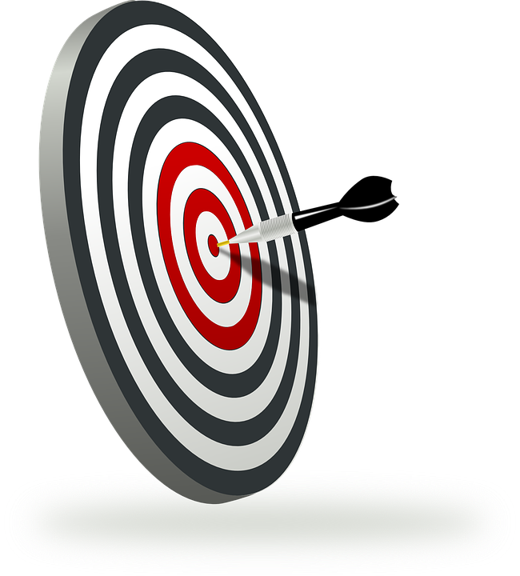
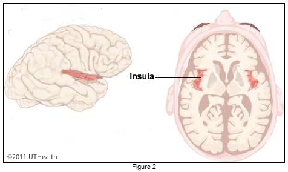
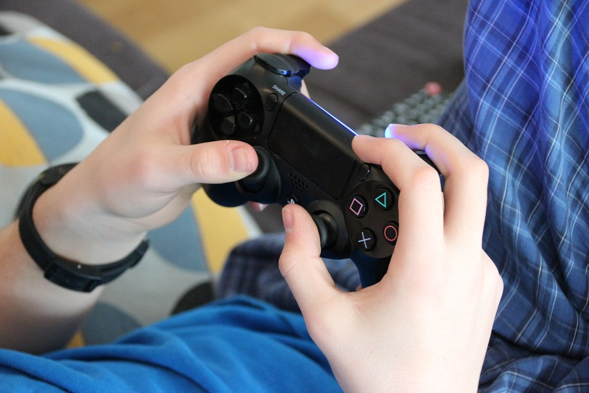
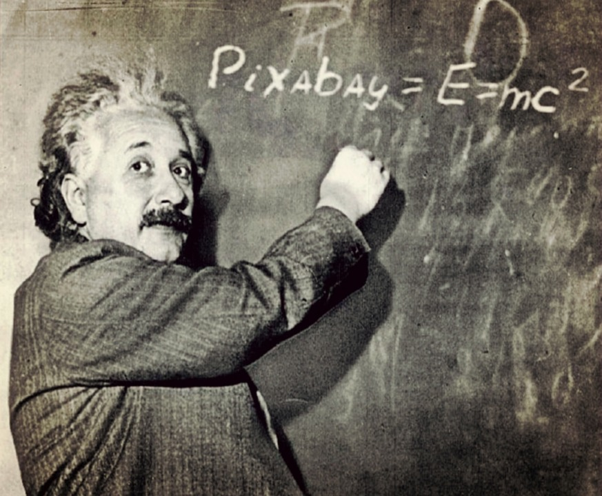
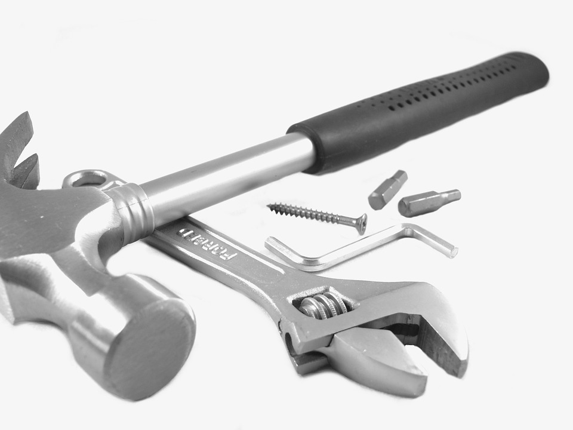

## Procrastination

---

## Why does it arise?

## How can we address it?

---

#[fit] Everyone
#[fit]has issues with
#[fit] procrastination

---

^ When you look at something you would rather not do, you activate an area of the brain associated with pain.

---

---

^ Naturally your brain looks for a way to stop the pain (or more accurately neuro-discomfort)

---

#[fit] Two
#[fit] Options

---

#Do
#something
#else

^ Temporarily effective.

---

#Get
#To Work
^ Get to work - the other option

---

^ Not long after people start doing the work, the neuro-discomfort disappears.

---

^ I know what you're thinking.  Thanks a lot genius … that’s easier said than done.

---

#Pomodoro

^ Pomodoro was invented by Francesco Cirillo in the early 1980s.  Pomodoro is italian for tomato.

---

Decide on the task to be done.

---

Set the timer (typically for 25 minutes).

---

Work on the task until the timer rings.  If a distraction pops into your head, write it down, but immediately get back on task.

---

After the timer rings - give yourself a small reward. (3-5 minutes)

---

Start again.

---

^There are a variety of tools to help with this technique, from actual physical timers to browser plug ins to full applications.

---

^Questions
